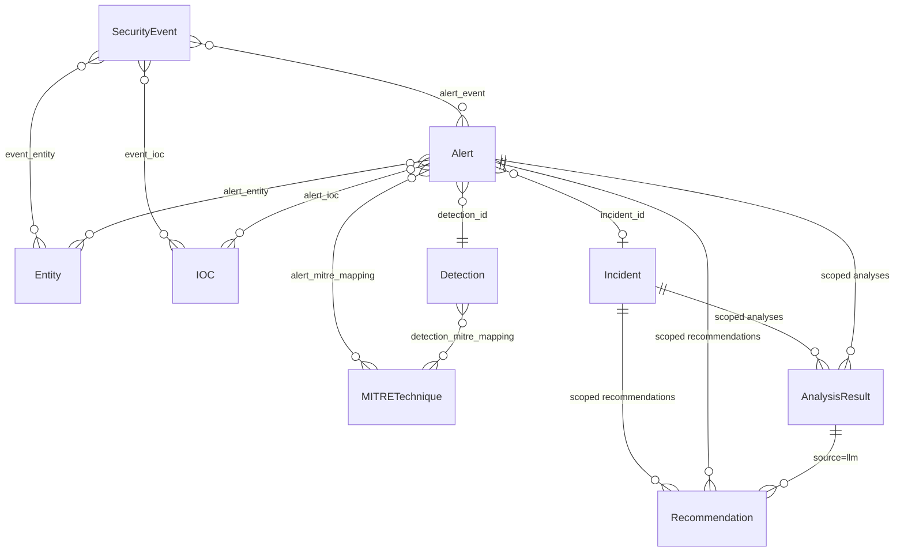

# SITA — Core Data Model Definitions

Companion to [TODO.md](TODO.md) Phase 1. This document defines the schema for every core entity at the field level: names, types, constraints, relationships, and provenance. It is the source of truth to implement against when writing the SQLAlchemy models, Alembic migration, and Pydantic schemas — those remain separate, later tasks (see status note at the bottom).

## Conventions

- **Primary keys:** UUID (`uuid4`), stored as `UUID` in Postgres / `CHAR(36)` in SQLite via the SQLAlchemy type-decorator abstraction. Never expose auto-increment integers over the API.
- **Timestamps:** all `TIMESTAMP` fields are UTC, timezone-aware. Every table has `created_at`; tables representing mutable state also have `updated_at`.
- **Provenance tagging:** every table is one of two kinds, never mixed:
  - **Deterministic tables** — `SecurityEvent`, `Alert`, `Incident` (core fields), `IOC`, `Entity`, `Detection`, `MITRETechnique` (rule-sourced rows). Populated only by rule/code paths. No field on these tables is ever written from raw LLM output.
  - **AI-attributed tables** — `AnalysisResult`, and the `source='llm'` rows within `Recommendation` and the MITRE-mapping junction. Every row carries `provider`, `model`, `prompt_version`, so a reviewer can always answer "did a human-written rule or a model produce this?" from the row itself, not from context.
  - Where a deterministic table needs to display an AI-derived opinion alongside it (e.g., an LLM-suggested MITRE technique next to a rule-derived one), that opinion lives in its own row with `source` set accordingly — it is never merged into the deterministic row.
- **Enums** are implemented as Postgres/SQLite-portable `VARCHAR` + application-level `Enum` validation (not native Postgres enum types), so SQLite dev/test parity holds and enum values can be extended via code + migration without `ALTER TYPE` friction.
- **Junction tables** are used for all many-to-many relationships so that association metadata (e.g., how an IOC relates to an alert) has somewhere to live.

---

## 1. `SecurityEvent`

The atomic, normalized unit of observation. Every ingested event becomes exactly one row, regardless of source type.

| Field | Type | Nullable | Description |
|---|---|---|---|
| `id` | UUID | No | Primary key |
| `source_type` | Enum: `auth`, `endpoint`, `network`, `dns`, `web` | No | Which ingestion adapter normalized this event |
| `occurred_at` | TIMESTAMP | No | Event time as reported by the source (not ingestion time) |
| `ingested_at` | TIMESTAMP | No | When SITA received/normalized the event |
| `source_host` | VARCHAR | Yes | Hostname/identifier of the system that generated the raw log |
| `raw_payload` | JSONB / JSON | No | Original, untouched source record — preserved for audit/debug |
| `normalized` | JSONB / JSON | No | Source-agnostic normalized attributes (see per-source shape below) |
| `ingestion_batch_id` | UUID | Yes | Groups events ingested together (file import or streaming session) |
| `created_at` | TIMESTAMP | No | Row creation time |

**`normalized` shape by `source_type`** (stored as JSON rather than promoted to columns, per the [[event-schema-design]] open question in TODO.md — keeps the table stable while source-specific detail evolves):

- `auth`: `{ event_result: "success"|"failure", username, source_ip, dest_host, auth_method }`
- `endpoint`: `{ process_name, command_line, pid, parent_pid, parent_process_name, user }`
- `network`: `{ src_ip, src_port, dst_ip, dst_port, protocol, bytes_sent, bytes_received }`
- `dns`: `{ query_name, query_type, response_code, resolved_ips, resolver_ip }`
- `web`: `{ method, path, status_code, source_ip, user_agent, host }`

**Relationships**
- `SecurityEvent` ↔ `Entity` via `event_entity` junction (`event_id`, `entity_id`, `role` e.g. `source`/`target`/`actor`)
- `SecurityEvent` ↔ `Alert` via `alert_event` junction (an alert cites one or more triggering events)
- `SecurityEvent` ↔ `IOC` via `event_ioc` junction (IOCs extracted from this event)

**Indexes:** `(source_type, occurred_at)`, `occurred_at`, `ingestion_batch_id`

---

## 2. `Entity`

A referenceable actor or asset — the join point that makes correlation possible. Deduplicated by `(entity_type, identifier)`.

| Field | Type | Nullable | Description |
|---|---|---|---|
| `id` | UUID | No | Primary key |
| `entity_type` | Enum: `host`, `user`, `ip`, `domain` | No | What kind of actor/asset this is |
| `identifier` | VARCHAR | No | Canonical value (hostname, username, IP string, domain name) |
| `first_seen` | TIMESTAMP | No | Earliest event referencing this entity |
| `last_seen` | TIMESTAMP | No | Most recent event referencing this entity |
| `metadata` | JSONB / JSON | Yes | Optional enrichment (e.g., asset criticality tag, department) — manually curated, never LLM-written |
| `created_at` | TIMESTAMP | No | Row creation time |
| `updated_at` | TIMESTAMP | No | Last update time (bumped on `last_seen` change) |

**Constraints:** unique on `(entity_type, identifier)`

**Relationships:** referenced by `SecurityEvent`, `Alert`, and `IOC` (for `ip`/`domain`-typed entities) via junctions.

**Indexes:** `(entity_type, identifier)` (unique), `last_seen`

---

## 3. `Detection`

A deterministic rule *definition* — static metadata about a rule, distinct from any given firing.

| Field | Type | Nullable | Description |
|---|---|---|---|
| `id` | UUID | No | Primary key |
| `rule_key` | VARCHAR | No | Stable code identifier, e.g. `ssh_brute_force` (unique) |
| `name` | VARCHAR | No | Human-readable name |
| `description` | TEXT | No | What the rule detects and its logic in prose |
| `category` | Enum: `authentication`, `network`, `endpoint`, `web` | No | Broad grouping for the detection page UI |
| `default_severity` | Enum: `low`, `medium`, `high`, `critical` | No | Baseline severity before contextual scoring adjustments |
| `enabled` | BOOLEAN | No | Whether the rule is active in the pipeline |
| `config` | JSONB / JSON | Yes | Rule-specific tunables (thresholds, window sizes) |
| `created_at` | TIMESTAMP | No | Row creation time |

**Relationships**
- `Detection` ↔ `MITRETechnique` via `detection_mitre_mapping` junction (`detection_id`, `technique_id`) — the deterministic, rule-authored MITRE mapping described in Phase 8
- `Detection` → `Alert` one-to-many (a rule produces many alert instances over time)

**Indexes:** `rule_key` (unique), `category`

---

## 4. `Alert`

One instance of a detection rule firing (or, in the LLM-assisted-classification path, a classification event) — always traceable back to a `Detection` and the `SecurityEvent`s that triggered it.

| Field | Type | Nullable | Description |
|---|---|---|---|
| `id` | UUID | No | Primary key |
| `detection_id` | UUID (FK → `Detection.id`) | No | Which rule produced this alert |
| `incident_id` | UUID (FK → `Incident.id`) | Yes | Set once correlation assigns this alert to an incident |
| `severity` | Enum: `low`, `medium`, `high`, `critical` | No | Deterministically computed (see scoring factors below) |
| `confidence` | FLOAT (0.0–1.0) | No | Deterministic confidence the rule assigns to this firing |
| `status` | Enum: `new`, `investigating`, `resolved`, `false_positive` | No | Analyst-managed triage state |
| `rationale` | TEXT | No | Human-readable, rule-generated explanation (e.g., "14 failed logins from 10.0.0.5 to host `web01` in 5 minutes") |
| `severity_factors` | JSONB / JSON | No | Structured breakdown of what drove the severity score (rule criticality weight, asset sensitivity, volume/frequency) — the deterministic explanation `AnalysisResult` severity-explanation text (Phase 7) is generated *from* this, never in place of it |
| `first_event_at` | TIMESTAMP | No | Timestamp of earliest contributing event |
| `last_event_at` | TIMESTAMP | No | Timestamp of latest contributing event |
| `created_at` | TIMESTAMP | No | Row creation time |
| `updated_at` | TIMESTAMP | No | Last update time |

**Relationships**
- `Alert` ↔ `SecurityEvent` via `alert_event` junction
- `Alert` ↔ `Entity` via `alert_entity` junction (`role`: `source`/`target`/`actor`)
- `Alert` ↔ `IOC` via `alert_ioc` junction
- `Alert` ↔ `MITRETechnique` via `alert_mitre_mapping` junction — inherited from `Detection`'s static mapping at creation time, plus any distinct instance-specific evidence
- `Alert` → `Incident` many-to-one (nullable until correlated)

**Indexes:** `(detection_id, created_at)`, `incident_id`, `severity`, `status`

---

## 5. `Incident`

A correlated group of one or more alerts representing a single security narrative.

| Field | Type | Nullable | Description |
|---|---|---|---|
| `id` | UUID | No | Primary key |
| `title` | VARCHAR | No | Short human-readable title (deterministically templated, e.g. `"SSH brute force → {host}"`; may later be refined by an `AnalysisResult` summarization pass, tracked separately, not overwritten in place) |
| `status` | Enum: `open`, `investigating`, `contained`, `closed` | No | Analyst-managed lifecycle state |
| `severity` | Enum: `low`, `medium`, `high`, `critical` | No | Deterministic rollup — max (or weighted max) of constituent alert severities |
| `first_activity_at` | TIMESTAMP | No | Earliest contributing alert's `first_event_at` |
| `last_activity_at` | TIMESTAMP | No | Latest contributing alert's `last_event_at` |
| `correlation_method` | JSONB / JSON | No | Structured record of which correlation signals (time window, shared IP/user/host/domain/IOC/technique) justified each alert's membership — the deterministic explainability trail |
| `created_at` | TIMESTAMP | No | Row creation time |
| `updated_at` | TIMESTAMP | No | Last update time (bumped whenever a new alert is correlated in) |

**Relationships**
- `Incident` → `Alert` one-to-many
- `Incident` → `AnalysisResult` one-to-many (all AI triage output scoped to this incident)
- `Incident` → `Recommendation` one-to-many
- Entities/IOCs/MITRE techniques are derived (queried, not duplicated) via the incident's constituent alerts

**Indexes:** `status`, `severity`, `last_activity_at`

---

## 6. `IOC`

A validated indicator of compromise, deduplicated across every event/alert that references it.

| Field | Type | Nullable | Description |
|---|---|---|---|
| `id` | UUID | No | Primary key |
| `ioc_type` | Enum: `ipv4`, `ipv6`, `domain`, `url`, `file_hash_md5`, `file_hash_sha1`, `file_hash_sha256`, `email`, `username` | No | Indicator category |
| `value` | VARCHAR | No | The indicator itself, normalized (lowercased domains, canonical IP form) |
| `extraction_source` | Enum: `regex`, `llm_assisted` | No | Provenance of the extraction — never blended within one row |
| `validation_status` | Enum: `valid`, `invalid`, `unverified` | No | Result of deterministic format/range validation, applied even to `llm_assisted` extractions before they are trusted |
| `confidence` | FLOAT (0.0–1.0) | No | Deterministic confidence (1.0 for regex-matched + validated; lower, rule-defined ceiling for `llm_assisted`) |
| `first_seen` | TIMESTAMP | No | Earliest event/alert referencing this IOC |
| `last_seen` | TIMESTAMP | No | Most recent event/alert referencing this IOC |
| `created_at` | TIMESTAMP | No | Row creation time |
| `updated_at` | TIMESTAMP | No | Last update time |

**Constraints:** unique on `(ioc_type, value)`

**Relationships**
- `IOC` ↔ `SecurityEvent` via `event_ioc` junction
- `IOC` ↔ `Alert` via `alert_ioc` junction

**Indexes:** `(ioc_type, value)` (unique), `ioc_type`, `last_seen`

---

## 7. `MITRETechnique`

Local, static representation of a relevant subset of MITRE ATT&CK — no runtime API dependency (Phase 8).

| Field | Type | Nullable | Description |
|---|---|---|---|
| `id` | UUID | No | Primary key |
| `technique_id` | VARCHAR | No | ATT&CK ID, e.g. `T1110.001` (unique) |
| `name` | VARCHAR | No | Technique name, e.g. "Password Guessing" |
| `tactic` | VARCHAR | No | Parent tactic, e.g. `credential-access` (ATT&CK short name) |
| `description` | TEXT | No | Vendored technique description |
| `dataset_version` | VARCHAR | No | Version/date of the vendored local ATT&CK snapshot this row came from |

**Relationships**
- `MITRETechnique` ↔ `Detection` via `detection_mitre_mapping` (deterministic, rule-authored)
- `MITRETechnique` ↔ `Alert` via `alert_mitre_mapping`, with a `source` column (`rule` | `llm`) and, for `llm` rows, a link to the originating `AnalysisResult` — this is how Phase 7's LLM-suggested techniques stay distinguishable from Phase 8's deterministic mapping

**Indexes:** `technique_id` (unique), `tactic`

---

## 8. `AnalysisResult`

The envelope for every piece of LLM output — the single place "AI said X" is recorded, so nothing downstream has to guess provenance.

| Field | Type | Nullable | Description |
|---|---|---|---|
| `id` | UUID | No | Primary key |
| `incident_id` | UUID (FK → `Incident.id`) | Yes | Scope, when the analysis targets an incident |
| `alert_id` | UUID (FK → `Alert.id`) | Yes | Scope, when the analysis targets a single alert (exactly one of `incident_id`/`alert_id` is set) |
| `task_type` | Enum: `incident_summary`, `severity_explanation`, `attack_classification`, `investigation_hypothesis`, `investigation_steps`, `mitre_suggestion` | No | Which Phase 7 triage task produced this |
| `provider` | VARCHAR | No | e.g. `ollama`, `mock` |
| `model` | VARCHAR | No | e.g. `llama3.1:8b-instruct` |
| `prompt_version` | VARCHAR | No | Version tag of the prompt template used |
| `raw_output` | TEXT | No | Unparsed model output, kept for debugging |
| `parsed_output` | JSONB / JSON | Yes | Output after schema validation; null if validation failed |
| `validation_status` | Enum: `valid`, `invalid`, `timeout`, `provider_error` | No | Outcome of the response-validation step (Phase 6) |
| `confidence` | FLOAT (0.0–1.0) | Yes | Only populated where derived deterministically (e.g., schema-validation success + agreement with rule-based signals) — never a raw self-reported LLM confidence, per the [[how-ai-confidence-represented]] decision in TODO.md |
| `latency_ms` | INTEGER | No | Call duration |
| `prompt_tokens` / `completion_tokens` | INTEGER | Yes | If exposed by the provider |
| `created_at` | TIMESTAMP | No | Row creation time |

**Relationships:** scoped to exactly one `Incident` or `Alert`; `alert_mitre_mapping` rows with `source='llm'` reference the `AnalysisResult` that produced them.

**Indexes:** `incident_id`, `alert_id`, `task_type`, `created_at`

---

## 9. `Recommendation`

A suggested next step, from either the deterministic rule layer or the LLM — kept in one table but always labeled by `source`.

| Field | Type | Nullable | Description |
|---|---|---|---|
| `id` | UUID | No | Primary key |
| `incident_id` | UUID (FK → `Incident.id`) | Yes | Scope, when tied to an incident |
| `alert_id` | UUID (FK → `Alert.id`) | Yes | Scope, when tied to a single alert |
| `source` | Enum: `rule_based`, `llm` | No | Provenance — determines UI treatment |
| `analysis_result_id` | UUID (FK → `AnalysisResult.id`) | Yes | Set when `source='llm'`, linking back to the generating call |
| `text` | TEXT | No | The recommendation itself |
| `priority` | Enum: `low`, `medium`, `high` | No | Suggested urgency |
| `status` | Enum: `open`, `acknowledged`, `dismissed`, `completed` | No | Analyst-managed lifecycle |
| `created_at` | TIMESTAMP | No | Row creation time |
| `updated_at` | TIMESTAMP | No | Last update time |

**Constraints:** `source='llm'` requires `analysis_result_id` set (application-level check, mirrored as a DB check constraint)

**Indexes:** `incident_id`, `alert_id`, `status`

---

## Entity-Relationship Overview

---

## Status: implemented

Phase 1 is complete. Everything defined above is implemented and verified:

- SQLAlchemy ORM models: `backend/app/models/` (one module per entity, plus `associations.py` for junction tables/objects, `enums.py`, `base.py` mixins)
- First Alembic migration: `backend/alembic/versions/6224f8f082fb_initial_schema.py` — applied and verified against **both** SQLite and a real Postgres container, with `alembic check` confirming no drift from the models
- Postgres/SQLite data-layer abstraction: `backend/app/db/session.py` + `backend/app/db/types.py` (the `JSONVariant` type — JSONB on Postgres, JSON elsewhere)
- Pydantic read/response schemas: `backend/app/schemas/` (one `*Read` schema per entity). Create/Update variants are deferred to Phase 9, when actual endpoints exist to consume them
- DB-level indexes: declared on the models per the index lists above, confirmed present in the migration and (for Postgres) via direct inspection
- Unit tests: `backend/tests/unit/test_models.py` and `test_schemas.py` — unique constraints, NOT NULL, FK integrity, and both check constraints (`AnalysisResult` single-scope, `Recommendation` LLM-provenance) all verified

One naming note: the `Entity.metadata` field described above is implemented as `Entity.entity_metadata` in code — `metadata` is a reserved attribute name on SQLAlchemy's declarative `Base` (it's the `MetaData` object), so it can't be reused as a column attribute.

See `TODO.md` Phase 1 for the itemized checklist.
