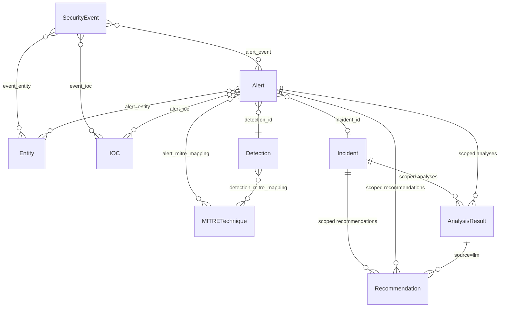

# SITA — Data & Contract Definitions

Companion to [TODO.md](../TODO.md). This document is the project's running data dictionary — the field-level source of truth for every schema and contract, written *before* the code that implements it, one section per phase. It's organized by phase in the order those phases were built, not by topic, so each section reflects what was actually decided at the time — later phases may refine earlier ones, and where that happens it's called out explicitly rather than silently overwritten.

- **Phase 1** (below): the core relational schema — every entity, its fields, and the relationships between them.
- **Phase 2** (below): the event ingestion contracts — the raw shape each of the 5 simulated event sources arrives in, the normalized shape they're mapped to, and the ingestion adapter/API contract.

---

# Phase 1: Core Data Model

## Conventions

- **Primary keys:** UUID (`uuid4`), stored as `UUID` in Postgres / `CHAR(36)` in SQLite via the SQLAlchemy type-decorator abstraction. Never expose auto-increment integers over the API.
- **Timestamps:** all `TIMESTAMP` fields are UTC, timezone-aware. Every table has `created_at`; tables representing mutable state also have `updated_at`.
- **Provenance tagging:** every table is one of two kinds, never mixed:
  - **Deterministic tables** — `SecurityEvent`, `Alert`, `Incident` (core fields), `IOC`, `Entity`, `Detection`, `MITRETechnique` (rule-sourced rows). Populated only by rule/code paths. No field on these tables is ever written from raw LLM output.
  - **AI-attributed tables** — `AnalysisResult`, and the `source='llm'` rows within `Recommendation` and the MITRE-mapping junction. Every row carries `provider`, `model`, `prompt_version`, so a reviewer can always answer "did a human-written rule or a model produce this?" from the row itself, not from context.
  - Where a deterministic table needs to display an AI-derived opinion alongside it (e.g., an LLM-suggested MITRE technique next to a rule-derived one), that opinion lives in its own row with `source` set accordingly — it is never merged into the deterministic row.
- **Enums** are implemented as Postgres/SQLite-portable `VARCHAR` + application-level `Enum` validation (not native Postgres enum types), so SQLite dev/test parity holds and enum values can be extended via code + migration without `ALTER TYPE` friction.
- **Junction tables** are used for all many-to-many relationships so that association metadata (e.g., how an IOC relates to an alert) has somewhere to live.

---

## 1. `SecurityEvent`

The atomic, normalized unit of observation. Every ingested event becomes exactly one row, regardless of source type.

| Field | Type | Nullable | Description |
|---|---|---|---|
| `id` | UUID | No | Primary key |
| `source_type` | Enum: `auth`, `endpoint`, `network`, `dns`, `web` | No | Which ingestion adapter normalized this event |
| `occurred_at` | TIMESTAMP | No | Event time as reported by the source (not ingestion time) |
| `ingested_at` | TIMESTAMP | No | When SITA received/normalized the event |
| `source_host` | VARCHAR | Yes | Hostname/identifier of the system that generated the raw log |
| `raw_payload` | JSONB / JSON | No | Original, untouched source record — preserved for audit/debug |
| `normalized` | JSONB / JSON | No | Source-agnostic normalized attributes (see per-source shape below) |
| `ingestion_batch_id` | UUID | Yes | Groups events ingested together (file import or streaming session) |
| `created_at` | TIMESTAMP | No | Row creation time |

**`normalized` shape by `source_type`** (stored as JSON rather than promoted to columns, per the [[event-schema-design]] open question in TODO.md — keeps the table stable while source-specific detail evolves):

- `auth`: `{ event_result: "success"|"failure", username, source_ip, dest_host, auth_method }`
- `endpoint`: `{ process_name, command_line, pid, parent_pid, parent_process_name, user }`
- `network`: `{ src_ip, src_port, dst_ip, dst_port, protocol, bytes_sent, bytes_received }`
- `dns`: `{ query_name, query_type, response_code, resolved_ips, resolver_ip }`
- `web`: `{ method, path, status_code, source_ip, user_agent, host }`

**Relationships**
- `SecurityEvent` ↔ `Entity` via `event_entity` junction (`event_id`, `entity_id`, `role` e.g. `source`/`target`/`actor`)
- `SecurityEvent` ↔ `Alert` via `alert_event` junction (an alert cites one or more triggering events)
- `SecurityEvent` ↔ `IOC` via `event_ioc` junction (IOCs extracted from this event)

**Indexes:** `(source_type, occurred_at)`, `occurred_at`, `ingestion_batch_id`

---

## 2. `Entity`

A referenceable actor or asset — the join point that makes correlation possible. Deduplicated by `(entity_type, identifier)`.

| Field | Type | Nullable | Description |
|---|---|---|---|
| `id` | UUID | No | Primary key |
| `entity_type` | Enum: `host`, `user`, `ip`, `domain` | No | What kind of actor/asset this is |
| `identifier` | VARCHAR | No | Canonical value (hostname, username, IP string, domain name) |
| `first_seen` | TIMESTAMP | No | Earliest event referencing this entity |
| `last_seen` | TIMESTAMP | No | Most recent event referencing this entity |
| `metadata` | JSONB / JSON | Yes | Optional enrichment (e.g., asset criticality tag, department) — manually curated, never LLM-written |
| `created_at` | TIMESTAMP | No | Row creation time |
| `updated_at` | TIMESTAMP | No | Last update time (bumped on `last_seen` change) |

**Constraints:** unique on `(entity_type, identifier)`

**Relationships:** referenced by `SecurityEvent`, `Alert`, and `IOC` (for `ip`/`domain`-typed entities) via junctions.

**Indexes:** `(entity_type, identifier)` (unique), `last_seen`

---

## 3. `Detection`

A deterministic rule *definition* — static metadata about a rule, distinct from any given firing.

| Field | Type | Nullable | Description |
|---|---|---|---|
| `id` | UUID | No | Primary key |
| `rule_key` | VARCHAR | No | Stable code identifier, e.g. `ssh_brute_force` (unique) |
| `name` | VARCHAR | No | Human-readable name |
| `description` | TEXT | No | What the rule detects and its logic in prose |
| `category` | Enum: `authentication`, `network`, `endpoint`, `web` | No | Broad grouping for the detection page UI |
| `default_severity` | Enum: `low`, `medium`, `high`, `critical` | No | Baseline severity before contextual scoring adjustments |
| `enabled` | BOOLEAN | No | Whether the rule is active in the pipeline |
| `config` | JSONB / JSON | Yes | Rule-specific tunables (thresholds, window sizes) |
| `created_at` | TIMESTAMP | No | Row creation time |

**Relationships**
- `Detection` ↔ `MITRETechnique` via `detection_mitre_mapping` junction (`detection_id`, `technique_id`) — the deterministic, rule-authored MITRE mapping described in Phase 8
- `Detection` → `Alert` one-to-many (a rule produces many alert instances over time)

**Indexes:** `rule_key` (unique), `category`

---

## 4. `Alert`

One instance of a detection rule firing (or, in the LLM-assisted-classification path, a classification event) — always traceable back to a `Detection` and the `SecurityEvent`s that triggered it.

| Field | Type | Nullable | Description |
|---|---|---|---|
| `id` | UUID | No | Primary key |
| `detection_id` | UUID (FK → `Detection.id`) | No | Which rule produced this alert |
| `incident_id` | UUID (FK → `Incident.id`) | Yes | Set once correlation assigns this alert to an incident |
| `severity` | Enum: `low`, `medium`, `high`, `critical` | No | Deterministically computed (see scoring factors below) |
| `confidence` | FLOAT (0.0–1.0) | No | Deterministic confidence the rule assigns to this firing |
| `status` | Enum: `new`, `investigating`, `resolved`, `false_positive` | No | Analyst-managed triage state |
| `rationale` | TEXT | No | Human-readable, rule-generated explanation (e.g., "14 failed logins from 10.0.0.5 to host `web01` in 5 minutes") |
| `severity_factors` | JSONB / JSON | No | Structured breakdown of what drove the severity score (rule criticality weight, asset sensitivity, volume/frequency) — the deterministic explanation `AnalysisResult` severity-explanation text (Phase 7) is generated *from* this, never in place of it |
| `first_event_at` | TIMESTAMP | No | Timestamp of earliest contributing event |
| `last_event_at` | TIMESTAMP | No | Timestamp of latest contributing event |
| `created_at` | TIMESTAMP | No | Row creation time |
| `updated_at` | TIMESTAMP | No | Last update time |

**Relationships**
- `Alert` ↔ `SecurityEvent` via `alert_event` junction
- `Alert` ↔ `Entity` via `alert_entity` junction (`role`: `source`/`target`/`actor`)
- `Alert` ↔ `IOC` via `alert_ioc` junction
- `Alert` ↔ `MITRETechnique` via `alert_mitre_mapping` junction — inherited from `Detection`'s static mapping at creation time, plus any distinct instance-specific evidence
- `Alert` → `Incident` many-to-one (nullable until correlated)

**Indexes:** `(detection_id, created_at)`, `incident_id`, `severity`, `status`

---

## 5. `Incident`

A correlated group of one or more alerts representing a single security narrative.

| Field | Type | Nullable | Description |
|---|---|---|---|
| `id` | UUID | No | Primary key |
| `title` | VARCHAR | No | Short human-readable title (deterministically templated, e.g. `"SSH brute force → {host}"`; may later be refined by an `AnalysisResult` summarization pass, tracked separately, not overwritten in place) |
| `status` | Enum: `open`, `investigating`, `contained`, `closed` | No | Analyst-managed lifecycle state |
| `severity` | Enum: `low`, `medium`, `high`, `critical` | No | Deterministic rollup — max (or weighted max) of constituent alert severities |
| `first_activity_at` | TIMESTAMP | No | Earliest contributing alert's `first_event_at` |
| `last_activity_at` | TIMESTAMP | No | Latest contributing alert's `last_event_at` |
| `correlation_method` | JSONB / JSON | No | Structured record of which correlation signals (time window, shared IP/user/host/domain/IOC/technique) justified each alert's membership — the deterministic explainability trail |
| `created_at` | TIMESTAMP | No | Row creation time |
| `updated_at` | TIMESTAMP | No | Last update time (bumped whenever a new alert is correlated in) |

**Relationships**
- `Incident` → `Alert` one-to-many
- `Incident` → `AnalysisResult` one-to-many (all AI triage output scoped to this incident)
- `Incident` → `Recommendation` one-to-many
- Entities/IOCs/MITRE techniques are derived (queried, not duplicated) via the incident's constituent alerts

**Indexes:** `status`, `severity`, `last_activity_at`

---

## 6. `IOC`

A validated indicator of compromise, deduplicated across every event/alert that references it.

| Field | Type | Nullable | Description |
|---|---|---|---|
| `id` | UUID | No | Primary key |
| `ioc_type` | Enum: `ipv4`, `ipv6`, `domain`, `url`, `file_hash_md5`, `file_hash_sha1`, `file_hash_sha256`, `email`, `username` | No | Indicator category |
| `value` | VARCHAR | No | The indicator itself, normalized (lowercased domains, canonical IP form) |
| `extraction_source` | Enum: `regex`, `llm_assisted` | No | Provenance of the extraction — never blended within one row |
| `validation_status` | Enum: `valid`, `invalid`, `unverified` | No | Result of deterministic format/range validation, applied even to `llm_assisted` extractions before they are trusted |
| `confidence` | FLOAT (0.0–1.0) | No | Deterministic confidence — refined in [DEF.md § Phase 4](#confidence-scale) into a graded per-strategy scale (structured field vs. free-text scan, and by IOC-type specificity) rather than a flat 1.0; a lower, rule-defined ceiling still applies to `llm_assisted` rows |
| `first_seen` | TIMESTAMP | No | Earliest event/alert referencing this IOC |
| `last_seen` | TIMESTAMP | No | Most recent event/alert referencing this IOC |
| `created_at` | TIMESTAMP | No | Row creation time |
| `updated_at` | TIMESTAMP | No | Last update time |

**Constraints:** unique on `(ioc_type, value)`

**Relationships**
- `IOC` ↔ `SecurityEvent` via `event_ioc` junction
- `IOC` ↔ `Alert` via `alert_ioc` junction

**Indexes:** `(ioc_type, value)` (unique), `ioc_type`, `last_seen`

---

## 7. `MITRETechnique`

Local, static representation of a relevant subset of MITRE ATT&CK — no runtime API dependency (Phase 8).

| Field | Type | Nullable | Description |
|---|---|---|---|
| `id` | UUID | No | Primary key |
| `technique_id` | VARCHAR | No | ATT&CK ID, e.g. `T1110.001` (unique) |
| `name` | VARCHAR | No | Technique name, e.g. "Password Guessing" |
| `tactic` | VARCHAR | No | Parent tactic, e.g. `credential-access` (ATT&CK short name) |
| `description` | TEXT | No | Vendored technique description |
| `dataset_version` | VARCHAR | No | Version/date of the vendored local ATT&CK snapshot this row came from |

**Relationships**
- `MITRETechnique` ↔ `Detection` via `detection_mitre_mapping` (deterministic, rule-authored)
- `MITRETechnique` ↔ `Alert` via `alert_mitre_mapping`, with a `source` column (`rule` | `llm`) and, for `llm` rows, a link to the originating `AnalysisResult` — this is how Phase 7's LLM-suggested techniques stay distinguishable from Phase 8's deterministic mapping

**Indexes:** `technique_id` (unique), `tactic`

---

## 8. `AnalysisResult`

The envelope for every piece of LLM output — the single place "AI said X" is recorded, so nothing downstream has to guess provenance.

| Field | Type | Nullable | Description |
|---|---|---|---|
| `id` | UUID | No | Primary key |
| `incident_id` | UUID (FK → `Incident.id`) | Yes | Scope, when the analysis targets an incident |
| `alert_id` | UUID (FK → `Alert.id`) | Yes | Scope, when the analysis targets a single alert (exactly one of `incident_id`/`alert_id` is set) |
| `task_type` | Enum: `incident_summary`, `severity_explanation`, `attack_classification`, `investigation_hypothesis`, `investigation_steps`, `mitre_suggestion` | No | Which Phase 7 triage task produced this |
| `provider` | VARCHAR | No | e.g. `ollama`, `mock` |
| `model` | VARCHAR | No | e.g. `llama3.1:8b-instruct` |
| `prompt_version` | VARCHAR | No | Version tag of the prompt template used |
| `raw_output` | TEXT | No | Unparsed model output, kept for debugging |
| `parsed_output` | JSONB / JSON | Yes | Output after schema validation; null if validation failed |
| `validation_status` | Enum: `valid`, `invalid`, `timeout`, `provider_error` | No | Outcome of the response-validation step (Phase 6) |
| `confidence` | FLOAT (0.0–1.0) | Yes | Only populated where derived deterministically (e.g., schema-validation success + agreement with rule-based signals) — never a raw self-reported LLM confidence, per the [[how-ai-confidence-represented]] decision in TODO.md |
| `latency_ms` | INTEGER | No | Call duration |
| `prompt_tokens` / `completion_tokens` | INTEGER | Yes | If exposed by the provider |
| `created_at` | TIMESTAMP | No | Row creation time |

**Relationships:** scoped to exactly one `Incident` or `Alert`; `alert_mitre_mapping` rows with `source='llm'` reference the `AnalysisResult` that produced them.

**Indexes:** `incident_id`, `alert_id`, `task_type`, `created_at`

---

## 9. `Recommendation`

A suggested next step, from either the deterministic rule layer or the LLM — kept in one table but always labeled by `source`.

| Field | Type | Nullable | Description |
|---|---|---|---|
| `id` | UUID | No | Primary key |
| `incident_id` | UUID (FK → `Incident.id`) | Yes | Scope, when tied to an incident |
| `alert_id` | UUID (FK → `Alert.id`) | Yes | Scope, when tied to a single alert |
| `source` | Enum: `rule_based`, `llm` | No | Provenance — determines UI treatment |
| `analysis_result_id` | UUID (FK → `AnalysisResult.id`) | Yes | Set when `source='llm'`, linking back to the generating call |
| `text` | TEXT | No | The recommendation itself |
| `priority` | Enum: `low`, `medium`, `high` | No | Suggested urgency |
| `status` | Enum: `open`, `acknowledged`, `dismissed`, `completed` | No | Analyst-managed lifecycle |
| `created_at` | TIMESTAMP | No | Row creation time |
| `updated_at` | TIMESTAMP | No | Last update time |

**Constraints:** `source='llm'` requires `analysis_result_id` set (application-level check, mirrored as a DB check constraint)

**Indexes:** `incident_id`, `alert_id`, `status`

---

## Entity-Relationship Overview



---

## Phase 1 Status: implemented

Phase 1 is complete. Everything defined above is implemented and verified:

- SQLAlchemy ORM models: `backend/app/models/` (one module per entity, plus `associations.py` for junction tables/objects, `enums.py`, `base.py` mixins)
- First Alembic migration: `backend/alembic/versions/6224f8f082fb_initial_schema.py` — applied and verified against **both** SQLite and a real Postgres container, with `alembic check` confirming no drift from the models
- Postgres/SQLite data-layer abstraction: `backend/app/db/session.py` + `backend/app/db/types.py` (the `JSONVariant` type — JSONB on Postgres, JSON elsewhere)
- Pydantic read/response schemas: `backend/app/schemas/` (one `*Read` schema per entity). Create/Update variants are deferred to Phase 9, when actual endpoints exist to consume them
- DB-level indexes: declared on the models per the index lists above, confirmed present in the migration and (for Postgres) via direct inspection
- Unit tests: `backend/tests/unit/test_models.py` and `test_schemas.py` — unique constraints, NOT NULL, FK integrity, and both check constraints (`AnalysisResult` single-scope, `Recommendation` LLM-provenance) all verified

One naming note: the `Entity.metadata` field described above is implemented as `Entity.entity_metadata` in code — `metadata` is a reserved attribute name on SQLAlchemy's declarative `Base` (it's the `MetaData` object), so it can't be reused as a column attribute.

See `TODO.md` Phase 1 for the itemized checklist.

---

# Phase 2: Event Ingestion

## Scope

Phase 1 defined `SecurityEvent` as the normalized, source-agnostic landing table (`source_type`, `occurred_at`, `raw_payload`, `normalized`, ...) but only sketched the per-source `normalized` shape loosely. Phase 2 finalizes that contract and adds everything upstream of it: what a raw simulated event looks like for each of the 5 source types, how it's validated and mapped into `SecurityEvent`, the two ways it can enter the system, and the format of the synthetic datasets used to exercise all of it. Every raw shape below is a **simulated** format designed for this project — not a copy of any real vendor's log schema — chosen to be realistic enough that the detection rules in Phase 3 have genuine signal to work with.

## Conventions

- **Transport format:** raw events are [JSON Lines](https://jsonlines.org/) (`.jsonl`) — one JSON object per line, UTF-8, no enclosing array. Chosen because it streams naturally (line-by-line parsing, no need to buffer a whole file to find the closing bracket) and because synthetic datasets are easiest to build by appending attack-pattern lines onto a benign baseline file.
- **Timestamps:** every raw record's `timestamp` field is an ISO 8601 UTC string (`...Z` suffix) — parsed into `SecurityEvent.occurred_at`.
- **Universal raw fields:** every raw record, regardless of source type, must include `timestamp` and `host`. These map to `SecurityEvent.occurred_at` and `SecurityEvent.source_host` respectively. Every other field is source-type-specific (below).
- **One source type per file/request:** a raw ingestion file or REST request body contains records of exactly one `source_type`. A scenario that spans multiple source types (e.g., an attack that touches auth, endpoint, and network logs) is represented as multiple single-source-type files ingested separately — see Synthetic Dataset Design below — not as one mixed file. This keeps each adapter's validation logic single-purpose.
- **`raw_payload` is preserved verbatim.** Whatever JSON object a source produces is stored byte-for-byte (as parsed JSON) in `SecurityEvent.raw_payload`, even after normalization — so nothing is ever lost between what was ingested and what the normalized view claims it means.

## 1. Raw Event Contracts

The input format each ingestion adapter accepts, before any normalization.

### `auth`

| Field | Type | Required | Description |
|---|---|---|---|
| `timestamp` | string (ISO 8601 UTC) | Yes | When the auth attempt occurred |
| `host` | string | Yes | System that generated the log (the auth service's host) |
| `event_result` | `"success"` \| `"failure"` | Yes | Outcome of the attempt |
| `username` | string | Yes | Account name used in the attempt |
| `source_ip` | string | Yes | Origin IP of the attempt |
| `auth_method` | `"password"` \| `"publickey"` \| `"mfa"` | Yes | Authentication mechanism |
| `service` | string | No | Originating service, e.g. `sshd`, `rdp`, `webapp-login` |

```json
{"timestamp": "2026-01-15T03:12:07Z", "host": "web01.internal", "event_result": "failure", "username": "root", "source_ip": "203.0.113.7", "auth_method": "password", "service": "sshd"}
```

### `endpoint`

| Field | Type | Required | Description |
|---|---|---|---|
| `timestamp` | string (ISO 8601 UTC) | Yes | When the process event occurred |
| `host` | string | Yes | Endpoint the process ran on |
| `process_name` | string | Yes | Executable name |
| `command_line` | string | Yes | Full command line, as launched |
| `pid` | integer | Yes | Process ID |
| `parent_pid` | integer | No | Parent process ID |
| `parent_process_name` | string | No | Parent executable name |
| `user` | string | Yes | Account the process ran under |

```json
{"timestamp": "2026-01-15T03:14:52Z", "host": "ws-12.internal", "process_name": "powershell.exe", "command_line": "powershell -enc SQBFAFgA...", "pid": 4821, "parent_pid": 3312, "parent_process_name": "explorer.exe", "user": "jdoe"}
```

### `network`

| Field | Type | Required | Description |
|---|---|---|---|
| `timestamp` | string (ISO 8601 UTC) | Yes | When the connection was observed |
| `host` | string | Yes | Sensor/host that logged the connection (e.g., a firewall or the endpoint itself) |
| `src_ip` | string | Yes | Source IP of the connection |
| `src_port` | integer | Yes | Source port |
| `dst_ip` | string | Yes | Destination IP |
| `dst_port` | integer | Yes | Destination port |
| `protocol` | `"tcp"` \| `"udp"` \| `"icmp"` | Yes | Transport protocol |
| `bytes_sent` | integer | No | Bytes sent, source → destination |
| `bytes_received` | integer | No | Bytes received, destination → source |

```json
{"timestamp": "2026-01-15T03:16:00Z", "host": "ws-12.internal", "src_ip": "10.0.0.12", "src_port": 51422, "dst_ip": "10.0.0.5", "dst_port": 22, "protocol": "tcp", "bytes_sent": 1200, "bytes_received": 340}
```

### `dns`

| Field | Type | Required | Description |
|---|---|---|---|
| `timestamp` | string (ISO 8601 UTC) | Yes | When the query was resolved |
| `host` | string | Yes | Resolver/sensor host that logged the query |
| `query_name` | string | Yes | Domain queried |
| `query_type` | `"A"` \| `"AAAA"` \| `"CNAME"` \| `"TXT"` \| `"MX"` \| `"NS"` | Yes | DNS record type requested |
| `response_code` | `"NOERROR"` \| `"NXDOMAIN"` \| `"SERVFAIL"` \| `"REFUSED"` | Yes | Resolution outcome |
| `resolved_ips` | array of string | No | IPs returned (empty/absent on failure) |
| `resolver_ip` | string | Yes | IP of the resolver that served the query |

```json
{"timestamp": "2026-01-15T03:16:30Z", "host": "dns01.internal", "query_name": "cdn-update-service.example", "query_type": "A", "response_code": "NOERROR", "resolved_ips": ["198.51.100.23"], "resolver_ip": "10.0.0.2"}
```

### `web`

| Field | Type | Required | Description |
|---|---|---|---|
| `timestamp` | string (ISO 8601 UTC) | Yes | When the request was served |
| `host` | string | Yes | Server that logged the request |
| `method` | `"GET"` \| `"POST"` \| `"PUT"` \| `"DELETE"` \| `"HEAD"` \| `"OPTIONS"` | Yes | HTTP method |
| `path` | string | Yes | Request path (query string included, if any) |
| `status_code` | integer | Yes | HTTP response status |
| `source_ip` | string | Yes | Client IP |
| `user_agent` | string | No | Client `User-Agent` header |

```json
{"timestamp": "2026-01-15T03:20:11Z", "host": "web01.internal", "method": "GET", "path": "/admin/login.php?id=1' OR '1'='1", "status_code": 401, "source_ip": "203.0.113.7", "user_agent": "curl/7.68.0"}
```

## 2. Normalized Shape (`SecurityEvent.normalized`) — finalized

This finalizes the sketch from the Phase 1 `SecurityEvent` section. For every source type, this is exactly what `normalized` contains after adapter mapping — the canonical reference for anything downstream (detection rules in Phase 3, IOC extraction in Phase 4) that reads `SecurityEvent.normalized` instead of re-parsing `raw_payload`.

| `source_type` | `normalized` fields |
|---|---|
| `auth` | `event_result`, `username`, `source_ip`, `dest_host`, `auth_method` |
| `endpoint` | `process_name`, `command_line`, `pid`, `parent_pid`, `parent_process_name`, `user` |
| `network` | `src_ip`, `src_port`, `dst_ip`, `dst_port`, `protocol`, `bytes_sent`, `bytes_received` |
| `dns` | `query_name`, `query_type`, `response_code`, `resolved_ips`, `resolver_ip` |
| `web` | `method`, `path`, `status_code`, `source_ip`, `user_agent`, `host` |

Mapping notes:
- `auth.dest_host` is the raw record's `host` field, renamed on the way into `normalized` — `SecurityEvent.source_host` already captures "which system produced this log," so `dest_host` inside `normalized` specifically means "which host the authentication attempt targeted," which happens to be the same value for these simulated logs but is named for its semantic role, not its literal source.
- `web.host` is intentionally still present inside `normalized` even though `SecurityEvent.source_host` also captures it — for web logs specifically, `source_host` is "which server produced this log entry" and `normalized.host` is "which virtual host / server the request was addressed to." They're the same value in every simulated dataset here (no load balancer/vhost fan-out modeled), but the fields are kept semantically distinct rather than collapsed, since a real deployment would have load-balanced web logs where they diverge.
- Optional raw fields not present in the source record are omitted from `normalized` rather than written as explicit `null` — keeps IOC extraction (Phase 4) and detection rules (Phase 3) able to use plain `dict.get(...)` / "key absent" checks without a null-vs-missing distinction to handle.

## 3. Ingestion Adapter Interface

One adapter per source type, all conforming to the same shape:

```python
class IngestionAdapter(Protocol):
    source_type: SourceType

    def parse(self, raw: dict) -> ParsedEvent | IngestionError:
        """Validate one raw record and map it to the normalized shape.
        Never raises for a malformed record — returns an IngestionError
        instead, so one bad record in a batch never aborts the rest."""
```

`ParsedEvent` (a Pydantic schema, `app/schemas/ingestion.py`) is the adapter's output — an in-memory representation ready to become a `SecurityEvent` row, not yet persisted:

| Field | Type | Description |
|---|---|---|
| `source_type` | `SourceType` | Echoed from the adapter |
| `occurred_at` | `datetime` | Parsed from raw `timestamp` |
| `source_host` | `str` | Copied from raw `host` |
| `raw_payload` | `dict` | The raw record, verbatim |
| `normalized` | `dict` | Mapped per the table in §2 |

`IngestionError` carries enough to build the rejection report in §5: `{ reason: str, field: str | None }`.

**Adapter responsibility boundary:** an adapter validates *shape* (required fields present, correct type, enum values within the allowed set) — it does **not** perform semantic/threat validation. Whether `203.0.113.7` is a known-bad IP is an IOC/detection question (Phases 3–4), not an ingestion question. Ingestion's only job is "is this a well-formed `auth` record," not "is this a suspicious one."

## 4. Ingestion Pathways

Two ways a raw event reaches `SecurityEvent`, both producing the same `IngestionReport`:

```
IngestionReport = {
  batch_id: UUID | null,
  source_type: SourceType,
  total: int,
  accepted: int,
  rejected: int,
  errors: [{ index: int, reason: str, field: str | null }]
}
```

### Batch file import

- Accepts a `.jsonl` file, all records the same declared `source_type`.
- Every accepted record in the file is stamped with the same newly-generated `ingestion_batch_id`, so an entire import can be queried, audited, or (in principle) rolled back as a unit.
- Each line is parsed and validated independently; one malformed line is recorded as a rejection and does not stop the rest of the file from being ingested. `errors[].index` is the 1-based line number.

### `POST /api/v1/events/{source_type}` (REST streaming)

- Body: a single raw event object, or a JSON array of raw event objects — all matching the `source_type` path parameter.
- No `ingestion_batch_id` is assigned (stays `null`) — this path is for individual/streamed events, not a bulk import, matching `SecurityEvent.ingestion_batch_id` being nullable per Phase 1. `errors[].index` is the array index (`0` for a single-object body).
- Scope note: this is a narrow, write-only ingestion endpoint. The broader queryable REST surface (`GET` with pagination/filtering/sorting across events, alerts, incidents, IOCs, etc.) is Phase 9's responsibility — this endpoint exists only to get raw events into the system, not to read them back out.

## 5. Validation & Rejection

- A record is rejected — never silently dropped — when: `timestamp` is missing or unparseable, `host` is missing, or any source-type-required field from §1 is missing or fails its declared type/enum check.
- Every rejection is recorded in `IngestionReport.errors` with a specific, actionable reason (e.g., `"missing required field: event_result"`, not a generic "invalid record").
- Ingestion never raises an unhandled exception because of one malformed record — a bad line in a 10,000-line file still leaves the other 9,999 ingested, with the one failure reported precisely.

## 6. Synthetic Dataset Design

**Location:** `data/synthetic_events/`

**Layout:**

```
data/synthetic_events/
├── auth/
│   ├── benign.jsonl
│   └── brute_force.jsonl
├── endpoint/
│   ├── benign.jsonl
│   └── suspicious_powershell.jsonl
├── network/
│   ├── benign.jsonl
│   └── port_scan.jsonl
├── dns/
│   ├── benign.jsonl
│   └── suspicious_domain.jsonl
├── web/
│   ├── benign.jsonl
│   └── suspicious_requests.jsonl
└── scenarios/
    └── brute_force_to_lateral_movement/
        ├── auth.jsonl
        ├── endpoint.jsonl
        ├── network.jsonl
        ├── dns.jsonl
        └── README.md
```

- Each per-source-type folder has a `benign.jsonl` baseline (normal traffic, used to check detection rules *don't* false-positive on ordinary activity) plus one or more attack-pattern files exercising a specific Phase 3 detection rule in isolation.
- `scenarios/` holds multi-stage datasets spanning several source types, meant to be ingested together and then run through the full pipeline (detection → correlation → MITRE mapping) as an end-to-end demo. Each scenario's `README.md` narrates the storyline and lists which Phase 3 detections and Phase 8 MITRE techniques it's meant to exercise, so it can later double as a Phase 12 evaluation fixture with a known expected outcome.
- **First planned scenario — `brute_force_to_lateral_movement`:** SSH brute force against `web01` (`auth`), an eventual successful login (`auth`), a suspicious PowerShell download-and-execute on the compromised host (`endpoint`), an internal port scan launched from that host (`network`), and a suspicious outbound DNS query to a C2-pattern domain (`dns`). Chosen specifically because it's the same scenario referenced in Phase 5's correlation design goal ("reconstructs the multi-stage attack scenario as a single incident, not scattered alerts") — the dataset and the correlation test target are the same story, by design.

## Phase 2 Status: implemented

Everything above is implemented and verified, matching the specification exactly:

- 5 ingestion adapters: `backend/app/ingestion/{auth,endpoint,network,dns,web}.py`, sharing the universal timestamp/host validation and the `normalize()` contract from `backend/app/ingestion/base.py`
- `ParsedEvent` / `IngestionReportError` / `IngestionReport` as real Pydantic schemas: `backend/app/schemas/ingestion.py`
- Both ingestion pathways: the CLI batch importer (`backend/app/ingestion/cli.py`) and `POST /api/v1/events/{source_type}` (`backend/app/api/events.py`), both calling the same `ingest_records()` service (`backend/app/ingestion/service.py`)
- Synthetic datasets: `data/synthetic_events/` — a `benign.jsonl` plus at least one attack-pattern file per source type, and the `scenarios/brute_force_to_lateral_movement/` multi-stage scenario with its narrative README
- Tests: `backend/tests/unit/test_ingestion_adapters.py`, `test_ingestion_service.py`, `test_ingestion_cli.py`, and `backend/tests/integration/test_events_api.py` + `test_synthetic_datasets.py` (the latter loads and validates every real dataset file, not synthetic fixtures written just for the test)

See [Documentation/PHASE-2.md](PHASE-2.md) for the full narrative — what was built, how it connects, and why each decision was made — and `TODO.md` Phase 2 for the itemized checklist.

---

# Phase 3: Detection Engine

## Scope

Deterministic rules that read `SecurityEvent` rows (Phase 2's output) and produce `Alert` rows (Phase 1's schema) — the system's ground truth, with no LLM involved anywhere in this phase. This section defines the rule engine interface, the severity-scoring formula, the contract for all 7 required rules, the (deliberately stubbed) geolocation dependency the impossible-travel rule needs, and the execution pipeline/CLI contract — all written before the rule code that implements them.

## Rule Engine Interface

```python
@dataclass
class RuleFinding:
    matched_event_ids: list[uuid.UUID]
    severity: Severity
    confidence: float          # 0.0–1.0, this rule's own confidence in this specific firing
    rationale: str              # human-readable, cites the actual matched values
    severity_factors: dict       # structured breakdown feeding the severity score (see below)
    first_event_at: datetime
    last_event_at: datetime

class DetectionRule(ABC):
    rule_key: ClassVar[str]                     # stable identifier, matches Detection.rule_key
    name: ClassVar[str]
    description: ClassVar[str]
    category: ClassVar[DetectionCategory]
    default_severity: ClassVar[Severity]         # baseline before volume-based adjustment
    source_types: ClassVar[tuple[SourceType, ...]]  # which SecurityEvent.source_type values this rule needs
    default_config: ClassVar[dict]               # tunables (thresholds, window sizes) — mirrors Detection.config

    def evaluate(self, db: Session, events: Sequence[SecurityEvent], config: dict) -> list[RuleFinding]:
        """`events` is every persisted SecurityEvent whose source_type is in
        `source_types` (and, if the pipeline was given a `since` cutoff, whose
        occurred_at >= since) — already loaded, ordered by occurred_at. `config`
        is this rule's Detection.config from the database, falling back to
        default_config if unset. `db` is available for rules that need
        historical context beyond the candidate window (see suspicious auth
        patterns and impossible travel below) — evaluate() may issue its own
        additional read queries.
        """
```

Each `RuleFinding` becomes exactly one `Alert` row: `detection_id` from the rule's `Detection` row (looked up by `rule_key`), `severity`/`confidence`/`rationale`/`severity_factors`/`first_event_at`/`last_event_at` copied directly, and `matched_event_ids` linked via the `alert_event` junction. `Alert.incident_id` is left `NULL` (Phase 5 sets it) and `Alert.status` defaults to `new`.

## Deterministic Severity Scoring

A rule's `default_severity` is a *baseline*, not the final answer — the actual severity is computed from a small weighted formula so two firings of the same rule can land at different severities depending on how far over threshold they are:

```
rule_weight        = { low: 0.25, medium: 0.5, high: 0.75, critical: 1.0 }[default_severity]
volume_ratio        = matched_count / config_threshold        (how many multiples over the minimum)
volume_factor       = min(0.3, 0.05 * volume_ratio)             (capped bonus, never dominates the base weight)
asset_sensitivity   = 0.0                                        (no asset-criticality data exists yet — reserved field, see Open Questions)
score               = min(1.0, rule_weight + volume_factor + asset_sensitivity)

severity =
  critical  if score >= 0.90
  high      if score >= 0.70
  medium    if score >= 0.45
  low       otherwise
```

`severity_factors` on every `Alert` stores `{rule_weight, volume_factor, asset_sensitivity, score}` — so the *deterministic* severity is fully reconstructable from the stored row, independent of any later Phase 7 LLM severity *explanation* (which explains this score in prose, but never computes it).

## The 7 Rules

| `rule_key` | Category | Source types | Grouping | Default config | Default severity |
|---|---|---|---|---|---|
| `ssh_brute_force` | authentication | `auth` | `(source_ip, dest_host)` among `event_result=failure` | `failure_threshold=10`, `window_seconds=300` | high (→ critical if a same-group success follows within `window_seconds`) |
| `password_spraying` | authentication | `auth` | `source_ip` alone, across distinct usernames | `distinct_username_threshold=5`, `max_attempts_per_username=3`, `window_seconds=600` | high |
| `suspicious_auth_pattern` | authentication | `auth` | per-event, with a DB history lookup | `off_hours_start=0`, `off_hours_end=5` (UTC) | medium |
| `port_scanning` | network | `network` | `src_ip` alone, across distinct `dst_port` | `distinct_port_threshold=6`, `window_seconds=60` | medium |
| `suspicious_powershell` | endpoint | `endpoint` | per-event, regex over `command_line` | indicator pattern list (below) | high |
| `impossible_travel` | authentication | `auth` | `username`, consecutive successful logins | `max_plausible_speed_kmh=900` | high |
| `repeated_auth_failures` | authentication | `auth` | `dest_host` alone, across distinct `source_ip` | `failure_threshold=20`, `distinct_source_ip_minimum=3`, `window_seconds=900` | medium |

Notes on the two rules whose grouping is easy to confuse with `ssh_brute_force`:

- **`password_spraying`** groups by source IP *only* (many usernames, few attempts each) — the opposite shape from `ssh_brute_force`, which groups by (source IP, target host) and expects *repeated* attempts against the *same* target.
- **`repeated_auth_failures`** groups by destination host *only*, explicitly requiring failures from **at least 3 distinct source IPs** — this is what keeps it from just re-detecting the same thing `ssh_brute_force` already catches (a single noisy source); it exists to catch distributed/credential-stuffing-style noise that no single-source rule would cross threshold on.

### `suspicious_auth_pattern` — two sub-checks

1. **Off-hours login**: a successful auth whose `occurred_at` hour (UTC) falls within `[off_hours_start, off_hours_end]`.
2. **New source IP for a known user**: a successful auth from `(username, source_ip)` where `username` has at least one *earlier* successful auth in the database from a *different* `source_ip` (i.e., not simply the user's first login ever — an actual IP change for an established user). This is the one rule beyond `impossible_travel` that reads history via `db` rather than only the candidate window.

Both sub-checks produce independent, single-event `RuleFinding`s (an event can trigger one, both, or neither).

### `suspicious_powershell` — indicator patterns

Flags `endpoint` events where `process_name` contains `powershell` and `command_line` matches one or more of: encoded-command flags (`-enc`, `-encodedcommand`, `-e ` short form), hidden-window flags (`-w hidden`, `-windowstyle hidden`), execution-policy bypass (`-ep bypass`, `-executionpolicy bypass`), or download-cradle patterns (`downloadstring`, `downloadfile`, `iex`, `invoke-expression`, `net.webclient`, `invoke-webrequest`). Confidence scales with the number of distinct indicator categories matched (`0.5` base + `0.15` per additional category beyond the first, capped at `0.95`) — one matched flag is suspicious, several together are close to conclusive.

### `impossible_travel` and the GeoIP dependency

Real impossible-travel detection needs an IP → geographic location resolver. This project has no real GeoIP database or paid geolocation API (and won't add one as a required dependency, per the project's "no paid APIs" rule). The rule is implemented against a small interface instead:

```python
class GeoIPResolver(ABC):
    def resolve(self, ip: str) -> GeoLocation | None: ...

@dataclass
class GeoLocation:
    latitude: float
    longitude: float
    label: str   # human-readable region name, for the alert rationale
```

`StaticGeoIPResolver` is the only implementation for now: a small hardcoded table covering the IP addresses that actually appear in this project's synthetic datasets (internal `10.0.0.x` addresses resolve to a single "local office" location; specific external test IPs resolve to fictional-but-fixed distant regions). This is a **known, explicit stub** — see the `[[geoip-resolver-stub]]` entry in `TODO.md`'s Architecture Decisions / Open Questions — not a real geolocation capability. For two consecutive successful logins by the same user where both IPs resolve to a known location, the rule computes great-circle (haversine) distance and required travel speed; if speed exceeds `max_plausible_speed_kmh` and the locations differ, it fires. Logins from unresolvable IPs never trigger this rule (silently skipped, not treated as suspicious by omission).

## Execution Pipeline & CLI

```python
def run_detection(db: Session, since: datetime | None = None) -> DetectionRunReport:
    """Ensures the 7 Detection rows exist (idempotent upsert by rule_key),
    then for each enabled rule: loads matching SecurityEvents (source_type
    filter, optional occurred_at >= since), calls rule.evaluate(), and
    persists one Alert per RuleFinding. Does not commit — caller-owned
    transaction, same convention as Phase 2's ingest_records().
    """

class DetectionRunReport(BaseModel):
    since: datetime | None
    rules_run: int
    alerts_created: int
    alerts_by_rule: dict[str, int]
```

No REST endpoint is added in this phase — deliberately. Phase 9 owns the general REST API surface (including whatever trigger-the-pipeline endpoint TODO.md's Phase 9 task list already anticipates); adding one now would duplicate that later. The pipeline is invoked via a CLI (`uv run python -m app.detection.cli [--since ISO8601]`), matching Phase 2's ingestion CLI pattern, and via the plain `run_detection()` function directly from tests.

**Known limitation, stated plainly**: `run_detection()` does not deduplicate — re-running it over a time range that was already processed creates duplicate `Alert` rows for the same underlying events. `since` lets a caller scope a run to only-new data, but avoiding overlap is the caller's responsibility. True idempotent re-runs (a fingerprint-based dedup) are deferred rather than solved with a rushed heuristic; tracked as `[[detection-run-idempotency]]` in `TODO.md`'s Architecture Decisions / Open Questions.

## Dataset additions

Four new files under `data/synthetic_events/auth/`, each built to cross exactly one rule's threshold and stay under every other rule's:

- `password_spraying.jsonl` — one source IP, 6 distinct usernames, 1–2 attempts each, against one host, within minutes.
- `suspicious_pattern.jsonl` — one off-hours (UTC 02:xx) successful login, plus a successful login from a new IP for a user with an established prior IP.
- `impossible_travel.jsonl` — one username, two successful logins ~8 minutes apart from IPs mapped to distant `StaticGeoIPResolver` regions.
- `distributed_failures.jsonl` — one destination host, failures from ≥3 distinct source IPs, aggregate count over threshold, no single source IP anywhere near the brute-force threshold on its own.

## Phase 3 Status: implemented

Everything above is implemented and verified, matching the specification exactly:

- Rule engine: `backend/app/detection/base.py` (`DetectionRule`, `RuleFinding`, `score_severity`), `backend/app/detection/windowing.py` (shared sliding-window helper)
- All 7 rules: `backend/app/detection/{ssh_brute_force,password_spraying,suspicious_auth_pattern,port_scanning,suspicious_powershell,impossible_travel,repeated_auth_failures}.py`
- GeoIP stub: `backend/app/detection/geoip.py` (`GeoIPResolver`, `StaticGeoIPResolver`, haversine distance) — confirmed as a known limitation, not a real capability
- Pipeline & seeding: `backend/app/detection/pipeline.py` (`run_detection`), `backend/app/detection/seed.py` (`ensure_detections_seeded`), `backend/app/detection/registry.py`
- CLI: `backend/app/detection/cli.py` (`uv run python -m app.detection.cli [--since ...]`)
- `DetectionRunReport` schema: `backend/app/schemas/detection_run.py`
- 4 new synthetic datasets: `data/synthetic_events/auth/{password_spraying,suspicious_pattern,impossible_travel,distributed_failures}.jsonl`
- Tests: `backend/tests/unit/test_detection_rules.py` (24 cases across all 7 rules, true-positive + boundary true-negative), `test_detection_seed.py`, `test_detection_pipeline.py`, `test_detection_cli.py`, and `backend/tests/integration/test_detection_against_datasets.py` (runs the real pipeline against the real checked-in datasets — every attack-pattern file triggers its intended rule, every benign file triggers nothing, the Phase 2 scenario triggers all 3 rules it touches)

Verified against both SQLite and a live Postgres container — `severity_factors` (JSONB) and the `alert_event` junction both confirmed correct via direct `psql` inspection, not just application-level assertions.

One deliberate, documented gap at the time this section was written: Phase 3 had no REST endpoint (see "Execution Pipeline & CLI" above), so it had no live-checkable HTTP surface, and the frontend dashboard showed it as a static "Implemented" asserted from this phase's own test suite rather than checked at runtime. **Update (Phase 9):** live now — `GET /api/v1/detections` gives the dashboard a real surface to check; see [DEF.md § Phase 9](#phase-9-rest-api).

See [Documentation/PHASE-3.md](PHASE-3.md) for the full narrative and `TODO.md` Phase 3 for the itemized checklist.

---

# Phase 4: IOC Extraction

## Scope

Deterministic extraction of indicators of compromise from `SecurityEvent` rows into the `IOC` table Phase 1 already built, deduplicated by `(ioc_type, value)`, linked back to their source events (and, transitively, the alerts those events belong to). No LLM involvement in this phase — the `[STRETCH]` LLM-assisted extraction task from `TODO.md` is not implemented; see the status note at the end of this section.

## Two extraction strategies, not one

Every `SecurityEvent.normalized` field either **is** a structured indicator already (e.g. `auth.source_ip` — the ingestion adapter already put a value there specifically because it's an IP) or **might contain** one embedded in free text (e.g. `endpoint.command_line`, `web.path`). Treating both cases the same way — regex-scanning everything, including fields that are already typed — would be both wasteful and less accurate than just trusting a field's known meaning. So extraction uses two distinct strategies per normalized field, declared explicitly per source type rather than inferred:

| `source_type` | Field | Strategy | Extracts |
|---|---|---|---|
| `auth` | `source_ip` | field (`ip`) | `ipv4` or `ipv6`, classified by `ipaddress.ip_address()` |
| `auth` | `username` | field (`username`) | `username` |
| `endpoint` | `command_line` | scan | any of `ipv4`, `ipv6`, `domain`, `url`, `file_hash_*`, `email` found embedded in the text |
| `endpoint` | `user` | field (`username`) | `username` |
| `network` | `src_ip`, `dst_ip` | field (`ip`) | `ipv4` or `ipv6` |
| `dns` | `query_name` | field (`domain`) | `domain` |
| `dns` | `resolved_ips` | field (`ip_list`) | one `ipv4`/`ipv6` per list entry |
| `web` | `source_ip` | field (`ip`) | `ipv4` or `ipv6` |
| `web` | `path` | scan | any embedded indicator, same as `command_line` |

Fields not listed (`dest_host`, `host`, `process_name`, `parent_process_name`, `protocol`, `status_code`, `user_agent`, `event_result`, `auth_method`, `response_code`, `query_type`, `method`) are never scanned — they're either not IOC-shaped or (in the case of `dest_host`/`host`) represent an `Entity`, not an `IOC`, per the Phase 1 schema's own type distinction. **Usernames are never extracted from free text** — only from the two fields explicitly known to carry them (`auth.username`, `endpoint.user`) — because a regex cannot distinguish "this word is a username" from "this word is any other word." This mirrors the `[HIGH VALUE]`-flagged design intent already stated in `TODO.md`'s Phase 4 task list.

## Regex extractors (the `scan` strategy)

Each of the 6 scan-eligible types has its own small extractor: match a pattern, then apply a semantic validity check before accepting the candidate. None of them run against `username`, since that's field-only.

- **`ipv4`** — standard dotted-quad regex, validated via `ipaddress.IPv4Address`. **Private, loopback, link-local, and reserved addresses are filtered out entirely** when found via free-text scanning — they're overwhelmingly noise in that context (version strings, unrelated internal references) and the structured `ip` field strategy already captures every internal IP that actually matters for correlation (Phase 5). This is the concrete meaning of `TODO.md`'s "reject private/reserved ranges where relevant to context": the *context* is exactly what determines whether a private IP is trusted (structured field: yes, embedded in arbitrary text: no).
- **`ipv6`** — same shape, via `ipaddress.IPv6Address`, same private/reserved filtering.
- **`domain`** — a label-dot-label…-TLD pattern, validated by per-label length (1–63 chars) and a final TLD segment that is alphabetic-only (this is also what naturally excludes dotted-quad IPs from ever matching as a "domain" — a numeric last segment fails the TLD check). Two exclusion lists apply: special-use/reserved TLDs from RFC 2606 / RFC 6762 (`.internal`, `.local`, `.test`, `.invalid`, `.localhost`) — these aren't indicators of anything, they're reserved non-routable names, the same "reject the non-signal" principle applied to IPs above — and a small denylist of common file extensions (`.exe`, `.bin`, `.dll`, `.json`, …), because "payload.bin" and "powershell.exe" both otherwise match the same label.TLD shape as a real domain once they appear in a Windows path or URL fragment inside free text. **`.example` is deliberately *not* in the reserved-TLD exclusion list** despite being RFC 2606-reserved: this project's own synthetic datasets use `.example` throughout, per that same RFC's convention, to represent externally-hosted malicious domains without pointing at a real one (e.g. Phase 2's `cdn-update-service.example`) — filtering it out would make Phase 4 unable to detect exactly the kind of domain its own fixtures are built to represent.
- **`url`** — `scheme://...` pattern (`http`, `https`, `ftp`), validated via `urllib.parse.urlparse` requiring both a scheme and a netloc.
- **`file_hash_md5` / `file_hash_sha1` / `file_hash_sha256`** — one regex, classified by matched length: exactly 32 hex chars → MD5, 40 → SHA1, 64 → SHA256, all word-boundary bounded so a match can't be a substring of a longer hex blob.
- **`email`** — standard `local@domain` shape, validated by requiring the domain part to contain at least one dot.

## Confidence scale

Refines Phase 1's original flat "1.0 for regex-matched + validated" into a scale that actually reflects how certain each extraction path is:

| Extraction path | Confidence |
|---|---|
| Field strategy (`ip`, `domain`, `username`, `ip_list`) | `1.0` — the source field's own meaning already guarantees what this value is |
| Scan: `file_hash_*` | `0.9` — a 32/40/64-char hex string is extremely unlikely to be anything else |
| Scan: `url` | `0.85` |
| Scan: `email` | `0.85` |
| Scan: `ipv4` / `ipv6` | `0.7` |
| Scan: `domain` | `0.6` — the highest false-positive risk of the scan types (plausible-looking dotted strings appear in more contexts than the others) |

All values are deterministic constants, not computed from any model — `ExtractionSource` is always `regex` for everything this phase produces (`llm_assisted` stays reserved for the unimplemented stretch goal).

## Deduplication, linking, and the two-pass pipeline

```python
def run_ioc_extraction(db: Session, since: datetime | None = None) -> IOCExtractionReport:
    """Pass 1: for every SecurityEvent (optionally occurred_at >= since),
    extract candidates, upsert into IOC by (ioc_type, value) — updating
    first_seen/last_seen on an existing row, inserting a new one otherwise —
    and link event_ioc if not already linked.

    Pass 2: for every Alert, union the IOCs already linked to its matched
    events into alert_ioc. Runs over *all* alerts every call (not scoped by
    `since`), so it self-heals regardless of whether extraction or detection
    ran first — see the ordering note below.
    """
```

**Recommended pipeline order**: ingest → detect (Phase 3) → extract IOCs. Running extraction before detection still populates `event_ioc` correctly, but `alert_ioc` will be empty for alerts that don't exist yet — running extraction again after detection (cheap, since pass 1 is idempotent per `(ioc_type, value)` dedup) fully backfills `alert_ioc` at that point. This is the same "re-running is safe but ordering matters for completeness" shape Phase 3's pipeline already has, not a new kind of limitation.

```python
class IOCExtractionReport(BaseModel):
    since: datetime | None
    events_scanned: int
    iocs_created: int
    iocs_updated: int
    event_links_created: int
    alert_links_created: int
    iocs_by_type: dict[str, int]
```

No REST endpoint in this phase either, for the same reason as Phase 3: Phase 9 owns the API surface. Triggered via `uv run python -m app.ioc.cli [--since ...]`, or `run_ioc_extraction()` directly from tests.

## Dataset additions

Existing Phase 2/3 datasets already exercise `ipv4` and `username` (extensively, via `auth.source_ip`/`username` and `network.src_ip`/`dst_ip`) and `domain` (via `dns.query_name`). Three new files close the remaining gaps:

- `data/synthetic_events/network/ipv6_traffic.jsonl` — no existing dataset has a single IPv6 address; this adds a small benign IPv6 conversation.
- `data/synthetic_events/endpoint/ioc_rich_activity.jsonl` — realistic incident-response-style commands (a download via `Invoke-WebRequest` embedding an IPv4 and a URL; a `Get-FileHash` comparison embedding a SHA256 literal) — exercises `url` and `file_hash_sha256` extraction from `command_line`.
- `data/synthetic_events/web/ioc_rich_requests.jsonl` — a password-reset path embedding an email address, and an open-redirect-style path embedding a full external URL — exercises `email` and `url` extraction from `path`.

New files rather than edits to Phase 2/3's existing fixtures, so their already-verified detection-rule behavior (Phase 3) can't be disturbed by IOC-focused additions.

## Phase 4 Status: implemented

Everything above is implemented and verified, matching the specification exactly (including the two refinements — the confidence scale and the `.example`/file-extension exclusion rules — made explicit above rather than silently diverging from Phase 1's original flat-1.0 sketch):

- 6 regex extractors: `backend/app/ioc/{ipv4,ipv6,domain,url,file_hash,email}.py`; field-only `backend/app/ioc/username.py`
- Field-extraction map and dispatcher: `backend/app/ioc/field_extraction.py`
- Upsert/dedup + linking: `backend/app/ioc/service.py` (`upsert_ioc`, `link_event`)
- Two-pass pipeline: `backend/app/ioc/pipeline.py` (`run_ioc_extraction`)
- CLI: `backend/app/ioc/cli.py` (`uv run python -m app.ioc.cli [--since ...]`)
- `IOCExtractionReport` schema: `backend/app/schemas/ioc_run.py`
- 3 new synthetic datasets: `data/synthetic_events/network/ipv6_traffic.jsonl`, `data/synthetic_events/endpoint/ioc_rich_activity.jsonl`, `data/synthetic_events/web/ioc_rich_requests.jsonl`
- Tests: `backend/tests/unit/test_ioc_extractors.py` (25 cases across all 6 regex types + username), `test_ioc_field_extraction.py`, `test_ioc_service.py`, `test_ioc_pipeline.py`, `test_ioc_cli.py`, and `backend/tests/integration/test_ioc_extraction_against_datasets.py` (all 9 `IOCType` values reached through the real pipeline against real datasets, benign data produces zero false positives, the scenario's alert_ioc rollup verified end-to-end)

Verified against both SQLite and a live Postgres container — dedup, `event_ioc`/`alert_ioc` junction population, and confidence values all confirmed correct via direct `psql` inspection.

Same deliberate gap as Phase 3, at the time this section was written: no REST endpoint, so the frontend dashboard showed Phase 4 as a static "Implemented," not a live-checked "Working." **Update (Phase 9):** live now, via `GET /api/v1/iocs`.

LLM-assisted extraction (`[STRETCH]` in `TODO.md`) was not implemented in this pass — see `TODO.md` Phase 4 for what remains optional.

See [Documentation/PHASE-4.md](PHASE-4.md) for the full narrative and `TODO.md` Phase 4 for the itemized checklist.

---

# Phase 5: Incident Correlation

## Scope

Group `Alert` rows (Phase 3) into `Incident` rows (Phase 1's schema), using the `IOC` links Phase 4 built plus a new `Entity` population step this phase owns. Deterministic, weighted scoring — no LLM. This section documents the strategy *before* implementation, per `TODO.md`'s explicit instruction to design and document the correlation strategy before writing correlation code.

## The real problem: hostnames and IPs don't literally match

Before any scoring design, a genuine obstacle has to be named: `auth` and `endpoint` events identify a host by hostname (`dest_host`, `host` — e.g. `"web01.internal"`), while `network` and `dns` events identify it by IP (`src_ip`, `dst_ip` — e.g. `"10.0.0.5"`). Nothing in the schema or in Phase 2–4's work ties these two representations of the *same physical host* together. This isn't a corner case — it's the central problem the Phase 2 scenario (`brute_force_to_lateral_movement`) was explicitly built to pose: its `ssh_brute_force` alert (auth, targets `web01.internal`) and its `port_scanning` alert (network, sourced from `10.0.0.5`) share no literal field in common at all, even though they're the same attacker pivoting from the same compromised host. A real SOC platform resolves this via a CMDB or asset inventory (hostname ↔ IP registry, DHCP lease history, etc.) — infrastructure this project doesn't have and isn't adding as a required dependency.

The resolution follows the same pattern Phase 3 used for `impossible_travel`'s GeoIP dependency: a small, explicitly-labeled **stub**, not a real capability.

```python
# Hostname -> canonical internal IP, established by this project's own
# scenario dataset design (see data/synthetic_events/scenarios/
# brute_force_to_lateral_movement/README.md). A stand-in for what a real
# CMDB / asset inventory would provide — not a general hostname-resolution
# capability. Only covers hosts this project's own scenario deliberately
# ties together; unknown hosts/IPs simply don't get bridged.
KNOWN_HOST_ALIASES: dict[str, str] = {
    "web01.internal": "10.0.0.5",
    "ws-07.internal": "10.0.0.7",
}
```

During `Entity` population (below), a `network`/`dns` event's IP is checked against this map's *values*; if it matches, the event links to the **same** `Entity(type=host)` row as the canonical hostname, not a separate IP-identified entity. This is the mechanism — and the only mechanism — that lets correlation bridge the scenario's `auth`/`endpoint` alerts to its `network` alert. See `[[host-identity-stub]]` in `TODO.md`'s Architecture Decisions for the honest limitation this implies.

## Entity population (new in this phase)

Phase 1 designed `Entity` specifically to "enable correlation," but no phase through Phase 4 populated it — deliberately deferred, per Phase 3 and Phase 4's own "what this phase does not include" notes. Phase 5 is where that debt comes due, but only partially: **only `entity_type="host"` is populated**, and from `SecurityEvent.source_host` (the top-level column every ingestion adapter already populates from the raw record's `host` field, universally — not from a `normalized` field, which not every source type has: `endpoint`'s `normalized` has no host key at all, only `pid`/`command_line`/etc.) rather than reaching into per-source `normalized` fields inconsistently. `ip`, `user`, and `domain` entity types are *not* populated here — Phase 4's `IOC` table already covers those (`ipv4`/`ipv6`/`username`/`domain`), and duplicating that as `Entity` rows too would be redundant infrastructure with no new correlating power. This is why `TODO.md`'s "shared IP / shared user / shared domain" signals collapse into one mechanism below (shared IOC) while "shared host" needs this dedicated, new population step.

Two cases:

- **`auth`, `endpoint`, `web`, `dns`** — one host entity per event, from `source_host` directly (canonicalized through the alias map, in case a future dataset ever names a host by an aliased IP in this field — it doesn't currently, but the canonicalization is applied uniformly rather than only where it happens to matter today). Linked via `EventEntity` with `role=source`.
- **`network`** — a connection inherently involves *two* hosts, not one, so `src_ip` and `dst_ip` are each checked (via the alias map, then independently): only **internal** addresses become host entities (`role=source` / `role=target` respectively) — a public address here is an attacker's infrastructure, already covered as an `ipv4`/`ipv6` IOC by Phase 4, and treating it as "our host" would blur the `Entity`/`IOC` distinction the schema deliberately keeps separate. "Internal" here means RFC 1918 (`10.0.0.0/8`, `172.16.0.0/12`, `192.168.0.0/16`) / RFC 4193 ULA specifically — **deliberately narrower than Python's `ipaddress.is_private`**, which also flags the RFC 5737 documentation ranges (`203.0.113.0/24`, `198.51.100.0/24`, `192.0.2.0/24`) as private. This project uses those exact documentation ranges throughout its synthetic datasets to represent *external attacker* addresses (the same RFC-reserved-range convention as Phase 4's `.example` domains) — trusting `.is_private` directly would have wrongly turned attacker infrastructure into "our" host entities, caught the same way Phase 4's file-extension/`.example` issues were: by inspecting real extraction output against real data, not by assumption. An aliased internal IP resolves to its canonical hostname's `Entity` row; an unaliased one (e.g. `10.0.0.20`, no known hostname) still gets its own `Entity(type=host, identifier="10.0.0.20")` row — a real, correlatable asset even without a name for it.

`Entity` rows are deduplicated by `(entity_type, identifier)`, `identifier` = the canonical hostname (or raw private IP, if unaliased). After an alert's incident membership is decided, its matched events' host entities roll up onto `AlertEntity` the same way Phase 4 rolls IOCs onto `alert_ioc`.

## Correlation signals

| Signal | Source | Generalizes |
|---|---|---|
| **Time proximity** | `Alert.first_event_at`/`last_event_at` vs. the candidate incident's activity range | — |
| **Shared IOC** | `Alert.iocs` (Phase 4) — any `IOC.id` in common with the incident's aggregate IOC set | shared IP, shared user, shared domain, plus shared URL/hash/email as a bonus — all are just `IOCType` values, so one mechanism covers all of them |
| **Shared host** | `Alert`'s matched events' host `Entity` rows (this phase, including the alias bridge above) vs. the incident's aggregate host set | shared host |
| **Shared MITRE technique** | `Alert.mitre_mappings` vs. the incident's aggregate technique set | — |

The MITRE signal is real, tested code — but was **inert in practice** at the time this section was written: no `Detection` row carried a MITRE mapping until Phase 8 populated `detection_mitre_mapping`, so every alert's technique set was empty and this signal always contributed `0`. Built now rather than bolted on later, exactly like Phase 3's MITRE-mapping association objects were built in Phase 1 before Phase 3 could use them. **Update (Phase 8):** no longer inert — `run_mitre_mapping()` now populates `alert.mitre_mappings` for real, and this scoring code (unchanged since Phase 5) produces a genuine nonzero contribution; see [DEF.md § Phase 8](#phase-8-mitre-attck-integration).

## Scoring formula

```
time_score   = time_weight   * max(0, 1 - gap_seconds / time_decay_seconds)   # 0 if gap exceeds decay window
ioc_score    = ioc_weight    * min(1, shared_ioc_count / ioc_saturation)
host_score   = host_weight   * min(1, shared_host_count / host_saturation)
mitre_score  = mitre_weight  * min(1, shared_technique_count / mitre_saturation)

score = time_score + ioc_score + host_score + mitre_score
join if score >= correlation_threshold
```

| Constant | Default | Reasoning |
|---|---|---|
| `time_weight` | `0.2` | Necessary supporting signal, never sufficient alone — pure time adjacency between two coincidentally-nearby-but-unrelated alerts shouldn't merge them |
| `time_decay_seconds` | `1800` (30 min) | Generous enough to span a realistic multi-stage attack's pacing, tight enough to decay to ~0 well before unrelated daily activity |
| `ioc_weight` | `0.4` | The strongest single signal — a literally-shared indicator (same attacker IP, same compromised account) is hard to explain as coincidence |
| `ioc_saturation` | `2` | Two or more shared IOCs already fully justifies the max score; no need to keep climbing |
| `host_weight` | `0.3` | A shared host is strong evidence (same asset touched twice) but weighted below shared IOC since Phase 5's own alias-bridging makes it partly inferred rather than purely literal |
| `host_saturation` | `1` | A single shared host is already enough — hosts don't have graded "more shared" the way IOC counts do |
| `mitre_weight` | `0.1` | Smallest weight — currently always `0` in practice (see above), reserved for Phase 8 |
| `mitre_saturation` | `1` | — |
| `correlation_threshold` | `0.4` | Chosen so that shared-IOC alone (`0.4`) or shared-host-plus-any-time-proximity (`0.3 + ≥0.1`) crosses it, but time proximity alone (`≤0.2`) never does |

These are module-level constants (`CorrelationConfig`), not a per-row DB config the way `Detection.config` is — there's one correlation algorithm, not several interchangeable rules, so a dataclass with defaults is proportionate; no schema table needed for it.

## Grouping algorithm

Alerts are processed in **chronological order** (`first_event_at` ascending) — a forward-only sweep, not full pairwise graph clustering. For each alert not yet assigned to an incident:

1. Query candidate incidents: `status IN (open, investigating)` (an incident an analyst has marked `contained`/`closed` is not silently reopened by new correlated activity — see rationale below) and `last_activity_at >= alert.first_event_at - window_seconds` (a cheap, indexed range filter; `window_seconds` is set generously above `time_decay_seconds` so it never excludes a candidate the scoring formula would still consider).
2. Score the alert against each candidate incident's **aggregate signature** (union of all its constituent alerts' IOCs, host entities, and MITRE techniques, plus its activity time range) — not against every individual alert already in the incident. This keeps the algorithm's cost linear in the number of alerts, not quadratic.
3. Join the highest-scoring candidate if its score `>= correlation_threshold`; otherwise create a new `Incident` containing just this alert.
4. Update the incident's rollup fields (below) and its `correlation_method` JSON with exactly which signals justified this alert's membership.

**Why closed/contained incidents are excluded from rejoining**: an analyst closing an incident is a judgment call the pipeline shouldn't silently override. A new alert that would otherwise match a closed incident starts a fresh one (or joins a different open one) instead — the analyst can manually link them later if that's actually the right call, but the automated pipeline never reopens a decision a human already made.

## Incident rollup

- **`severity`**: the maximum severity among constituent alerts (ordinal: `low < medium < high < critical`).
- **`status`**: `open` on creation; never changed by the pipeline afterward (see above).
- **`first_activity_at` / `last_activity_at`**: min/max of constituent alerts' `first_event_at`/`last_event_at`.
- **`title`**: deterministically templated, per Phase 1's own description of this field. One alert: `"{detection.name} — {primary host or IP}"`. Multiple alerts: the distinct detection names, in chronological order of first appearance, joined by `" → "` (e.g. `"SSH Brute Force → Port Scanning → Suspicious PowerShell Activity"` — deliberately the same shape as the scenario's own narrative in its README, since that's exactly what a correctly-functioning correlation engine should produce for it).
- **`correlation_method`**: `{"alerts": {"<alert_id>": {"score": ..., "signals": {"time_score": ..., "shared_iocs": [...], "shared_hosts": [...], "shared_techniques": [...]}}}, "config": {snapshot of the weights used}}` — a full, inspectable justification for every alert's membership, not just a final score.

## Pipeline & CLI

Same shape as Phase 3/4: `run_correlation(db, since=None) -> CorrelationRunReport`, no REST endpoint (Phase 9's job), triggered via `uv run python -m app.correlation.cli [--since ...]`. Recommended order: ingest → detect → extract IOCs → correlate, so the IOC and host signals are fully populated before scoring runs; like Phase 4, re-running is safe (host/IOC population is idempotent) but ordering affects completeness of the *first* pass.

```python
class CorrelationRunReport(BaseModel):
    since: datetime | None
    alerts_processed: int
    incidents_created: int
    incidents_joined: int
    host_entities_created: int
    host_links_created: int
```

## Phase 5 Status: implemented

Everything above is implemented and verified, matching the specification exactly (including one refinement made while implementing — see below):

- Host identity bridge: `backend/app/correlation/host_identity.py` (`KNOWN_HOST_ALIASES`)
- Host extraction: `backend/app/correlation/host_extraction.py`
- Entity upsert/linking: `backend/app/correlation/entity_service.py` (`upsert_host_entity`, `link_event`, `link_alert`)
- Signatures, config, scoring: `backend/app/correlation/base.py`, `scoring.py`
- Title generation: `backend/app/correlation/title.py`
- Pipeline & CLI: `backend/app/correlation/pipeline.py` (`run_correlation`), `cli.py`
- `CorrelationRunReport` schema: `backend/app/schemas/correlation_run.py`
- Tests: `backend/tests/unit/test_correlation_{scoring,host_extraction,entity_service,title,pipeline,cli}.py` and `backend/tests/integration/test_correlation_against_datasets.py` (both DoD halves proven against the real scenario dataset, plus a regression test for the refinement below)

**One refinement made during implementation**: the `network` host-extraction filter was specified as "private/internal addresses only," originally implemented via Python's `ipaddress.is_private`. Real verification against real data caught that `is_private` also flags the RFC 5737 documentation ranges (`203.0.113.0/24`, `198.51.100.0/24`, `192.0.2.0/24`) this project's own datasets deliberately use to represent *external attacker* addresses (the same convention as Phase 4's `.example` domains) — which would have turned attacker infrastructure into "our" host entities. Fixed with a precise RFC 1918 / RFC 4193 ULA check instead of the broader `is_private`; documented above and covered by a dedicated regression test (`test_port_scan_fixture_attacker_ip_is_not_treated_as_a_host_entity`).

Verified against both SQLite and a live Postgres container — the scenario's 4 alerts (`ssh_brute_force`, `suspicious_auth_pattern`, `port_scanning`, `suspicious_powershell`) correctly land in one incident titled `"SSH Brute Force → Suspicious Authentication Pattern → Port Scanning → Suspicious PowerShell Activity"`, while the unrelated standalone `auth/brute_force.jsonl` alert and the unrelated standalone `network/port_scan.jsonl` alert (same target host as the scenario, but ~2.7 hours later — a genuine near-miss, not a trivial case) both correctly form their own separate incidents.

Same deliberate gap as Phase 3/4, at the time this section was written: no REST endpoint, so the frontend dashboard showed Phase 5 as a static "Implemented," not a live-checked "Working." **Update (Phase 9):** live now, via `GET /api/v1/incidents`.

See [Documentation/PHASE-5.md](PHASE-5.md) for the full narrative and `TODO.md` Phase 5 for the itemized checklist.

---

# Phase 6: Local LLM Integration

## Scope

The `LLMProvider` abstraction itself — talking to a model, enforcing structured output, timeout/retry, and logging — with **no actual triage tasks yet**. Phase 7 writes the real prompts (incident summarization, severity explanation, etc.) and persists `AnalysisResult` rows; Phase 6 only has to prove the machinery works, using an illustrative example schema for its own tests, not any of Phase 7's real ones. This split matters: Phase 6's Definition of Done is about the *provider layer* being swappable and safe, not about any specific AI-generated content existing yet.

## Interface: template method, not duplicated retry logic

```python
class LLMProvider(ABC):
    name: ClassVar[str]   # "ollama" | "mock"

    def generate(self, request: LLMRequest) -> LLMResponse:
        """Concrete on the base class — retry loop, timeout handling,
        structured-output validation, and logging are identical for every
        provider, so they live here once. Never raises: every failure mode
        (timeout, connection error, invalid output) becomes a returned
        LLMResponse with validation_status reflecting what happened, not
        an exception a caller has to remember to catch.
        """
        ...  # calls self._complete() in a bounded retry loop, then validates

    @abstractmethod
    def _complete(self, prompt: str, config: LLMConfig) -> RawCompletion:
        """One *unretried* call to the underlying model. Raises
        LLMTimeoutError or LLMProviderError on failure — the base class's
        generate() is what decides whether to retry, not the subclass.
        """
```

This is the same template-method shape Phase 3's `DetectionRule` used (`score_severity()` shared, `evaluate()` per-rule) — the part that's identical across every provider (retry/timeout/validation/logging) lives once on the base class; each provider implements only what's genuinely provider-specific (how to actually call the model).

## Request/response types

```python
@dataclass
class LLMConfig:
    model: str
    temperature: float = 0.2
    max_tokens: int = 1024
    timeout_seconds: float = 30.0
    max_retries: int = 2
    retry_backoff_seconds: float = 0.2

@dataclass
class LLMRequest:
    task_type: AnalysisTaskType   # Phase 1's enum — reused, not redefined
    prompt: str                    # already-rendered text; Phase 6 does not template
    response_schema: type[BaseModel]
    prompt_version: str

@dataclass
class RawCompletion:
    text: str
    prompt_tokens: int | None = None
    completion_tokens: int | None = None

@dataclass
class LLMResponse:
    provider: str
    model: str
    prompt_version: str
    raw_output: str
    parsed_output: dict | None
    validation_status: AnalysisValidationStatus   # Phase 1's enum — reused
    confidence: float | None
    latency_ms: int
    prompt_tokens: int | None
    completion_tokens: int | None
    error: str | None
```

`LLMResponse`'s fields map 1:1 onto `AnalysisResult`'s columns (minus `incident_id`/`alert_id`/`task_type`'s row-linkage, which only the caller — Phase 7 — knows). This isn't a coincidence: `AnalysisResult` was designed in Phase 1 specifically to record this call's outcome; Phase 6 produces the value, Phase 7 is what persists it.

**`prompt_version` is a plain string tag, not a templating system.** Phase 6 doesn't build prompt template management — there are no real prompts yet to manage. `LLMRequest.prompt` is already-rendered text; whoever calls `generate()` (Phase 7, eventually) owns how it constructs that string and what version tag it assigns. Building a templating engine now, with nothing real to template, would be exactly the kind of ahead-of-need infrastructure this project avoids.

## Structured output validation

```python
def validate_structured_output(
    raw_text: str, schema: type[BaseModel]
) -> tuple[dict | None, AnalysisValidationStatus, str | None]:
    """Pydantic v2's model_validate_json raises ValidationError for both
    malformed JSON and schema mismatches — one exception type covers both
    failure modes this function needs to report as INVALID."""
```

Enforced via Ollama's JSON mode (`"format": "json"` on the request — see below) *and* independently re-validated against the caller's specific Pydantic schema, since Ollama's JSON mode guarantees syntactically valid JSON, not that it matches any particular shape.

## Retry semantics

`generate()`'s retry loop treats three failure kinds the same way — retry up to `max_retries` times, `retry_backoff_seconds` between attempts, then give up and return a failure `LLMResponse`:

1. **Timeout** (`LLMTimeoutError`) → final response has `validation_status=timeout`.
2. **Connection/HTTP failure** (`LLMProviderError`) → `validation_status=provider_error`.
3. **Invalid output** (malformed JSON, or valid JSON that doesn't match `response_schema`) → `validation_status=invalid`. Retrying here is deliberate, not just for transient network issues: local LLMs are stochastic and don't always follow format instructions on the first try, so a second attempt at the *same* prompt genuinely has a chance of succeeding where the first didn't.

## Confidence, derived not self-reported

`TODO.md`'s "How AI confidence should be represented" open question already leaned toward "a derived confidence based on schema-validation success... not raw self-reported LLM confidence." Phase 6 resolves this concretely, using exactly the data `generate()` already has at the point it returns: confidence starts at `1.0` for a response validated on the first attempt, reduced by `0.15` per retry consumed, floored at `0.5` — never asking the model to rate its own certainty (which local models are notoriously unreliable at), only reflecting how much the *validation process itself* had to fight to get a usable answer. Only set when `validation_status=valid`; `None` for any failure response.

## Providers

- **`MockProvider`** — configurable with a canned `RawCompletion` (or a queue of them, for testing multi-attempt retry sequences), or configured to raise `LLMTimeoutError`/`LLMProviderError` to exercise failure paths. Zero network I/O, ever. Goes through the exact same `generate()` retry/validation/logging path as `OllamaProvider` — it's a stand-in for `_complete()` only, not a shortcut around the shared machinery. This is what makes "the app runs fully... with `MockProvider` and zero network calls" true by construction: nothing about the retry/validation/logging logic changes based on which provider is plugged in.
- **`OllamaProvider`** — a single `httpx` (sync, matching this project's fully-synchronous architecture — no other module uses `asyncio`) POST to `{ollama_base_url}/api/generate` with `{"model", "prompt", "stream": false, "format": "json", "options": {"temperature", "num_predict"}}`, reading `response`/`prompt_eval_count`/`eval_count` from Ollama's JSON reply. Connection/timeout failures are translated into `LLMTimeoutError`/`LLMProviderError` for the shared retry loop to handle.
- **`get_llm_provider()`** — a factory reading `Settings.llm_provider` (`"ollama"` | `"mock"`, already defined in Phase 0's config) and returning the matching instance. This one function is the entire "swapping providers requires no code changes elsewhere" mechanism the Definition of Done asks for — any caller uses `get_llm_provider()` and never imports a concrete provider class directly.

## Recommended local model

Per `[[recommended-local-model]]` in `TODO.md`'s Architecture Decisions: `Settings.ollama_model` already defaults to `llama3.1:8b-instruct-q4_K_M` (set in Phase 0) — a widely-available, JSON-mode-capable instruct model that runs on typical development hardware (8B parameters, quantized). This phase doesn't change that default; it's recorded here as the model `OllamaProvider` targets unless overridden.

## Diagnostic CLI

`uv run python -m app.llm.cli "some prompt"` — not a pipeline CLI like Phase 3–5's (there's no batch job to run), just a manual smoke-test: constructs a minimal request against whichever provider `get_llm_provider()` returns and prints the resulting `LLMResponse`. Exists so a real Ollama round-trip can be checked by hand without writing a throwaway script each time.

## Phase 6 Status: implemented

Everything above is implemented and verified, matching the specification exactly:

- Exceptions: `backend/app/llm/exceptions.py` (`LLMTimeoutError`, `LLMProviderError`)
- Dataclasses: `backend/app/llm/types.py` (`LLMConfig`, `LLMRequest`, `RawCompletion`, `LLMResponse`)
- Structured-output validation: `backend/app/llm/validation.py` (`validate_structured_output`)
- Provider abstraction: `backend/app/llm/base.py` (`LLMProvider`, concrete `generate()` with the bounded retry loop, confidence derivation, and structured logging — never raises)
- `MockProvider`: `backend/app/llm/mock_provider.py` (queue, repeating-response, or forced-exception modes; zero network calls)
- `OllamaProvider`: `backend/app/llm/ollama_provider.py` (sync `httpx` call to `/api/generate` with `"format": "json"`, matching the project's sync-everywhere architecture)
- Registry: `backend/app/llm/registry.py` (`get_llm_provider()`, `default_llm_config()`, entirely config-driven — `llm_provider`, `ollama_model`, `llm_temperature`, `llm_max_tokens`, `llm_request_timeout_seconds`, `llm_max_retries`, `llm_retry_backoff_seconds` all read from `Settings`, none hardcoded)
- Diagnostic CLI: `backend/app/llm/cli.py` (`uv run python -m app.llm.cli "prompt"`)
- Tests: `backend/tests/unit/test_llm_{validation,mock_provider,generate,ollama_provider,registry,cli}.py` (33 cases — retry/backoff/confidence-floor math, every `AnalysisValidationStatus` outcome, "never raises" under every failure mode, config-driven provider selection) and `backend/tests/integration/test_llm_ollama_live.py`, an opportunistic test against a real running Ollama instance.

**One refinement made during implementation**: the live-Ollama integration test's skip-check originally verified only that the Ollama *server* responded, not that the specific `settings.ollama_model` was actually pulled. Verifying against a real Ollama container — pulled with a small model (`qwen2.5:0.5b`) for hand-verification rather than the real default (`llama3.1:8b-instruct-q4_K_M`, never pulled in that container) — surfaced this: the test attempted a real call and failed with an HTTP 404 instead of skipping cleanly. Fixed by checking `GET /api/tags` and confirming the configured model is present before running, matching the test's own stated intent of never failing on a machine where Ollama is only partially set up. Both the CLI and the integration test were then confirmed to genuinely round-trip against the live container (`response: Paris` for "capital of France").

This phase touches no database tables and required no Postgres verification — `LLMProvider` and its providers are pure in-memory/network components with zero persistence; wiring `LLMResponse` into the `AnalysisResult` table is Phase 7's job.

Confirmed against the Definition of Done: the app runs fully with `MockProvider` and zero network calls (the real project default — see `test_current_default_settings_use_mock`), swapping to `OllamaProvider` requires no code changes elsewhere (only `LLM_PROVIDER=ollama` in config), and every response records `provider`/`model`/`prompt_version`/`latency_ms`.

---

# Phase 7: AI-Powered Triage

## Scope

Phase 6 proved the provider mechanism works with an illustrative schema. Phase 7 writes the six real triage tasks — one per `AnalysisTaskType` value from Phase 1 — and is the first code that actually calls `LLMProvider.generate()` from a real pipeline step and persists the result into `AnalysisResult`. Everything here is incident-scoped: all six tasks read the same incident context and write `AnalysisResult.incident_id` (never `alert_id` — Phase 7 doesn't introduce any alert-scoped task).

## Task registry

One `_TriageTask` per `AnalysisTaskType` value, run in this fixed order for every incident:

| `task_type` | `prompt_version` | Response schema (`app/triage/schemas.py`) | Side effect beyond the `AnalysisResult` row |
|---|---|---|---|
| `incident_summary` | `triage-incident-summary-v1` | `IncidentSummaryOutput{summary: str, key_points: list[str]}` | none |
| `severity_explanation` | `triage-severity-explanation-v1` | `SeverityExplanationOutput{explanation: str}` | none |
| `attack_classification` | `triage-attack-classification-v1` | `AttackClassificationOutput{category: str, kill_chain_stage: str, rationale: str}` | none |
| `investigation_hypothesis` | `triage-investigation-hypothesis-v1` | `InvestigationHypothesisOutput{hypotheses: list[str]}` | none |
| `investigation_steps` | `triage-investigation-steps-v1` | `InvestigationStepsOutput{steps: list[InvestigationStep{text: str, priority: low\|medium\|high}]}` | one `Recommendation(source=llm, analysis_result_id=<this row>)` per step |
| `mitre_suggestion` | `triage-mitre-suggestion-v1` | `MitreSuggestionOutput{techniques: list[MitreTechniqueSuggestion{technique_id, technique_name, rationale}]}` | one `AlertMitreMapping(source=llm, analysis_result_id=<this row>)` per (incident alert × suggested technique that exists in the local `MITRETechnique` table) |

Severity is the one task with an explicit guardrail in its own prompt: the deterministic `Incident.severity` and each alert's `severity_factors` are given to the model as fact, and the prompt instructs it to *explain*, never recompute — matching the engineering principle that the LLM is never the sole source of truth for a security decision.

## Context building (`app/triage/context.py`)

`build_incident_context(incident) -> IncidentContext` walks the ORM relationships already loaded in Phase 1–5 (`incident.alerts`, each alert's `.detection`, `.iocs`, `.mitre_mappings`) into a plain dataclass, and `render_context_block(ctx) -> str` renders it once into the deterministic text block every one of the six prompts embeds. One render function, reused six times, keeps prompt formatting from drifting per-task and keeps the "what the model was actually shown" auditable from one place.

## Idempotency / re-run semantics

Per TODO.md's "idempotent/re-runnable" requirement: before calling `generate()` for a given `(incident, task_type)`, the pipeline checks whether an `AnalysisResult` with that `incident_id`/`task_type`/`prompt_version` already exists and skips the call if so (`force=True` bypasses this and always regenerates). This makes prompt-version bumps the mechanism for intentional regeneration — the same "bump the version, get a fresh model call" pattern Phase 6 leaves `prompt_version` a plain tag for — while a plain re-run of the pipeline over unchanged incidents does zero LLM calls and zero writes, matching the correlation and IOC pipelines' own "safe to run repeatedly" behavior.

## MITRE cross-check: inert until Phase 8, not deferred code

`mitre_suggestion` writes `AlertMitreMapping(source=llm, ...)` rows only for technique IDs the model names that already exist in the local `mitre_techniques` table — populated by Phase 8's vendored dataset, which doesn't exist yet. Until Phase 8 lands, every suggested technique ID fails that lookup and no mapping rows are written; `AnalysisResult.parsed_output` still records the raw suggestion regardless, so nothing is lost. This is the same "real, tested code path, inert until Phase 8" pattern TODO.md already documents for correlation's shared-MITRE-technique signal (Phase 5). Deliberately, no extra "disagreement" field is added anywhere: because `AlertMitreMapping` keeps `source='rule'` and `source='llm'` as separate rows per the Phase 1 design, a consumer can already compute agreement/disagreement per alert by comparing the two `source` groups directly from the data — inventing a redundant flag would violate the "provenance must be checkable from the data itself" principle by duplicating what the schema already exposes.

`mitre_suggestion` is incident-scoped like the other five tasks (one `AnalysisResult` per incident, not per alert), so a suggested technique is fanned out to every alert currently in that incident rather than attributed to a single one — a deliberate simplification (see PHASE-7.md's Key Decisions) rather than an oversight.

## Recommendations from `investigation_steps`

Each `InvestigationStep` becomes one `Recommendation` row: `source=llm`, `analysis_result_id` set to the producing `AnalysisResult`, `status=open`, `priority` taken directly from the step. This is a distinct code path from Phase 9's future rule-based recommendations (`source=rule_based`, no `analysis_result_id`) — both share the one `Recommendation` table per the Phase 1 design, distinguished only by `source`.

## Pipeline & CLI

```python
def run_triage(
    db: Session,
    incident_id: uuid.UUID | None = None,
    since: datetime | None = None,
    provider: LLMProvider | None = None,
    config: LLMConfig | None = None,
    force: bool = False,
) -> TriageRunReport: ...
```

`provider`/`config` default to `get_llm_provider()`/`default_llm_config()` (Phase 6's registry) when omitted — real callers never need to import a concrete provider, tests inject a `MockProvider` directly. `incident_id` scopes to one incident; otherwise every incident with `last_activity_at >= since` (or every incident, if `since` is omitted) is processed, six tasks each. `backend/app/triage/cli.py` mirrors Phase 5/6's CLI shape: `uv run python -m app.triage.cli [--incident-id UUID] [--since ...] [--force]`.

## Phase 7 Status: implemented

Everything above is implemented and verified, matching the specification exactly (including one refinement made while implementing — see below):

- Response schemas: `backend/app/triage/schemas.py` (`IncidentSummaryOutput`, `SeverityExplanationOutput`, `AttackClassificationOutput`, `InvestigationHypothesisOutput`, `InvestigationStepsOutput`/`InvestigationStep`, `MitreSuggestionOutput`/`MitreTechniqueSuggestion`)
- Context building: `backend/app/triage/context.py` (`build_incident_context`, `render_context_block`)
- Prompts: `backend/app/triage/prompts.py` (six builders + `PROMPT_VERSION_*` constants)
- Pipeline & CLI: `backend/app/triage/pipeline.py` (`run_triage`, the `TASKS` registry), `cli.py`
- `TriageRunReport` schema: `backend/app/schemas/triage_run.py`
- Tests: `backend/tests/unit/test_triage_{context,prompts,pipeline,cli}.py` (19 cases — one `AnalysisResult` per task type, `investigation_steps` → `Recommendation` rows, `mitre_suggestion` → `AlertMitreMapping` rows only when the technique exists locally (and none when it doesn't, with the raw suggestion still preserved in `parsed_output`), idempotent re-run vs. `force=True` regeneration, invalid output creating no `Recommendation`/`AlertMitreMapping`, `incident_id`/`since` scoping)

**One refinement made during implementation**: real verification against a live Postgres container (not just SQLite, which doesn't enforce `VARCHAR` length) caught that three of the six `prompt_version` tags — `triage-severity-explanation-v1`, `triage-attack-classification-v1`, `triage-investigation-hypothesis-v1` — exceeded `AnalysisResult.prompt_version`'s `VARCHAR(30)` column from Phase 1's schema, failing the insert with `StringDataRightTruncation`. Every unit test passed against SQLite regardless, since SQLite silently accepts oversized `VARCHAR` values. Fixed by shortening the three tags (`triage-severity-explain-v1`, `triage-attack-classify-v1`, `triage-inv-hypothesis-v1`) to fit, and added a regression test (`test_prompt_versions_fit_the_analysis_result_column`) that reads the column's actual length from the model rather than hardcoding `30`, so a future column-width or tag change can't silently drift apart again. Same "caught by actually running it, not by reading the code" pattern as Phase 4/5/6's own refinements.

Verified against a live Postgres container: seeded a real brute-force event burst through `run_detection`/`run_correlation`, ran `run_triage` with a `MockProvider` returning valid completions for every task, and confirmed (inside a rolled-back transaction, so nothing was left in the dev database) all 6 `AnalysisResult` rows persisted with `parsed_output` round-tripping through `JSONB` as a `dict`, 2 `Recommendation` rows from `investigation_steps`, and 1 `AlertMitreMapping` row from `mitre_suggestion` once a matching `MITRETechnique` row existed.

Same deliberate gap as Phase 3–6, at the time this section was written: no REST endpoint, so the frontend dashboard showed Phase 7 as a static "Implemented," not a live-checked "Working." **Update (Phase 9):** live now, via `GET /api/v1/analysis-results`.

See [Documentation/PHASE-7.md](PHASE-7.md) for the full narrative and `TODO.md` Phase 7 for the itemized checklist.

---

# Phase 8: MITRE ATT&CK Integration

## Scope

`MITRETechnique` and both its junction tables (`detection_mitre_mapping`, `alert_mitre_mapping`) were designed and migrated in Phase 1, and Phase 5's correlation scoring and Phase 7's `mitre_suggestion` task already read/write against them — but until now nothing ever populated `mitre_techniques`, so every one of those code paths has been running against an empty table. Phase 8 is entirely about making that data real: vendoring a local technique dataset, syncing it onto the 7 existing detection rules, and propagating that mapping onto fired alerts — with zero runtime dependency on attack.mitre.org or any ATT&CK API.

## `[[mitre-data-source]]` resolved: curated subset, not the full Enterprise matrix

Per the open question in TODO.md: a **curated subset matching implemented detection rules**, not a full vendored ATT&CK Enterprise snapshot. Six techniques cover the 7 existing rules (two rules intentionally share one technique — see the mapping table below):

| `technique_id` | `name` | `tactic` |
|---|---|---|
| `T1110` | Brute Force | `credential-access` |
| `T1110.001` | Brute Force: Password Guessing | `credential-access` |
| `T1110.003` | Brute Force: Password Spraying | `credential-access` |
| `T1078` | Valid Accounts | `initial-access` |
| `T1046` | Network Service Discovery | `discovery` |
| `T1059.001` | Command and Scripting Interpreter: PowerShell | `execution` |

Vendored as `data/mitre/techniques.json` (a top-level `dataset_version` plus a `techniques` array — `technique_id`/`name`/`tactic`/`description` per entry), following the same "checked-in local dataset, not fetched at runtime" convention as `data/synthetic_events/`. `dataset_version` is `"curated-2026-08"` — a project-local curation tag with a date, not a specific official ATT&CK release number, since this is a hand-picked 6-technique subset rather than a re-vendored snapshot of any particular upstream release. **Refresh process**: manual — add a technique to the JSON file and re-run the loader whenever a new detection rule needs one; there is no periodic re-vendoring job, since the subset is defined by "what the rules currently need," not by keeping pace with upstream ATT&CK revisions.

`tactic` stores one value per row (Phase 1's schema — a single `VARCHAR`), even though canonical ATT&CK techniques can belong to multiple tactics (e.g., `T1078` spans initial-access/persistence/privilege-escalation/defense-evasion). Each row here uses the tactic most relevant to *how this project's rules actually use the technique* — e.g., `T1078` is tagged `initial-access` because both rules that reference it (`suspicious_auth_pattern`, `impossible_travel`) detect anomalous account usage suggestive of unauthorized access, not persistence or privilege escalation specifically. This is a deliberate simplification of Phase 1's schema, not an error — recorded here rather than silently chosen.

## Rules declare their techniques at definition time

`DetectionRule` (Phase 3) gains one new `ClassVar`:

```python
class DetectionRule(ABC):
    ...
    mitre_technique_ids: ClassVar[tuple[str, ...]] = ()
```

| Rule | `mitre_technique_ids` |
|---|---|
| `ssh_brute_force` | `("T1110.001",)` |
| `password_spraying` | `("T1110.003",)` |
| `repeated_auth_failures` | `("T1110",)` — distributed, multi-source volume with no username/password evidence to justify a more specific sub-technique |
| `suspicious_auth_pattern` | `("T1078",)` |
| `impossible_travel` | `("T1078",)` — same technique as `suspicious_auth_pattern`, different detection signal (anomalous location vs. anomalous source-IP/off-hours) |
| `port_scanning` | `("T1046",)` |
| `suspicious_powershell` | `("T1059.001",)` |

This is a static declaration on each rule class (like `category`/`default_severity`), not a lookup table maintained separately — the same "rule metadata lives on the rule" pattern Phase 3 already established.

## Two sync passes, both idempotent and self-healing

`app/mitre/pipeline.py::run_mitre_mapping(db, since=None)`:

1. **Detection ↔ MITRETechnique** (`detection_mitre_mapping`): for every rule in `RULES`, for every `technique_id` in its `mitre_technique_ids`, look up the matching `MITRETechnique` row and link it onto that rule's `Detection` if not already linked. Calls `ensure_detections_seeded()` first (Phase 3's own idempotent Detection-row upsert), so this pass works standalone regardless of whether `run_detection()` has run yet.
2. **Alert ↔ MITRETechnique, `source='rule'`** (`alert_mitre_mapping`): for every `Alert` (optionally scoped to `first_event_at >= since`), for every technique already linked to its `Detection` (pass 1's output), create an `AlertMitreMapping(source='rule')` row if one doesn't already exist for that `(alert, technique)` pair.

Both passes only ever add rows for techniques that exist in the local `mitre_techniques` table — if the loader hasn't run yet, or a rule references a `technique_id` not yet vendored, that link is silently skipped and picked up on the next run once the data exists. This is the same "self-heals regardless of run order" property Phase 4's IOC pipeline and Phase 7's `mitre_suggestion` task already have, applied to the same table those depend on.

**Recommended order**: `app.ingestion.cli` → `app.detection.cli` → `app.ioc.cli` → `app.mitre.cli` → `app.correlation.cli` → `app.triage.cli`. Phase 8 must run before Phase 5's correlation for that run to get a non-zero MITRE-agreement signal — `_build_alert_signature()` in `app/correlation/pipeline.py` already reads `alert.mitre_mappings` (built in Phase 5, dormant until now), so no correlation code changes with this phase; it simply stops being fed an empty set.

## The technique display model

`app/mitre/rollup.py` — pure, read-only functions over already-loaded ORM state, no persistence, same spirit as Phase 7's `context.py`:

```python
@dataclass
class TechniqueEvidence:
    alert_id: uuid.UUID
    source: MitreMappingSource       # 'rule' | 'llm'
    analysis_result_id: uuid.UUID | None   # set only when source='llm'
    confidence: float | None               # the linked AnalysisResult's confidence when source='llm'; None for 'rule' (a deterministic assertion, not a probabilistic one)

@dataclass
class IncidentTechniqueEntry:
    technique_id: str
    name: str
    tactic: str
    evidence: list[TechniqueEvidence]      # which alerts, and via which source(s), pointed at this technique
    sources: set[str]                       # {'rule'}, {'llm'}, or {'rule', 'llm'} — agreement is visible directly from this
```

`incident_technique_rollup(incident) -> list[IncidentTechniqueEntry]` groups every `AlertMitreMapping` across an incident's alerts by `technique_id`. No separate "agreement/disagreement" flag is computed — `sources` already tells a caller whether a technique came from the rule layer, the LLM, or both, matching Phase 7's own "provenance must be checkable from the data itself" decision for the exact same junction table.

`techniques_by_tactic(entries) -> dict[str, list[IncidentTechniqueEntry]]` (the `[STRETCH]` task) — a plain groupby, for the eventual Phase 10 ATT&CK-matrix view.

## Loader & CLI

```python
def load_techniques(db: Session, path: Path = DEFAULT_DATASET_PATH) -> MitreLoadReport: ...
```

Parses `data/mitre/techniques.json` through a small Pydantic model (`MitreDataset`/`MitreTechniqueRecord`, local to `app/mitre/loader.py` — an internal parsing contract for the vendored file, not an API I/O schema, so it doesn't belong in `app/schemas/`), then upserts by `technique_id`: update `name`/`tactic`/`description`/`dataset_version` if a row already exists and any field changed, insert if not. Idempotent — re-running against an unchanged file makes zero writes.

`uv run python -m app.mitre.cli [--since ...]` runs the loader and then both `run_mitre_mapping()` passes in one shot, printing both reports — the two steps are always run together in practice (there's no scenario where you'd want techniques loaded without the mapping synced, or vice versa), so one combined CLI rather than two.

## Phase 8 Status: implemented

Everything above is implemented and verified, matching the specification exactly:

- Vendored dataset: `data/mitre/techniques.json` (6 techniques, `dataset_version: "curated-2026-08"`)
- Rule declarations: `DetectionRule.mitre_technique_ids` (`backend/app/detection/base.py`), set on all 7 rule classes
- Loader: `backend/app/mitre/loader.py` (`load_techniques`, `MitreDataset`/`MitreTechniqueRecord`)
- Sync pipeline: `backend/app/mitre/pipeline.py` (`run_mitre_mapping` — Detection↔MITRETechnique then Alert↔MITRETechnique(`source='rule'`) passes)
- Display model: `backend/app/mitre/rollup.py` (`incident_technique_rollup`, `techniques_by_tactic`)
- CLI: `backend/app/mitre/cli.py` (`uv run python -m app.mitre.cli [--since ...]`)
- `MitreLoadReport`/`MitreMappingReport` schemas: `backend/app/schemas/mitre_run.py`
- Tests: `backend/tests/unit/test_mitre_{loader,rule_mapping,pipeline,rollup,cli}.py` (18 cases — real-dataset loading and idempotency, custom-dataset create/update, every rule maps to a technique_id present in the vendored file, both sync passes including self-healing when the loader runs *after* detection, `since` scoping, the technique-display-model grouping across rule/llm sources with per-evidence confidence, and — a direct regression against TODO.md's own "inert until Phase 8" claim — confirming Phase 5's unmodified `score_alert_against_incident` produces a nonzero `mitre_score` once real mapping data exists)
- `ruff check`/`ruff format --check` pass clean. Full backend suite: 262 passed, 1 skipped (Phase 6's live-Ollama test), 0 failed.

Verified against a live Postgres container (run from the host via `uv run`, `DATABASE_URL` pointed at the docker-compose Postgres's published `127.0.0.1:5432` — the same convention `app.ingestion.cli` already uses, since the backend container only bind-mounts `backend/app`, not the repo-root `data/` directory the loader and ingestion CLI both read from): `load_techniques` created all 6 rows, `run_mitre_mapping` linked every rule's `Detection` and created real `AlertMitreMapping(source='rule')` rows against a genuine detection-pipeline-produced `Alert`, and the same unmodified Phase 5 scoring function returned a nonzero `mitre_score` (`0.1`, i.e. the full `mitre_weight`) against that data — confirmed inside a rolled-back transaction, so nothing was left in the dev database.

Same deliberate gap as Phase 3–7, at the time this section was written: no REST endpoint, so the frontend dashboard showed Phase 8 as a static "Implemented," not a live-checked "Working." **Update (Phase 9):** live now, via `GET /api/v1/mitre-techniques`.

See [Documentation/PHASE-8.md](PHASE-8.md) for the full narrative and `TODO.md` Phase 8 for the itemized checklist.

---

# Phase 9: REST API

## Scope

Every `*Read` schema this project needed already exists — Phase 1 defined them alongside the models, and `app/schemas/__init__.py` has said "Create/Update variants are added in Phase 9 alongside the endpoints that actually need them" since it was written. Phase 9 is the wiring: read-only list/get endpoints over all 8 domain object types, three shared cross-cutting concerns (pagination, filtering, sorting), consistent error handling, and one write endpoint genuinely new to this phase — a pipeline-trigger for demos. No resource in this phase gets Create/Update/Delete: every task in TODO.md's list is phrased "list/filter/get," and nothing downstream yet needs to mutate an `Alert`/`Incident`/etc. through the API (Phase 10's analyst-facing status changes are the first real consumer, and get their own endpoints then, not spec'd ahead of need here).

## Pagination

Every list endpoint returns the same envelope, offset-based (not cursor-based — there's no infinite-scroll consumer yet, and offset pagination is the simpler contract for the tabular list views Phase 10 will build):

```python
class Page(BaseModel, Generic[T]):
    items: list[T]
    total: int      # total matching rows, ignoring limit/offset — for "page X of Y" UI
    limit: int
    offset: int
```

Query params: `limit` (default 50, max 200) and `offset` (default 0), both validated by FastAPI's own `Query(ge=..., le=...)` bounds — an out-of-range value is a plain 422 via the shared validation-error handler below, not custom logic.

## Filtering

Query params per resource, typed directly as the relevant enum/primitive so FastAPI/Pydantic validates them before a handler ever runs (an invalid `severity=extreme` is a 422 naming the bad value, not a 500 or a silently-empty result set):

| Resource | Filters |
|---|---|
| `SecurityEvent` | `source_type`, `since`, `until` (on `occurred_at`) |
| `Alert` | `severity`, `status`, `rule_key` (joins `Detection.rule_key`), `incident_id` |
| `Incident` | `status`, `severity` |
| `IOC` | `ioc_type`, `validation_status`, `min_confidence` |
| `Detection` | `category`, `enabled` |
| `AnalysisResult` | exactly one of `incident_id`/`alert_id` (**required** — "scoped to an incident/alert" per TODO.md; both-or-neither is a 422), optional `task_type` |
| `Recommendation` | `incident_id`, `alert_id`, `status`, `source`, `priority` |
| `MITRETechnique` | `tactic` |

## Sorting

A `sort` query param per list endpoint: a bare field name (ascending) or `-field` (descending), validated against a small explicit whitelist per resource — never every column, and never raw user input reaching a SQL `ORDER BY` unchecked. An unlisted field is a 422 naming the allowed set. `Severity`/enum-typed fields are deliberately excluded from every whitelist: they're stored as plain `VARCHAR`, so a naive SQL sort would order alphabetically (`critical` < `high` < `low` < `medium`) rather than by actual severity rank — building a `CASE`-based severity ordering for a feature nothing has asked for yet would be exactly the ahead-of-need work this project avoids, so severity sorting is left undone rather than silently wrong.

| Resource | Sortable fields | Default |
|---|---|---|
| `SecurityEvent` | `occurred_at`, `ingested_at`, `created_at` | `-occurred_at` |
| `Alert` | `created_at`, `first_event_at`, `last_event_at`, `confidence` | `-first_event_at` |
| `Incident` | `created_at`, `first_activity_at`, `last_activity_at` | `-last_activity_at` |
| `IOC` | `first_seen`, `last_seen`, `confidence`, `created_at` | `-last_seen` |
| `Detection` | `name`, `created_at` | `name` |
| `AnalysisResult` | `created_at` | `-created_at` |
| `Recommendation` | `created_at`, `updated_at` | `-created_at` |
| `MITRETechnique` | `technique_id`, `name` | `technique_id` |

## Error envelope

Every non-2xx JSON response — a custom 404/422, or FastAPI's own default validation failure — shares one shape, via exception handlers registered in `app/main.py` rather than per-endpoint try/except:

```json
{"error": {"code": "not_found", "message": "Alert 3fa8...  not found", "details": null}}
```

`app/core/exceptions.py` defines two application exceptions: `NotFoundError` (→ 404) and `InvalidQueryParameterError` (→ 422, used for the sort-whitelist and the `AnalysisResult` incident_id/alert_id-exactly-one-of check). FastAPI's built-in `RequestValidationError` (malformed query params, bad path-param types) is reshaped into the same envelope by an override handler, so a client never has to branch on whether a given 422 came from custom or built-in validation.

## Endpoint reference

All under `api_v1_prefix` (`/api/v1`, from Phase 0's `Settings`).

| Method & path | Response | Notes |
|---|---|---|
| `GET /events` | `Page[SecurityEventRead]` | |
| `GET /events/{id}` | `SecurityEventRead` | |
| `POST /events/{source_type}` | `IngestionReport` | Phase 2, unchanged |
| `GET /alerts` | `Page[AlertRead]` | |
| `GET /alerts/{id}` | `AlertRead` | |
| `GET /alerts/{id}/mitre-techniques` | `list[AlertMitreMappingRead]` | that alert's own rule/LLM technique mappings |
| `GET /incidents` | `Page[IncidentRead]` | `IncidentRead` carries `alert_count` (**Phase 10 amendment** — computed via an aggregated `GROUP BY` in the list query, `len(alerts)` in the detail view; Phase 9 didn't anticipate the incident list view needing it) |
| `GET /incidents/{id}` | `IncidentDetail` | `IncidentRead` + nested `alerts`, deduplicated `iocs`/`entities` (rolled up across alerts — `entities` is a **Phase 10 amendment**, same reasoning as `alert_count`), `analysis_results`, `recommendations`, `mitre_techniques` (Phase 8's rollup) |
| `GET /incidents/{id}/mitre-techniques` | `list[IncidentTechniqueEntryOut]` | standalone, same data as the nested field above — for a caller that only wants this |
| `GET /iocs` | `Page[IOCRead]` | `search` query param added in Phase 10 (`ILIKE` substring match on `value`); `IOCRead` carries `alert_ids`/`event_ids` (**Phase 10 amendment** — built explicitly in `app/api/converters.py::to_ioc_read`, since Pydantic's `from_attributes` can't turn `IOC.alerts`/`.events` — lists of full ORM objects — into id lists on its own) |
| `GET /iocs/{id}` | `IOCRead` | |
| `GET /detections` | `Page[DetectionRead]` | |
| `GET /detections/{id}` | `DetectionDetail` | `DetectionRead` + nested `mitre_techniques` |
| `GET /analysis-results` | `Page[AnalysisResultRead]` | |
| `GET /analysis-results/{id}` | `AnalysisResultRead` | |
| `GET /recommendations` | `Page[RecommendationRead]` | |
| `GET /recommendations/{id}` | `RecommendationRead` | |
| `GET /mitre-techniques` | `Page[MITRETechniqueRead]` | |
| `GET /mitre-techniques/{id}` | `MITRETechniqueRead` | |
| `POST /pipeline/run` | `PipelineRunReport` | see below |

Every `{id}` path param is the resource's internal UUID (`GET /mitre-techniques/{id}`, not `.../T1110.001`) — consistent with every other resource, even though a human would more often think in `technique_id` strings; `technique_id` is still filterable/visible via the list endpoint and the response body.

## The pipeline-trigger endpoint

`POST /api/v1/pipeline/run`, body `{"since": "<ISO 8601>" | null}` (optional) — runs the full deterministic-then-AI pipeline in the same dependency order every CLI docstring since Phase 8 has documented (detection → IOC extraction → MITRE mapping → correlation → triage), against whichever `LLMProvider` `Settings.llm_provider` configures, and returns one `PipelineRunReport` bundling each stage's own existing report schema (`DetectionRunReport`, `IOCExtractionReport`, `MitreMappingReport`, `CorrelationRunReport`, `TriageRunReport`) unchanged. Explicitly "for demo purposes" per TODO.md — synchronous (no job queue/background task/polling status endpoint; this project's synthetic datasets run the whole chain in well under a second, so there's no latency problem a background-job abstraction would actually solve), and not authenticated (matches every other endpoint pre-Phase-14). Does **not** run ingestion itself — "ingest → detect → correlate → triage" in TODO.md's phrasing means the already-existing `POST /events/{source_type}` covers ingestion; this endpoint starts from whatever `SecurityEvent` rows already exist, matching every pipeline CLI's own "since limits new work, not historical context" convention.

## Phase 9 Status: implemented

Everything above is implemented and verified, matching the specification exactly:

- Pagination: `backend/app/schemas/pagination.py` (`Page[T]`, PEP 695 generic syntax)
- Shared dependencies: `backend/app/api/deps.py` (`pagination_params`, `apply_sort`)
- Errors: `backend/app/core/exceptions.py` (`NotFoundError`, `InvalidQueryParameterError`); handlers registered in `backend/app/main.py`, including an override for FastAPI's built-in `RequestValidationError` so every 4xx shares one envelope
- Routers: `backend/app/api/{events,alerts,incidents,iocs,detections,analysis_results,recommendations,mitre,pipeline}.py`
- New/extended schemas: `IncidentDetail` (`schemas/incident.py`), `DetectionDetail` (`schemas/detection.py`), `AlertMitreMappingRead`/`TechniqueEvidenceOut`/`IncidentTechniqueEntryOut` (`schemas/mitre.py`), `PipelineRunRequest`/`PipelineRunReport` (`schemas/pipeline_run.py`)
- Tags/OpenAPI metadata: `openapi_tags` in `app/main.py`, one tag per resource plus `pipeline`/`health`, every endpoint carrying a docstring FastAPI surfaces as its description
- Tests: `backend/tests/integration/test_{events,alerts,incidents,iocs,detections,analysis_results,recommendations,mitre,pipeline}_api.py` (51 cases total, 48 net-new — pagination envelope shape, every documented filter, sort whitelisting including the 422 for an unlisted field, the structured 404/422 error envelopes for both custom and FastAPI-native validation failures, the `AnalysisResult` exactly-one-of-scope validation, the nested `IncidentDetail` payload against a real fully-linked object graph, and the pipeline-trigger endpoint's report shape and `since` handling) plus a shared `tests/integration/conftest.py` (`client` fixture, `seed_full_incident` helper) extracted from the pre-existing `test_events_api.py` so every new suite reuses it rather than re-deriving its own DB/TestClient wiring
- `ruff check`/`ruff format --check` pass clean. Full backend suite: 310 passed, 1 skipped (Phase 6's live-Ollama test), 0 failed.

Verified against the live docker-compose stack (real Postgres, `uvicorn --reload` picking up the bind-mounted `backend/app` automatically): every list/get endpoint, the nested `IncidentDetail` payload (JSONB `correlation_method` round-tripping correctly, deduplicated `iocs` across a real alert graph), the `rule_key` join-based filter on `/alerts`, and both the custom and FastAPI-native error envelopes were exercised over real HTTP against real persisted data. `POST /pipeline/run` was deliberately **not** exercised over HTTP against the live stack — unlike the read endpoints, it commits, and there was no way to roll that back through a live server the way Phase 7/8's verification scripts rolled back a direct Postgres transaction; its correctness instead rests on (a) the SQLite integration tests exercising the exact same request/response/orchestration code, and (b) every pipeline stage it calls (`run_detection`, `run_ioc_extraction`, `run_mitre_mapping`, `run_correlation`, `run_triage`) already having its own dedicated live-Postgres verification in Phases 3–8.

**One retroactive update this phase makes to five earlier phases**: Phase 3/4/5/7/8 each documented, in their own sections above and in their `PHASE-N.md` reports, that the frontend dashboard would show a static "Implemented" until Phase 9 gave them a live-checkable surface. That promise is now kept — `frontend/src/data/phases.ts` upgrades all five from `staticImplemented` to `liveCheck`, each checking that its own now-real endpoint (`/api/v1/detections`, `/api/v1/iocs`, `/api/v1/incidents`, `/api/v1/analysis-results`, `/api/v1/mitre-techniques`) is present in the live `/openapi.json` — the same shallow-but-honest pattern Phase 2 established (confirms the route is genuinely mounted, not that any given resource has data yet). Phase 6 deliberately stays static: the `LLMProvider` abstraction has no domain-object identity of its own for a REST resource to expose — `AnalysisResult` (Phase 7's output, not Phase 6's) is what Phase 9 can check.

See [Documentation/PHASE-9.md](PHASE-9.md) for the full narrative and `TODO.md` Phase 9 for the itemized checklist.

---

# Phase 10: Frontend

## Scope

The real SOC-style dashboard — replacing, in role, the build-status page `FRONTEND.md` documents (Phases 0–9's cross-cutting meta-tool). That page isn't deleted: it moves to `/status` as a standing diagnostic, since it still answers a question ("is each backend phase actually live right now") the real dashboard doesn't. `/` and every other route become the genuine product: browsing real incidents, alerts, IOCs, detections, and MITRE mappings sourced entirely from Phase 9's REST API.

## Routing

`react-router-dom` (the one new runtime dependency this phase adds — hand-rolling multi-page routing with deep-linkable URLs, browser history, and nested layouts is exactly the kind of solved problem this project's own "hand-roll only where it's a portfolio signal" principle (see the LLM provider, the API client) doesn't apply to):

| Path | Page | Notes |
|---|---|---|
| `/` | Overview | Severity counts, recent incidents, alert volume |
| `/alerts` | Alert list | Filterable/sortable table |
| `/incidents` | Incident list | Filterable/sortable table |
| `/incidents/:incidentId` | Incident detail | Alerts, IOCs, entities, MITRE techniques, AI analysis panel, recommendations, timeline |
| `/iocs` | IOC explorer | Searchable/filterable |
| `/detections` | Detection rules | List + recent firings per rule |
| `/mitre` | MITRE technique library | Grouped by tactic (see below — not a live "observed" matrix) |
| `/status` | Build-status page | Moved unchanged from Phases 0–9; see `FRONTEND.md` |

## Typed API client

`frontend/src/api/types.ts` hand-mirrors every Pydantic schema Phase 9 exposes (no OpenAPI codegen — same reasoning as `react-router-dom` above, but in the other direction: this project's own hand-written API client, not a generated one, is itself part of the "own the code that matters" signal, and the schema surface is small and stable enough that hand-mirroring costs less than wiring up a generator). `frontend/src/api/resources.ts` has one typed fetch function per endpoint, all going through a shared `fetchPage`/`fetchJson` helper that decodes the `{"error": {...}}` envelope Phase 9 guarantees on failure into a typed `ApiError`.

## Data fetching

One hook, `useApiQuery<T>(fetcher, deps)` (`frontend/src/hooks/useApiQuery.ts`), used by every page — mirrors the shape `useBackendStatus` already established (`loading`/`data`/`error`/`refetch`), so a page's data-fetching code is never more than a `useApiQuery(() => fetchIncidents(params), [params])` call. No client-side cache/query library: this dashboard has ~8 independent views each fetching once per navigation, not the kind of shared-cache, background-refetch problem a library like that earns its keep solving.

## Visual language

Extends `index.css`'s existing dark/monospace-accented palette from the status page rather than starting over (same reasoning `FRONTEND.md` gave for choosing that palette originally — so replacing the status page later didn't mean starting from zero, and now that "later" is this phase):

- **Severity** (`--color-severity-{low,medium,high,critical}`) — a distinct 4-step scale (blue → amber → orange → red), used for every severity badge across alerts/incidents. Kept separate from the status page's green/yellow/red health-check palette — severity and liveness are different axes and were deliberately never made to share colors.
- **AI attribution** (`--color-ai`, a violet accent) — every piece of AI-generated content (an `AnalysisResult` card, an LLM-sourced `Recommendation`, an LLM-sourced MITRE mapping badge) gets this accent consistently: a left border, a badge reading "AI-generated," and — wherever the data has it — the model/provider and derived confidence shown directly. This is the `[HIGH VALUE]` requirement from TODO.md, and the mechanism is the same one the backend already uses for provenance: every AI claim is only ever attached to a `source`/`analysis_result_id`-carrying row, so the frontend's job is just to render that distinction, never to infer it.
- Loading/empty/error states are one shared trio of components (`LoadingState`, `EmptyState`, `ErrorState`) used everywhere `useApiQuery` is, so no page silently renders nothing while loading or on failure.

## The MITRE page is a technique library, not a live "observed" matrix

TODO.md asks for "a matrix-style view highlighting techniques observed in the environment." Phase 9 exposes the vendored technique list (`GET /mitre-techniques`) and per-incident/per-alert rollups (`GET /incidents/{id}/mitre-techniques`, `GET /alerts/{id}/mitre-techniques`) — but no environment-wide "which techniques has anything ever mapped to" aggregate. Computing that client-side would mean fetching every incident's rollup individually (N+1 against the API), and no such aggregate endpoint exists server-side. Rather than build one speculatively or fake the aggregation, `/mitre` renders the technique library grouped by tactic (Phase 8's `techniques_by_tactic()` concept, reimplemented client-side over the flat list) — genuinely a "matrix-style view... using local data," just not cross-referenced against live incident data. Recorded here as a deliberate, documented scope boundary, not a silent gap.

## Small Phase 9 amendments this phase required

Two fields Phase 9's endpoints didn't carry, both because Phase 9 was written before any UI consumer existed to reveal the need: `IncidentRead.alert_count` (the incident list view needs it; computed via an aggregated query, not a per-row lazy-load) and `IncidentDetail.entities` (TODO.md's incident detail task explicitly asks for entities, which Phase 9's endpoint table never listed as its own resource — Phase 5's `Entity` model already existed, just never had a nested field). `IOCRead.alert_ids`/`.event_ids` were added for the IOC explorer's "links back to source alerts/events" requirement, plus a `search` query param on `GET /iocs`. All four are documented in-place in the Phase 9 endpoint reference above rather than silently changing what that section already claimed.

## Phase 10 Status: implemented

Everything above is implemented and verified, matching the specification exactly:

- Routing: `frontend/src/App.tsx` (route table), `frontend/src/main.tsx` (`BrowserRouter`), `frontend/src/components/Layout.tsx` (nav shell + the demo "Run pipeline" button, calling `POST /pipeline/run` directly)
- Typed client: `frontend/src/api/types.ts` (hand-mirrored schemas), `frontend/src/api/resources.ts` (one typed fetch function per endpoint), `frontend/src/api/client.ts`'s new `apiFetch`/`ApiError`/`buildQuery` (kept alongside the original `fetchJson`/`fetchHealthz`/`fetchOpenApiPaths`, which `/status` still uses unchanged)
- Data fetching: `frontend/src/hooks/useApiQuery.ts`
- Shared UI: `frontend/src/components/ui/{QueryState,Badges,Pagination}.tsx`, `frontend/src/styles/dashboard.css` (severity scale, AI-attribution treatment, tables, cards, filters, pagination)
- Pages: `frontend/src/pages/{OverviewPage,AlertsPage,IncidentsPage,IncidentDetailPage,IocsPage,DetectionsPage,MitrePage,StatusPage}.tsx`
- Backend amendments this phase required: `IncidentRead.alert_count`, `IncidentDetail.entities`, `IOCRead.alert_ids`/`.event_ids`, `GET /iocs`'s `search` param, `app/api/converters.py::to_ioc_read` — all documented in-place in the Phase 9 endpoint reference above, plus 5 new/extended backend tests covering them
- `npm run build`/`lint`/`format:check` all pass clean. Backend: `ruff check`/`ruff format --check` pass clean, full suite 311 passed, 1 skipped.

Verified against the live docker-compose stack: the frontend image was rebuilt (`docker compose up -d --build frontend`) after adding `react-router-dom` — the container's `node_modules` isn't bind-mounted, only `src/`, so the new dependency wasn't visible until rebuild; this was caught directly (every route-importing file 500'd with "Failed to resolve import react-router-dom" in the container logs) rather than assumed to work because `npm run build` passed on the host. Every route (`/`, `/incidents`, `/incidents/{id}` deep-linked, `/alerts`, `/iocs`, `/detections`, `/mitre`, `/status`) confirmed serving `200` post-rebuild. The MITRE loader was run and `POST /pipeline/run` was triggered for real against the live Postgres stack, and the resulting `GET /incidents/{id}` payload was inspected directly: 2 correlated alerts, real `correlation_method` scoring signals (including a nonzero `mitre_score`), 2 deduplicated IOCs, 1 entity, 1 MITRE technique with rule-sourced evidence, and 6 `AnalysisResult` rows — confirming the nested-detail page's data shape end-to-end against genuine data, not fixtures.

**One characteristic worth recording, not a bug**: with `LLM_PROVIDER=mock` (this project's own default), every triage `AnalysisResult` in that live run had `validation_status=invalid`, since the unconfigured `MockProvider()` `get_llm_provider()` constructs in production returns a bare `{}` for every call (Phase 6's deliberate, minimal default — never fabricated content). The incident detail page's AI panel renders this correctly (an honest "did not validate" message, not a crash or blank state), satisfying Phase 10's "no dead ends or unhandled empty states" requirement — but a reviewer wanting to see genuinely populated AI panels needs `LLM_PROVIDER=ollama` with a real model pulled. Not addressed here since it's Phase 6/7's own established behavior, not something Phase 10 introduced or should silently patch.

Same convention as every prior phase's own dashboard entry: Phase 10 shows static "Implemented" on `/status`, not live-checked "Working" — it's the dashboard itself, with no separate REST resource for a live check to point at (the same reasoning as Phase 6).

See [Documentation/PHASE-10.md](PHASE-10.md) for the full narrative and `TODO.md` Phase 10 for the itemized checklist.

---

# Phase 11: Testing

## Scope

Every prior phase already wrote its own tests as it went — Phase 11's task list frames this explicitly as closing gaps and raising coverage, not building a test suite from scratch. It's the phase where that per-phase discipline gets audited: measure real coverage instead of assuming it, close the specific gaps that measurement finds, consolidate fixtures that had drifted into duplication, resolve the one open architectural question TODO.md left for this phase (`[[postgres-vs-sqlite]]`), and give CI a real, enforced coverage threshold instead of just printing a number nobody has to look at.

## Coverage: measured, not assumed

`uv run pytest --cov=app --cov-report=term-missing` was run before any Phase 11 work started, not after — the gap-closing work below is a direct response to what that run actually showed (98% at the start of the phase), not a guess at what might be undertested. `--cov-fail-under=95` is now enforced in CI's `backend-test` job (comfortable margin below the phase's actual ending coverage of 99%, high enough to catch a real regression) — this is the `[HIGH VALUE]` "track and report" task: the job also writes the coverage table to the GitHub Actions step summary and uploads the Cobertura XML as a build artifact, so the number is visible without digging through raw logs.

## What the coverage run actually found (and how each gap was closed)

Not a blanket "add more tests" pass — every addition below traces to a specific line `--cov-report=term-missing` named as unexecuted:

- **`GET /healthz`'s except-branch was never exercised** (`app/api/health.py`, then 81%) — the DB-unavailable path TODO.md's failure-injection task explicitly asks for. Closed with `tests/integration/test_health_api.py`, monkeypatching `Session.execute` to raise and confirming the endpoint still returns `200` with `{"status": "degraded", "database": "unavailable"}` — degradation, not a crash.
- **No pipeline-level LLM-unavailable test existed** — Phase 6 thoroughly proved `LLMProvider.generate()` itself never raises, but nothing proved the same one layer up, at `run_triage()`, the function real callers actually invoke. `TestLLMUnavailableDegradesGracefully` in `test_triage_pipeline.py` runs `run_triage()` with a `MockProvider` configured to raise `LLMProviderError`/`LLMTimeoutError` on every call, and confirms it doesn't raise, produces `AnalysisResult` rows correctly marked `provider_error`/`timeout`, and — the part that actually matters — the triggering `Incident` and its `Alert`s are byte-for-byte what deterministic detection and correlation left them, untouched by the LLM being down.
- **No test ran the complete chain against real data** — every dataset-backed integration test from Phases 3-5 stops at correlation. `test_full_pipeline_against_datasets.py` is the one test that runs ingest → detect → extract IOCs → MITRE-map → correlate → triage against the real checked-in multi-stage scenario (not ad-hoc data), ending with a fully-analyzed incident: real deterministic alerts and IOCs, a real rule-sourced MITRE mapping, and real (mock-backed) `AnalysisResult` rows, all coexisting and distinguishable by construction.
- **Several REST API filters had never actually been exercised by a passing request** — not "low coverage," genuinely never called: `Alert.status`, `SecurityEvent.since`/`until`, `AnalysisResult`'s `alert_id`-scoped branch, `IOC.validation_status`, and `Recommendation.alert_id`/`source`. Each is a real, documented query parameter that a client could have been silently relying on with zero test evidence it worked. Closed with one targeted test per filter across the Phase 9 API test files. `GET /alerts/{id}/mitre-techniques`'s own 404 branch (distinct from `GET /alerts/{id}`'s) was in the same state — closed alongside it.
- **IOC extractor false-positive/malformed-input paths were thinner than the pattern `TestIPv4` already established** — `ipv6.py` was at 79%: its private/loopback filter and its `ipaddress.IPv6Address` `ValueError` handling (a value the deliberately-permissive regex matches but isn't actually valid, e.g. `1::2::3` with two `::` compressions) were never hit, because `test_scan_filters_loopback`'s existing input never actually matched the regex in the first place (a leading `::` after whitespace fails the pattern's own `\b` word-boundary anchor) — confirmed directly, not assumed, before writing the replacement test. `domain`/`email`/`file_hash`/`url` each had one untested dedup branch. All five now match `TestIPv4`'s existing rigor exactly: public match, filtered match, dedup, malformed rejection.
- **Two correlation-scoring branches, one title-generation branch**: `_time_gap_seconds` returning early for an alert *before* the incident's window (the mirror case of the existing "gap beyond decay window" test, which only checked *after*) and for an incident signature with no activity window yet (a fresh `IncidentSignature` before any alert has merged into it — confirmed this scores the *full* time weight, not zero, since "nothing to conflict with" is treated as no gap; an assumption worth checking, not asserting blind). `generate_title()`'s fallback from an entity-link identifier to an IPv4/IPv6 IOC identifier, when an alert has an IOC but no linked entity, was untested. `extract_host_candidates()`'s missing-field and malformed-IP-address branches on `network` events were untested.

## Reusable fixtures: `brute_force_events`, consolidated

`_brute_force_events()` — a 10-event, single-source, single-host auth-failure burst that trips exactly the `ssh_brute_force` rule — was defined near-identically in `test_correlation_pipeline.py`, `test_mitre_pipeline.py`, and `test_triage_pipeline.py`, each with its own copy of the same `NOW` constant. Consolidated into `brute_force_events` (`tests/conftest.py`), alongside `make_event` and the now-shared `BRUTE_FORCE_NOW`. This is TODO.md's own "reusable synthetic fixtures... avoid duplicated ad-hoc data" task, applied to the one piece of ad-hoc data that had actually drifted into duplication — `tests/integration/conftest.py`'s `seed_full_incident()` (Phase 9) was already the equivalent consolidation for API-layer tests and needed no further change.

## `[[postgres-vs-sqlite]]` resolved: both, every run, via one opt-in fixture

Every test using the shared `db_session` fixture — most of `tests/unit/`, plus the dataset-backed integration tests — now runs against a real Postgres instance when `TEST_POSTGRES_URL` is set, each test isolated in its own transaction via SQLAlchemy 2.0's `Session(bind=connection, join_transaction_mode="create_savepoint")` (a `SAVEPOINT` per test, so a test's own `db_session.commit()` calls never escape the outer rollback). `TEST_POSTGRES_URL` is deliberately a distinct variable from `DATABASE_URL`/`Settings.database_url` — the app's own config — so a developer's ordinary `.env` can never accidentally point the test suite at a real database; it only activates when explicitly, separately set, which today is only `.github/workflows/ci.yml`'s new `backend-test-postgres` job (running against that job's own ephemeral, empty `postgres:16-alpine` service container). Verified locally first, against a disposable scratch database (`sita_test`, dropped afterward) rather than trusted blind: 254 tests passed for real against Postgres, and querying tables directly afterward confirmed zero leftover rows — the rollback isolation genuinely holds. Tests that build their own engine directly — the CLI tests' local SQLite fixtures, the API tests' `TestClient` DB override — are unaffected by this and still run against SQLite even in the Postgres CI job; this is stated plainly rather than left to look like broader coverage than it is.

This resolves the open question in favor of "both, every run": SQLite alone already let one real bug through once (Phase 7's over-length `prompt_version` `VARCHAR` tag), caught only because a phase's own manual live-Postgres verification happened to run afterward. Making Postgres verification periodic/optional would make catching that class of bug periodic/optional too.

## CI: coverage-gated, both dialects, frontend tests included

`.github/workflows/ci.yml` gained a coverage threshold and step-summary reporting on `backend-test`, a new `backend-test-postgres` job (renamed from `backend-migrations-postgres`, now running the real suite rather than only `alembic upgrade head`), and an `npm run test` step on the frontend job (Phase 10 added a real Vitest suite; CI never ran it until now — closed as part of this phase's own "audit what's actually covered" mandate, even though it's a frontend gap, not a backend one).

## Phase 11 Status: implemented

Everything above is implemented and verified:

- Coverage threshold + reporting: `.github/workflows/ci.yml`'s `backend-test` job (`--cov-fail-under=95`, step-summary + XML artifact)
- Dual-dialect fixture: `backend/tests/conftest.py` (`TEST_POSTGRES_URL`-gated `db_session`)
- New Postgres CI job: `.github/workflows/ci.yml`'s `backend-test-postgres`
- New tests: `backend/tests/integration/test_health_api.py`, `backend/tests/integration/test_full_pipeline_against_datasets.py`, `TestLLMUnavailableDegradesGracefully` in `test_triage_pipeline.py`, plus targeted additions across `test_ioc_extractors.py`, `test_correlation_scoring.py`, `test_correlation_title.py`, `test_correlation_host_extraction.py`, and the Phase 9 API test files
- Consolidated fixture: `brute_force_events`/`BRUTE_FORCE_NOW` in `backend/tests/conftest.py`, replacing three near-duplicate local copies
- Frontend CI: `npm run test` added to `.github/workflows/ci.yml`'s frontend job
- Final numbers: 338 backend tests passed (1 opportunistic skip, the live-Ollama test), 99.06% line coverage; 11 frontend tests passed; 254 of the backend tests independently verified against a real Postgres instance

See [Documentation/PHASE-11.md](PHASE-11.md) for the full narrative and `TODO.md` Phase 11 for the itemized checklist.

---

# Phase 12: Performance and Evaluation

## Scope

Two genuinely different activities that TODO.md bundles into one phase: **performance** (how fast) and **evaluation** (how correct, measured against ground truth). They get separate packages — `app/benchmark/` and `app/evaluation/` — because they answer different questions with different tooling, even though both produce numbers for the same eventual resume/README summary.

## The eval dataset must be genuinely held out — not `data/synthetic_events/` again

The detection rules' thresholds (Phase 3), the IOC extractors' patterns (Phase 4), and the correlation weights (Phase 5) were all written and verified against `data/synthetic_events/`. Computing precision/recall against that same data would measure "does the code do what it was tuned to do," which is circular and not a real accuracy claim. `data/eval/` is a second, independent dataset — different hosts, IPs, usernames, and timestamps throughout — generated by a checked-in script (`backend/app/evaluation/generate_dataset.py`) rather than hand-written like `data/synthetic_events/` was.

**Generated, not hand-written, and why that's not a departure from Phase 2's convention**: Phase 2's synthetic datasets are hand-crafted because each one is a small, individually-meaningful fixture reviewed by eye. The eval dataset's job is different — it needs enough independent positive/negative cases *per rule* for precision/recall to mean something statistically, and it needs its ground-truth labels to never drift out of sync with the event data itself. A generator script makes both true by construction: the same function that emits a case's events also emits its ground-truth label, so there's no hand-transcription step where the two could disagree. The generator is checked in and reviewable as code; its *output* (the actual JSONL files and `ground_truth.json`) is also checked in, static, and what the evaluation harness actually reads — nothing about running the evaluation depends on regenerating data at eval time.

**One honest limitation, stated rather than hidden**: `impossible_travel`'s `StaticGeoIPResolver` (Phase 3) only knows a fixed, small set of IP-to-location mappings — a documented stub, not a real GeoIP database (see `[[geoip-resolver-stub]]`). The eval dataset's `impossible_travel` cases must reuse those exact IPs; there is no way to construct a held-out case for this one rule without either reusing the stub's known addresses or extending the stub. Every other identifier (hosts, usernames, every other rule's IPs) is genuinely independent of the dev dataset.

## `ground_truth.json`

```python
{
  "dataset_version": "eval-v1",
  "detection_cases": [
    {
      "case_id": str,                     # globally unique, also embedded in the case's marker
      "source_type": str,
      "marker": str,                      # unique host/IP/username baked into the case's events
      "expect_alert": bool,
      "expected_rule_key": str | None,    # set iff expect_alert
      "also_expected_rule_keys": [str],   # other rules excused from counting as FPs (documented,
                                           # inherent overlap — e.g. impossible_travel also always
                                           # satisfies suspicious_auth_pattern's own precondition)
      "description": str,
    }, ...
  ],
  "ioc_cases": [
    {
      "case_id": str,
      "marker": str,
      "expected_ioc_type": str | None,    # set for positive cases
      "expected_value": str | None,
      "forbidden_ioc_type": str | None,   # set for negative cases (must NOT be extracted)
      "forbidden_value": str | None,
      "description": str,
    }, ...
  ],
  "correlation_cases": [
    {"case_id": str, "source_types": [str], "expect_single_incident": bool, "description": str}, ...
  ],
}
```

33 detection cases (7 rules × 3 positive + 2 negative, except `impossible_travel` at 2 positive + 1 negative), 12 IOC cases (9 positive — one per `IOCType` — + 3 negative), 2 correlation cases (`multi_stage` expects a merge, `unrelated_pair` expects no merge).

**IOC evaluation is per-case/per-event, not a global set comparison.** An earlier design compared the full extracted-IOC set against the full expected set and produced misleadingly low precision (as low as 2.3% for `ipv4`) — every legitimately-extracted-but-unlisted IOC (e.g. every auth event's own `source_ip`) counted as a false positive, which measures "did you enumerate every IOC in the dataset," not "did extraction work correctly for this case." Redesigned before publishing any number: each case now checks only its own event's extracted IOCs against its own expected/forbidden pair.

Case-to-event attribution doesn't rely on parsing rationale text or timestamp windows — every case gets a unique marker identifier (a host name or IP baked into its events at generation time), so the harness finds a case's own `SecurityEvent` rows by querying for that exact identifier, then checks which `Alert`/`Incident` rows their `alert_event`/matched-events actually landed in. Precise regardless of how a rule's rationale happens to be worded.

## Metrics

- **Detection**: precision/recall/F1 per rule and overall, from case-level TP/FP/FN — a case counts as a true positive only if an alert from its *expected* rule matched its *own* events, not merely if some alert fired somewhere.
- **IOC extraction**: precision/recall per `IOCType` and overall, comparing the set of extracted `(ioc_type, value)` pairs against each case's expected pair.
- **Correlation**: "correct grouping rate" — for each correlation case, whether the final incident graph matches its `expect_single_incident` label (the multi-stage case's alerts all land in one incident; the unrelated-pair case's alerts land in two).
- **AI-generated triage — resolved (`How to evaluate AI-generated triage`)**: automated grounding checks, not manual rubric scoring. A human rater isn't available in this project's actual workflow (an agentic session, not a staffed eval team), so "manual 1–5 scoring" was never really an option here — stated plainly rather than claimed and skipped. The automated check: does an `incident_summary`/`investigation_hypothesis` output mention at least one of the incident's real entity/IOC identifiers (a grounding signal — not hallucinating entirely unrelated content), and does `mitre_suggestion`'s technique set overlap with the deterministic rule-mapped techniques Phase 8 already computes. This only produces a meaningful number against a real model — `MockProvider`'s canned text isn't grounded in any specific incident's data, so evaluating it would measure the canned string, not the model. The harness runs this opportunistically against `OllamaProvider` when reachable (same pattern as Phase 6's `test_llm_ollama_live.py`) and states plainly when it's skipped, rather than reporting a number computed against Mock as if it meant something.

## Benchmarks

`app/benchmark/` bulk-generates load-test events programmatically (thousands, not the small labeled eval set) and times: ingestion throughput (events/sec), each deterministic pipeline stage's batch wall-clock time (detection, IOC extraction, MITRE mapping, correlation — reported as throughput, since this project's pipelines are batch jobs, not a per-event streaming service; a single "latency" number would misrepresent that architecture, so this is stated explicitly rather than implied), API endpoint latency percentiles (p50/p95/p99) for the "common access patterns" TODO.md names (incident list, IOC search — covering the DB-query-performance task without a redundant separate benchmark), and triage orchestration overhead under `MockProvider` plus real per-call latency and token usage under `OllamaProvider` when reachable (opportunistic, same reasoning as the AI-evaluation check above — `MockProvider` calls are sub-millisecond in-process returns, not a meaningful "LLM latency" number).

## Phase 12 Status: implemented

**Evaluation** (`backend/app/evaluation/`): `generate_dataset.py` (the checked-in generator, output at `data/eval/`), `harness.py` (`run_evaluation()`), `cli.py` (`python -m app.evaluation.cli`, isolated in-memory SQLite, never `DATABASE_URL`), `ai_grounding.py` (`evaluate_grounding()`, opportunistic against real `OllamaProvider`). Locked in by `backend/tests/integration/test_evaluation_harness.py` (3 tests, run against the standard test-SQLite fixture).

Detection: 20/20 cases correct — precision 1.0, recall 1.0 overall and for every one of the 7 rules. IOC extraction: 9/9 positive cases correct plus all 3 negative cases correctly produced no extraction — precision 1.0, recall 1.0 overall and per `IOCType`. Correlation: 2/2 cases correct (`multi_stage` merges, `unrelated_pair` doesn't). Near-100% here is the expected, correct result for rule-conformance testing against a held-out dataset built to the same specification the rules were written against — it demonstrates the rules generalize past the exact dev fixtures, not that the rules are flawless in the wild. Full numbers in `docs/evaluation_methodology.md`.

AI grounding ran for real against a live Ollama instance (`qwen2.5:0.5b`, a small hand-verification model — not the project's recommended default) over the eval dataset's `multi_stage` incident: all 6 triage tasks returned schema-valid output (533–3906ms latency, ~1200–1250 prompt tokens, 58–317 completion tokens), but `grounding_rate` was `0.0` (0/5 text outputs mentioned a real entity/IOC identifier) and `attack_classification` hallucinated a `"ransomware"` category not present anywhere in the data; `mitre_overlap_rate` was `1.0` (the one MITRE suggestion correctly overlapped the rule-mapped `T1110.001`). This is a genuine, unflattering result, reported as observed rather than smoothed over — see `docs/evaluation_methodology.md` for the full discussion and why a 0.5B model is not evidence against the recommended 7–8B default.

**Benchmarks** (`backend/app/benchmark/`): `generate_load.py` (disposable, not checked in — regenerated every run), `harness.py` (`run_benchmark()`, isolated in-memory SQLite via `StaticPool` so the FastAPI `TestClient`'s dependency-injected sessions share the same in-memory database as the seeded data), `cli.py` (`python -m app.benchmark.cli`). Smoke-tested by `backend/tests/integration/test_benchmark_harness.py` (asserts the harness runs end-to-end and returns well-formed data at a small scale — benchmarks are about real timing, not correctness assertions, so no throughput/latency number is asserted).

A real run (1500 events, 3 sources, 50 API requests/endpoint) is reported in `docs/benchmarks.md`; summary: ingestion ~27.7k events/sec, detection ~18.4k events/sec, IOC extraction ~1.3k events/sec, correlation ~430 alerts/sec, API list/search endpoints at single-digit-millisecond p50 and under 14ms p99 against SQLite. `triage_orchestration_mock` measures pipeline/validation overhead only (`MockProvider` returns in-process, sub-millisecond) — real per-task LLM latency comes from the Ollama grounding run above, not from this stage.

**One real, unresolved finding, documented rather than silently worked around**: ingesting only the eval dataset's `multi_stage` scenario files in isolation produces a *different* (incorrect, 2-incident) correlation result than ingesting the full eval dataset (1 incident — matching ground truth, and what the harness test above verifies). The AI-grounding script works around this by using the full-dataset ingest path rather than the isolated one. Root cause not yet chased down (order- or context-sensitivity in correlation's chronological single-pass grouping, or in how alerts from other cases' events interleave) — flagged here as a real gap rather than hidden, worth investigating in a later phase rather than blocking this one.

See [Documentation/PHASE-12.md](PHASE-12.md) for the full narrative and `TODO.md` Phase 12 for the itemized checklist.
