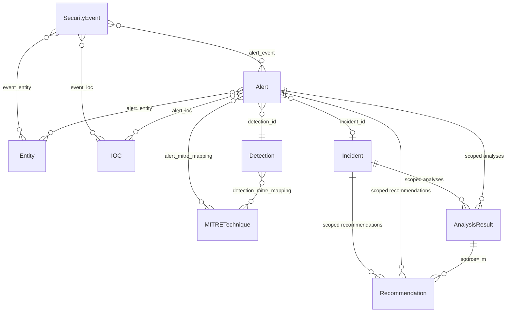

# SITA — Data & Contract Definitions

Companion to [TODO.md](../TODO.md). This document is the project's running data dictionary — the field-level source of truth for every schema and contract, written *before* the code that implements it, one section per phase. It's organized by phase in the order those phases were built, not by topic, so each section reflects what was actually decided at the time — later phases may refine earlier ones, and where that happens it's called out explicitly rather than silently overwritten.

- **Phase 1** (below): the core relational schema — every entity, its fields, and the relationships between them.
- **Phase 2** (below): the event ingestion contracts — the raw shape each of the 5 simulated event sources arrives in, the normalized shape they're mapped to, and the ingestion adapter/API contract.

---

# Phase 1: Core Data Model

## Conventions

- **Primary keys:** UUID (`uuid4`), stored as `UUID` in Postgres / `CHAR(36)` in SQLite via the SQLAlchemy type-decorator abstraction. Never expose auto-increment integers over the API.
- **Timestamps:** all `TIMESTAMP` fields are UTC, timezone-aware. Every table has `created_at`; tables representing mutable state also have `updated_at`.
- **Provenance tagging:** every table is one of two kinds, never mixed:
  - **Deterministic tables** — `SecurityEvent`, `Alert`, `Incident` (core fields), `IOC`, `Entity`, `Detection`, `MITRETechnique` (rule-sourced rows). Populated only by rule/code paths. No field on these tables is ever written from raw LLM output.
  - **AI-attributed tables** — `AnalysisResult`, and the `source='llm'` rows within `Recommendation` and the MITRE-mapping junction. Every row carries `provider`, `model`, `prompt_version`, so a reviewer can always answer "did a human-written rule or a model produce this?" from the row itself, not from context.
  - Where a deterministic table needs to display an AI-derived opinion alongside it (e.g., an LLM-suggested MITRE technique next to a rule-derived one), that opinion lives in its own row with `source` set accordingly — it is never merged into the deterministic row.
- **Enums** are implemented as Postgres/SQLite-portable `VARCHAR` + application-level `Enum` validation (not native Postgres enum types), so SQLite dev/test parity holds and enum values can be extended via code + migration without `ALTER TYPE` friction.
- **Junction tables** are used for all many-to-many relationships so that association metadata (e.g., how an IOC relates to an alert) has somewhere to live.

---

## 1. `SecurityEvent`

The atomic, normalized unit of observation. Every ingested event becomes exactly one row, regardless of source type.

| Field | Type | Nullable | Description |
|---|---|---|---|
| `id` | UUID | No | Primary key |
| `source_type` | Enum: `auth`, `endpoint`, `network`, `dns`, `web` | No | Which ingestion adapter normalized this event |
| `occurred_at` | TIMESTAMP | No | Event time as reported by the source (not ingestion time) |
| `ingested_at` | TIMESTAMP | No | When SITA received/normalized the event |
| `source_host` | VARCHAR | Yes | Hostname/identifier of the system that generated the raw log |
| `raw_payload` | JSONB / JSON | No | Original, untouched source record — preserved for audit/debug |
| `normalized` | JSONB / JSON | No | Source-agnostic normalized attributes (see per-source shape below) |
| `ingestion_batch_id` | UUID | Yes | Groups events ingested together (file import or streaming session) |
| `created_at` | TIMESTAMP | No | Row creation time |

**`normalized` shape by `source_type`** (stored as JSON rather than promoted to columns, per the [[event-schema-design]] open question in TODO.md — keeps the table stable while source-specific detail evolves):

- `auth`: `{ event_result: "success"|"failure", username, source_ip, dest_host, auth_method }`
- `endpoint`: `{ process_name, command_line, pid, parent_pid, parent_process_name, user }`
- `network`: `{ src_ip, src_port, dst_ip, dst_port, protocol, bytes_sent, bytes_received }`
- `dns`: `{ query_name, query_type, response_code, resolved_ips, resolver_ip }`
- `web`: `{ method, path, status_code, source_ip, user_agent, host }`

**Relationships**
- `SecurityEvent` ↔ `Entity` via `event_entity` junction (`event_id`, `entity_id`, `role` e.g. `source`/`target`/`actor`)
- `SecurityEvent` ↔ `Alert` via `alert_event` junction (an alert cites one or more triggering events)
- `SecurityEvent` ↔ `IOC` via `event_ioc` junction (IOCs extracted from this event)

**Indexes:** `(source_type, occurred_at)`, `occurred_at`, `ingestion_batch_id`

---

## 2. `Entity`

A referenceable actor or asset — the join point that makes correlation possible. Deduplicated by `(entity_type, identifier)`.

| Field | Type | Nullable | Description |
|---|---|---|---|
| `id` | UUID | No | Primary key |
| `entity_type` | Enum: `host`, `user`, `ip`, `domain` | No | What kind of actor/asset this is |
| `identifier` | VARCHAR | No | Canonical value (hostname, username, IP string, domain name) |
| `first_seen` | TIMESTAMP | No | Earliest event referencing this entity |
| `last_seen` | TIMESTAMP | No | Most recent event referencing this entity |
| `metadata` | JSONB / JSON | Yes | Optional enrichment (e.g., asset criticality tag, department) — manually curated, never LLM-written |
| `created_at` | TIMESTAMP | No | Row creation time |
| `updated_at` | TIMESTAMP | No | Last update time (bumped on `last_seen` change) |

**Constraints:** unique on `(entity_type, identifier)`

**Relationships:** referenced by `SecurityEvent`, `Alert`, and `IOC` (for `ip`/`domain`-typed entities) via junctions.

**Indexes:** `(entity_type, identifier)` (unique), `last_seen`

---

## 3. `Detection`

A deterministic rule *definition* — static metadata about a rule, distinct from any given firing.

| Field | Type | Nullable | Description |
|---|---|---|---|
| `id` | UUID | No | Primary key |
| `rule_key` | VARCHAR | No | Stable code identifier, e.g. `ssh_brute_force` (unique) |
| `name` | VARCHAR | No | Human-readable name |
| `description` | TEXT | No | What the rule detects and its logic in prose |
| `category` | Enum: `authentication`, `network`, `endpoint`, `web` | No | Broad grouping for the detection page UI |
| `default_severity` | Enum: `low`, `medium`, `high`, `critical` | No | Baseline severity before contextual scoring adjustments |
| `enabled` | BOOLEAN | No | Whether the rule is active in the pipeline |
| `config` | JSONB / JSON | Yes | Rule-specific tunables (thresholds, window sizes) |
| `created_at` | TIMESTAMP | No | Row creation time |

**Relationships**
- `Detection` ↔ `MITRETechnique` via `detection_mitre_mapping` junction (`detection_id`, `technique_id`) — the deterministic, rule-authored MITRE mapping described in Phase 8
- `Detection` → `Alert` one-to-many (a rule produces many alert instances over time)

**Indexes:** `rule_key` (unique), `category`

---

## 4. `Alert`

One instance of a detection rule firing (or, in the LLM-assisted-classification path, a classification event) — always traceable back to a `Detection` and the `SecurityEvent`s that triggered it.

| Field | Type | Nullable | Description |
|---|---|---|---|
| `id` | UUID | No | Primary key |
| `detection_id` | UUID (FK → `Detection.id`) | No | Which rule produced this alert |
| `incident_id` | UUID (FK → `Incident.id`) | Yes | Set once correlation assigns this alert to an incident |
| `severity` | Enum: `low`, `medium`, `high`, `critical` | No | Deterministically computed (see scoring factors below) |
| `confidence` | FLOAT (0.0–1.0) | No | Deterministic confidence the rule assigns to this firing |
| `status` | Enum: `new`, `investigating`, `resolved`, `false_positive` | No | Analyst-managed triage state |
| `rationale` | TEXT | No | Human-readable, rule-generated explanation (e.g., "14 failed logins from 10.0.0.5 to host `web01` in 5 minutes") |
| `severity_factors` | JSONB / JSON | No | Structured breakdown of what drove the severity score (rule criticality weight, asset sensitivity, volume/frequency) — the deterministic explanation `AnalysisResult` severity-explanation text (Phase 7) is generated *from* this, never in place of it |
| `first_event_at` | TIMESTAMP | No | Timestamp of earliest contributing event |
| `last_event_at` | TIMESTAMP | No | Timestamp of latest contributing event |
| `created_at` | TIMESTAMP | No | Row creation time |
| `updated_at` | TIMESTAMP | No | Last update time |

**Relationships**
- `Alert` ↔ `SecurityEvent` via `alert_event` junction
- `Alert` ↔ `Entity` via `alert_entity` junction (`role`: `source`/`target`/`actor`)
- `Alert` ↔ `IOC` via `alert_ioc` junction
- `Alert` ↔ `MITRETechnique` via `alert_mitre_mapping` junction — inherited from `Detection`'s static mapping at creation time, plus any distinct instance-specific evidence
- `Alert` → `Incident` many-to-one (nullable until correlated)

**Indexes:** `(detection_id, created_at)`, `incident_id`, `severity`, `status`

---

## 5. `Incident`

A correlated group of one or more alerts representing a single security narrative.

| Field | Type | Nullable | Description |
|---|---|---|---|
| `id` | UUID | No | Primary key |
| `title` | VARCHAR | No | Short human-readable title (deterministically templated, e.g. `"SSH brute force → {host}"`; may later be refined by an `AnalysisResult` summarization pass, tracked separately, not overwritten in place) |
| `status` | Enum: `open`, `investigating`, `contained`, `closed` | No | Analyst-managed lifecycle state |
| `severity` | Enum: `low`, `medium`, `high`, `critical` | No | Deterministic rollup — max (or weighted max) of constituent alert severities |
| `first_activity_at` | TIMESTAMP | No | Earliest contributing alert's `first_event_at` |
| `last_activity_at` | TIMESTAMP | No | Latest contributing alert's `last_event_at` |
| `correlation_method` | JSONB / JSON | No | Structured record of which correlation signals (time window, shared IP/user/host/domain/IOC/technique) justified each alert's membership — the deterministic explainability trail |
| `created_at` | TIMESTAMP | No | Row creation time |
| `updated_at` | TIMESTAMP | No | Last update time (bumped whenever a new alert is correlated in) |

**Relationships**
- `Incident` → `Alert` one-to-many
- `Incident` → `AnalysisResult` one-to-many (all AI triage output scoped to this incident)
- `Incident` → `Recommendation` one-to-many
- Entities/IOCs/MITRE techniques are derived (queried, not duplicated) via the incident's constituent alerts

**Indexes:** `status`, `severity`, `last_activity_at`

---

## 6. `IOC`

A validated indicator of compromise, deduplicated across every event/alert that references it.

| Field | Type | Nullable | Description |
|---|---|---|---|
| `id` | UUID | No | Primary key |
| `ioc_type` | Enum: `ipv4`, `ipv6`, `domain`, `url`, `file_hash_md5`, `file_hash_sha1`, `file_hash_sha256`, `email`, `username` | No | Indicator category |
| `value` | VARCHAR | No | The indicator itself, normalized (lowercased domains, canonical IP form) |
| `extraction_source` | Enum: `regex`, `llm_assisted` | No | Provenance of the extraction — never blended within one row |
| `validation_status` | Enum: `valid`, `invalid`, `unverified` | No | Result of deterministic format/range validation, applied even to `llm_assisted` extractions before they are trusted |
| `confidence` | FLOAT (0.0–1.0) | No | Deterministic confidence — refined in [DEF.md § Phase 4](#confidence-scale) into a graded per-strategy scale (structured field vs. free-text scan, and by IOC-type specificity) rather than a flat 1.0; a lower, rule-defined ceiling still applies to `llm_assisted` rows |
| `first_seen` | TIMESTAMP | No | Earliest event/alert referencing this IOC |
| `last_seen` | TIMESTAMP | No | Most recent event/alert referencing this IOC |
| `created_at` | TIMESTAMP | No | Row creation time |
| `updated_at` | TIMESTAMP | No | Last update time |

**Constraints:** unique on `(ioc_type, value)`

**Relationships**
- `IOC` ↔ `SecurityEvent` via `event_ioc` junction
- `IOC` ↔ `Alert` via `alert_ioc` junction

**Indexes:** `(ioc_type, value)` (unique), `ioc_type`, `last_seen`

---

## 7. `MITRETechnique`

Local, static representation of a relevant subset of MITRE ATT&CK — no runtime API dependency (Phase 8).

| Field | Type | Nullable | Description |
|---|---|---|---|
| `id` | UUID | No | Primary key |
| `technique_id` | VARCHAR | No | ATT&CK ID, e.g. `T1110.001` (unique) |
| `name` | VARCHAR | No | Technique name, e.g. "Password Guessing" |
| `tactic` | VARCHAR | No | Parent tactic, e.g. `credential-access` (ATT&CK short name) |
| `description` | TEXT | No | Vendored technique description |
| `dataset_version` | VARCHAR | No | Version/date of the vendored local ATT&CK snapshot this row came from |

**Relationships**
- `MITRETechnique` ↔ `Detection` via `detection_mitre_mapping` (deterministic, rule-authored)
- `MITRETechnique` ↔ `Alert` via `alert_mitre_mapping`, with a `source` column (`rule` | `llm`) and, for `llm` rows, a link to the originating `AnalysisResult` — this is how Phase 7's LLM-suggested techniques stay distinguishable from Phase 8's deterministic mapping

**Indexes:** `technique_id` (unique), `tactic`

---

## 8. `AnalysisResult`

The envelope for every piece of LLM output — the single place "AI said X" is recorded, so nothing downstream has to guess provenance.

| Field | Type | Nullable | Description |
|---|---|---|---|
| `id` | UUID | No | Primary key |
| `incident_id` | UUID (FK → `Incident.id`) | Yes | Scope, when the analysis targets an incident |
| `alert_id` | UUID (FK → `Alert.id`) | Yes | Scope, when the analysis targets a single alert (exactly one of `incident_id`/`alert_id` is set) |
| `task_type` | Enum: `incident_summary`, `severity_explanation`, `attack_classification`, `investigation_hypothesis`, `investigation_steps`, `mitre_suggestion` | No | Which Phase 7 triage task produced this |
| `provider` | VARCHAR | No | e.g. `ollama`, `mock` |
| `model` | VARCHAR | No | e.g. `llama3.1:8b-instruct` |
| `prompt_version` | VARCHAR | No | Version tag of the prompt template used |
| `raw_output` | TEXT | No | Unparsed model output, kept for debugging |
| `parsed_output` | JSONB / JSON | Yes | Output after schema validation; null if validation failed |
| `validation_status` | Enum: `valid`, `invalid`, `timeout`, `provider_error` | No | Outcome of the response-validation step (Phase 6) |
| `confidence` | FLOAT (0.0–1.0) | Yes | Only populated where derived deterministically (e.g., schema-validation success + agreement with rule-based signals) — never a raw self-reported LLM confidence, per the [[how-ai-confidence-represented]] decision in TODO.md |
| `latency_ms` | INTEGER | No | Call duration |
| `prompt_tokens` / `completion_tokens` | INTEGER | Yes | If exposed by the provider |
| `created_at` | TIMESTAMP | No | Row creation time |

**Relationships:** scoped to exactly one `Incident` or `Alert`; `alert_mitre_mapping` rows with `source='llm'` reference the `AnalysisResult` that produced them.

**Indexes:** `incident_id`, `alert_id`, `task_type`, `created_at`

---

## 9. `Recommendation`

A suggested next step, from either the deterministic rule layer or the LLM — kept in one table but always labeled by `source`.

| Field | Type | Nullable | Description |
|---|---|---|---|
| `id` | UUID | No | Primary key |
| `incident_id` | UUID (FK → `Incident.id`) | Yes | Scope, when tied to an incident |
| `alert_id` | UUID (FK → `Alert.id`) | Yes | Scope, when tied to a single alert |
| `source` | Enum: `rule_based`, `llm` | No | Provenance — determines UI treatment |
| `analysis_result_id` | UUID (FK → `AnalysisResult.id`) | Yes | Set when `source='llm'`, linking back to the generating call |
| `text` | TEXT | No | The recommendation itself |
| `priority` | Enum: `low`, `medium`, `high` | No | Suggested urgency |
| `status` | Enum: `open`, `acknowledged`, `dismissed`, `completed` | No | Analyst-managed lifecycle |
| `created_at` | TIMESTAMP | No | Row creation time |
| `updated_at` | TIMESTAMP | No | Last update time |

**Constraints:** `source='llm'` requires `analysis_result_id` set (application-level check, mirrored as a DB check constraint)

**Indexes:** `incident_id`, `alert_id`, `status`

---

## Entity-Relationship Overview



---

## Phase 1 Status: implemented

Phase 1 is complete. Everything defined above is implemented and verified:

- SQLAlchemy ORM models: `backend/app/models/` (one module per entity, plus `associations.py` for junction tables/objects, `enums.py`, `base.py` mixins)
- First Alembic migration: `backend/alembic/versions/6224f8f082fb_initial_schema.py` — applied and verified against **both** SQLite and a real Postgres container, with `alembic check` confirming no drift from the models
- Postgres/SQLite data-layer abstraction: `backend/app/db/session.py` + `backend/app/db/types.py` (the `JSONVariant` type — JSONB on Postgres, JSON elsewhere)
- Pydantic read/response schemas: `backend/app/schemas/` (one `*Read` schema per entity). Create/Update variants are deferred to Phase 9, when actual endpoints exist to consume them
- DB-level indexes: declared on the models per the index lists above, confirmed present in the migration and (for Postgres) via direct inspection
- Unit tests: `backend/tests/unit/test_models.py` and `test_schemas.py` — unique constraints, NOT NULL, FK integrity, and both check constraints (`AnalysisResult` single-scope, `Recommendation` LLM-provenance) all verified

One naming note: the `Entity.metadata` field described above is implemented as `Entity.entity_metadata` in code — `metadata` is a reserved attribute name on SQLAlchemy's declarative `Base` (it's the `MetaData` object), so it can't be reused as a column attribute.

See `TODO.md` Phase 1 for the itemized checklist.

---

# Phase 2: Event Ingestion

## Scope

Phase 1 defined `SecurityEvent` as the normalized, source-agnostic landing table (`source_type`, `occurred_at`, `raw_payload`, `normalized`, ...) but only sketched the per-source `normalized` shape loosely. Phase 2 finalizes that contract and adds everything upstream of it: what a raw simulated event looks like for each of the 5 source types, how it's validated and mapped into `SecurityEvent`, the two ways it can enter the system, and the format of the synthetic datasets used to exercise all of it. Every raw shape below is a **simulated** format designed for this project — not a copy of any real vendor's log schema — chosen to be realistic enough that the detection rules in Phase 3 have genuine signal to work with.

## Conventions

- **Transport format:** raw events are [JSON Lines](https://jsonlines.org/) (`.jsonl`) — one JSON object per line, UTF-8, no enclosing array. Chosen because it streams naturally (line-by-line parsing, no need to buffer a whole file to find the closing bracket) and because synthetic datasets are easiest to build by appending attack-pattern lines onto a benign baseline file.
- **Timestamps:** every raw record's `timestamp` field is an ISO 8601 UTC string (`...Z` suffix) — parsed into `SecurityEvent.occurred_at`.
- **Universal raw fields:** every raw record, regardless of source type, must include `timestamp` and `host`. These map to `SecurityEvent.occurred_at` and `SecurityEvent.source_host` respectively. Every other field is source-type-specific (below).
- **One source type per file/request:** a raw ingestion file or REST request body contains records of exactly one `source_type`. A scenario that spans multiple source types (e.g., an attack that touches auth, endpoint, and network logs) is represented as multiple single-source-type files ingested separately — see Synthetic Dataset Design below — not as one mixed file. This keeps each adapter's validation logic single-purpose.
- **`raw_payload` is preserved verbatim.** Whatever JSON object a source produces is stored byte-for-byte (as parsed JSON) in `SecurityEvent.raw_payload`, even after normalization — so nothing is ever lost between what was ingested and what the normalized view claims it means.

## 1. Raw Event Contracts

The input format each ingestion adapter accepts, before any normalization.

### `auth`

| Field | Type | Required | Description |
|---|---|---|---|
| `timestamp` | string (ISO 8601 UTC) | Yes | When the auth attempt occurred |
| `host` | string | Yes | System that generated the log (the auth service's host) |
| `event_result` | `"success"` \| `"failure"` | Yes | Outcome of the attempt |
| `username` | string | Yes | Account name used in the attempt |
| `source_ip` | string | Yes | Origin IP of the attempt |
| `auth_method` | `"password"` \| `"publickey"` \| `"mfa"` | Yes | Authentication mechanism |
| `service` | string | No | Originating service, e.g. `sshd`, `rdp`, `webapp-login` |

```json
{"timestamp": "2026-01-15T03:12:07Z", "host": "web01.internal", "event_result": "failure", "username": "root", "source_ip": "203.0.113.7", "auth_method": "password", "service": "sshd"}
```

### `endpoint`

| Field | Type | Required | Description |
|---|---|---|---|
| `timestamp` | string (ISO 8601 UTC) | Yes | When the process event occurred |
| `host` | string | Yes | Endpoint the process ran on |
| `process_name` | string | Yes | Executable name |
| `command_line` | string | Yes | Full command line, as launched |
| `pid` | integer | Yes | Process ID |
| `parent_pid` | integer | No | Parent process ID |
| `parent_process_name` | string | No | Parent executable name |
| `user` | string | Yes | Account the process ran under |

```json
{"timestamp": "2026-01-15T03:14:52Z", "host": "ws-12.internal", "process_name": "powershell.exe", "command_line": "powershell -enc SQBFAFgA...", "pid": 4821, "parent_pid": 3312, "parent_process_name": "explorer.exe", "user": "jdoe"}
```

### `network`

| Field | Type | Required | Description |
|---|---|---|---|
| `timestamp` | string (ISO 8601 UTC) | Yes | When the connection was observed |
| `host` | string | Yes | Sensor/host that logged the connection (e.g., a firewall or the endpoint itself) |
| `src_ip` | string | Yes | Source IP of the connection |
| `src_port` | integer | Yes | Source port |
| `dst_ip` | string | Yes | Destination IP |
| `dst_port` | integer | Yes | Destination port |
| `protocol` | `"tcp"` \| `"udp"` \| `"icmp"` | Yes | Transport protocol |
| `bytes_sent` | integer | No | Bytes sent, source → destination |
| `bytes_received` | integer | No | Bytes received, destination → source |

```json
{"timestamp": "2026-01-15T03:16:00Z", "host": "ws-12.internal", "src_ip": "10.0.0.12", "src_port": 51422, "dst_ip": "10.0.0.5", "dst_port": 22, "protocol": "tcp", "bytes_sent": 1200, "bytes_received": 340}
```

### `dns`

| Field | Type | Required | Description |
|---|---|---|---|
| `timestamp` | string (ISO 8601 UTC) | Yes | When the query was resolved |
| `host` | string | Yes | Resolver/sensor host that logged the query |
| `query_name` | string | Yes | Domain queried |
| `query_type` | `"A"` \| `"AAAA"` \| `"CNAME"` \| `"TXT"` \| `"MX"` \| `"NS"` | Yes | DNS record type requested |
| `response_code` | `"NOERROR"` \| `"NXDOMAIN"` \| `"SERVFAIL"` \| `"REFUSED"` | Yes | Resolution outcome |
| `resolved_ips` | array of string | No | IPs returned (empty/absent on failure) |
| `resolver_ip` | string | Yes | IP of the resolver that served the query |

```json
{"timestamp": "2026-01-15T03:16:30Z", "host": "dns01.internal", "query_name": "cdn-update-service.example", "query_type": "A", "response_code": "NOERROR", "resolved_ips": ["198.51.100.23"], "resolver_ip": "10.0.0.2"}
```

### `web`

| Field | Type | Required | Description |
|---|---|---|---|
| `timestamp` | string (ISO 8601 UTC) | Yes | When the request was served |
| `host` | string | Yes | Server that logged the request |
| `method` | `"GET"` \| `"POST"` \| `"PUT"` \| `"DELETE"` \| `"HEAD"` \| `"OPTIONS"` | Yes | HTTP method |
| `path` | string | Yes | Request path (query string included, if any) |
| `status_code` | integer | Yes | HTTP response status |
| `source_ip` | string | Yes | Client IP |
| `user_agent` | string | No | Client `User-Agent` header |

```json
{"timestamp": "2026-01-15T03:20:11Z", "host": "web01.internal", "method": "GET", "path": "/admin/login.php?id=1' OR '1'='1", "status_code": 401, "source_ip": "203.0.113.7", "user_agent": "curl/7.68.0"}
```

## 2. Normalized Shape (`SecurityEvent.normalized`) — finalized

This finalizes the sketch from the Phase 1 `SecurityEvent` section. For every source type, this is exactly what `normalized` contains after adapter mapping — the canonical reference for anything downstream (detection rules in Phase 3, IOC extraction in Phase 4) that reads `SecurityEvent.normalized` instead of re-parsing `raw_payload`.

| `source_type` | `normalized` fields |
|---|---|
| `auth` | `event_result`, `username`, `source_ip`, `dest_host`, `auth_method` |
| `endpoint` | `process_name`, `command_line`, `pid`, `parent_pid`, `parent_process_name`, `user` |
| `network` | `src_ip`, `src_port`, `dst_ip`, `dst_port`, `protocol`, `bytes_sent`, `bytes_received` |
| `dns` | `query_name`, `query_type`, `response_code`, `resolved_ips`, `resolver_ip` |
| `web` | `method`, `path`, `status_code`, `source_ip`, `user_agent`, `host` |

Mapping notes:
- `auth.dest_host` is the raw record's `host` field, renamed on the way into `normalized` — `SecurityEvent.source_host` already captures "which system produced this log," so `dest_host` inside `normalized` specifically means "which host the authentication attempt targeted," which happens to be the same value for these simulated logs but is named for its semantic role, not its literal source.
- `web.host` is intentionally still present inside `normalized` even though `SecurityEvent.source_host` also captures it — for web logs specifically, `source_host` is "which server produced this log entry" and `normalized.host` is "which virtual host / server the request was addressed to." They're the same value in every simulated dataset here (no load balancer/vhost fan-out modeled), but the fields are kept semantically distinct rather than collapsed, since a real deployment would have load-balanced web logs where they diverge.
- Optional raw fields not present in the source record are omitted from `normalized` rather than written as explicit `null` — keeps IOC extraction (Phase 4) and detection rules (Phase 3) able to use plain `dict.get(...)` / "key absent" checks without a null-vs-missing distinction to handle.

## 3. Ingestion Adapter Interface

One adapter per source type, all conforming to the same shape:

```python
class IngestionAdapter(Protocol):
    source_type: SourceType

    def parse(self, raw: dict) -> ParsedEvent | IngestionError:
        """Validate one raw record and map it to the normalized shape.
        Never raises for a malformed record — returns an IngestionError
        instead, so one bad record in a batch never aborts the rest."""
```

`ParsedEvent` (a Pydantic schema, `app/schemas/ingestion.py`) is the adapter's output — an in-memory representation ready to become a `SecurityEvent` row, not yet persisted:

| Field | Type | Description |
|---|---|---|
| `source_type` | `SourceType` | Echoed from the adapter |
| `occurred_at` | `datetime` | Parsed from raw `timestamp` |
| `source_host` | `str` | Copied from raw `host` |
| `raw_payload` | `dict` | The raw record, verbatim |
| `normalized` | `dict` | Mapped per the table in §2 |

`IngestionError` carries enough to build the rejection report in §5: `{ reason: str, field: str | None }`.

**Adapter responsibility boundary:** an adapter validates *shape* (required fields present, correct type, enum values within the allowed set) — it does **not** perform semantic/threat validation. Whether `203.0.113.7` is a known-bad IP is an IOC/detection question (Phases 3–4), not an ingestion question. Ingestion's only job is "is this a well-formed `auth` record," not "is this a suspicious one."

## 4. Ingestion Pathways

Two ways a raw event reaches `SecurityEvent`, both producing the same `IngestionReport`:

```
IngestionReport = {
  batch_id: UUID | null,
  source_type: SourceType,
  total: int,
  accepted: int,
  rejected: int,
  errors: [{ index: int, reason: str, field: str | null }]
}
```

### Batch file import

- Accepts a `.jsonl` file, all records the same declared `source_type`.
- Every accepted record in the file is stamped with the same newly-generated `ingestion_batch_id`, so an entire import can be queried, audited, or (in principle) rolled back as a unit.
- Each line is parsed and validated independently; one malformed line is recorded as a rejection and does not stop the rest of the file from being ingested. `errors[].index` is the 1-based line number.

### `POST /api/v1/events/{source_type}` (REST streaming)

- Body: a single raw event object, or a JSON array of raw event objects — all matching the `source_type` path parameter.
- No `ingestion_batch_id` is assigned (stays `null`) — this path is for individual/streamed events, not a bulk import, matching `SecurityEvent.ingestion_batch_id` being nullable per Phase 1. `errors[].index` is the array index (`0` for a single-object body).
- Scope note: this is a narrow, write-only ingestion endpoint. The broader queryable REST surface (`GET` with pagination/filtering/sorting across events, alerts, incidents, IOCs, etc.) is Phase 9's responsibility — this endpoint exists only to get raw events into the system, not to read them back out.

## 5. Validation & Rejection

- A record is rejected — never silently dropped — when: `timestamp` is missing or unparseable, `host` is missing, or any source-type-required field from §1 is missing or fails its declared type/enum check.
- Every rejection is recorded in `IngestionReport.errors` with a specific, actionable reason (e.g., `"missing required field: event_result"`, not a generic "invalid record").
- Ingestion never raises an unhandled exception because of one malformed record — a bad line in a 10,000-line file still leaves the other 9,999 ingested, with the one failure reported precisely.

## 6. Synthetic Dataset Design

**Location:** `data/synthetic_events/`

**Layout:**

```
data/synthetic_events/
├── auth/
│   ├── benign.jsonl
│   └── brute_force.jsonl
├── endpoint/
│   ├── benign.jsonl
│   └── suspicious_powershell.jsonl
├── network/
│   ├── benign.jsonl
│   └── port_scan.jsonl
├── dns/
│   ├── benign.jsonl
│   └── suspicious_domain.jsonl
├── web/
│   ├── benign.jsonl
│   └── suspicious_requests.jsonl
└── scenarios/
    └── brute_force_to_lateral_movement/
        ├── auth.jsonl
        ├── endpoint.jsonl
        ├── network.jsonl
        ├── dns.jsonl
        └── README.md
```

- Each per-source-type folder has a `benign.jsonl` baseline (normal traffic, used to check detection rules *don't* false-positive on ordinary activity) plus one or more attack-pattern files exercising a specific Phase 3 detection rule in isolation.
- `scenarios/` holds multi-stage datasets spanning several source types, meant to be ingested together and then run through the full pipeline (detection → correlation → MITRE mapping) as an end-to-end demo. Each scenario's `README.md` narrates the storyline and lists which Phase 3 detections and Phase 8 MITRE techniques it's meant to exercise, so it can later double as a Phase 12 evaluation fixture with a known expected outcome.
- **First planned scenario — `brute_force_to_lateral_movement`:** SSH brute force against `web01` (`auth`), an eventual successful login (`auth`), a suspicious PowerShell download-and-execute on the compromised host (`endpoint`), an internal port scan launched from that host (`network`), and a suspicious outbound DNS query to a C2-pattern domain (`dns`). Chosen specifically because it's the same scenario referenced in Phase 5's correlation design goal ("reconstructs the multi-stage attack scenario as a single incident, not scattered alerts") — the dataset and the correlation test target are the same story, by design.

## Phase 2 Status: implemented

Everything above is implemented and verified, matching the specification exactly:

- 5 ingestion adapters: `backend/app/ingestion/{auth,endpoint,network,dns,web}.py`, sharing the universal timestamp/host validation and the `normalize()` contract from `backend/app/ingestion/base.py`
- `ParsedEvent` / `IngestionReportError` / `IngestionReport` as real Pydantic schemas: `backend/app/schemas/ingestion.py`
- Both ingestion pathways: the CLI batch importer (`backend/app/ingestion/cli.py`) and `POST /api/v1/events/{source_type}` (`backend/app/api/events.py`), both calling the same `ingest_records()` service (`backend/app/ingestion/service.py`)
- Synthetic datasets: `data/synthetic_events/` — a `benign.jsonl` plus at least one attack-pattern file per source type, and the `scenarios/brute_force_to_lateral_movement/` multi-stage scenario with its narrative README
- Tests: `backend/tests/unit/test_ingestion_adapters.py`, `test_ingestion_service.py`, `test_ingestion_cli.py`, and `backend/tests/integration/test_events_api.py` + `test_synthetic_datasets.py` (the latter loads and validates every real dataset file, not synthetic fixtures written just for the test)

See [Documentation/PHASE-2.md](PHASE-2.md) for the full narrative — what was built, how it connects, and why each decision was made — and `TODO.md` Phase 2 for the itemized checklist.

---

# Phase 3: Detection Engine

## Scope

Deterministic rules that read `SecurityEvent` rows (Phase 2's output) and produce `Alert` rows (Phase 1's schema) — the system's ground truth, with no LLM involved anywhere in this phase. This section defines the rule engine interface, the severity-scoring formula, the contract for all 7 required rules, the (deliberately stubbed) geolocation dependency the impossible-travel rule needs, and the execution pipeline/CLI contract — all written before the rule code that implements them.

## Rule Engine Interface

```python
@dataclass
class RuleFinding:
    matched_event_ids: list[uuid.UUID]
    severity: Severity
    confidence: float          # 0.0–1.0, this rule's own confidence in this specific firing
    rationale: str              # human-readable, cites the actual matched values
    severity_factors: dict       # structured breakdown feeding the severity score (see below)
    first_event_at: datetime
    last_event_at: datetime

class DetectionRule(ABC):
    rule_key: ClassVar[str]                     # stable identifier, matches Detection.rule_key
    name: ClassVar[str]
    description: ClassVar[str]
    category: ClassVar[DetectionCategory]
    default_severity: ClassVar[Severity]         # baseline before volume-based adjustment
    source_types: ClassVar[tuple[SourceType, ...]]  # which SecurityEvent.source_type values this rule needs
    default_config: ClassVar[dict]               # tunables (thresholds, window sizes) — mirrors Detection.config

    def evaluate(self, db: Session, events: Sequence[SecurityEvent], config: dict) -> list[RuleFinding]:
        """`events` is every persisted SecurityEvent whose source_type is in
        `source_types` (and, if the pipeline was given a `since` cutoff, whose
        occurred_at >= since) — already loaded, ordered by occurred_at. `config`
        is this rule's Detection.config from the database, falling back to
        default_config if unset. `db` is available for rules that need
        historical context beyond the candidate window (see suspicious auth
        patterns and impossible travel below) — evaluate() may issue its own
        additional read queries.
        """
```

Each `RuleFinding` becomes exactly one `Alert` row: `detection_id` from the rule's `Detection` row (looked up by `rule_key`), `severity`/`confidence`/`rationale`/`severity_factors`/`first_event_at`/`last_event_at` copied directly, and `matched_event_ids` linked via the `alert_event` junction. `Alert.incident_id` is left `NULL` (Phase 5 sets it) and `Alert.status` defaults to `new`.

## Deterministic Severity Scoring

A rule's `default_severity` is a *baseline*, not the final answer — the actual severity is computed from a small weighted formula so two firings of the same rule can land at different severities depending on how far over threshold they are:

```
rule_weight        = { low: 0.25, medium: 0.5, high: 0.75, critical: 1.0 }[default_severity]
volume_ratio        = matched_count / config_threshold        (how many multiples over the minimum)
volume_factor       = min(0.3, 0.05 * volume_ratio)             (capped bonus, never dominates the base weight)
asset_sensitivity   = 0.0                                        (no asset-criticality data exists yet — reserved field, see Open Questions)
score               = min(1.0, rule_weight + volume_factor + asset_sensitivity)

severity =
  critical  if score >= 0.90
  high      if score >= 0.70
  medium    if score >= 0.45
  low       otherwise
```

`severity_factors` on every `Alert` stores `{rule_weight, volume_factor, asset_sensitivity, score}` — so the *deterministic* severity is fully reconstructable from the stored row, independent of any later Phase 7 LLM severity *explanation* (which explains this score in prose, but never computes it).

## The 7 Rules

| `rule_key` | Category | Source types | Grouping | Default config | Default severity |
|---|---|---|---|---|---|
| `ssh_brute_force` | authentication | `auth` | `(source_ip, dest_host)` among `event_result=failure` | `failure_threshold=10`, `window_seconds=300` | high (→ critical if a same-group success follows within `window_seconds`) |
| `password_spraying` | authentication | `auth` | `source_ip` alone, across distinct usernames | `distinct_username_threshold=5`, `max_attempts_per_username=3`, `window_seconds=600` | high |
| `suspicious_auth_pattern` | authentication | `auth` | per-event, with a DB history lookup | `off_hours_start=0`, `off_hours_end=5` (UTC) | medium |
| `port_scanning` | network | `network` | `src_ip` alone, across distinct `dst_port` | `distinct_port_threshold=6`, `window_seconds=60` | medium |
| `suspicious_powershell` | endpoint | `endpoint` | per-event, regex over `command_line` | indicator pattern list (below) | high |
| `impossible_travel` | authentication | `auth` | `username`, consecutive successful logins | `max_plausible_speed_kmh=900` | high |
| `repeated_auth_failures` | authentication | `auth` | `dest_host` alone, across distinct `source_ip` | `failure_threshold=20`, `distinct_source_ip_minimum=3`, `window_seconds=900` | medium |

Notes on the two rules whose grouping is easy to confuse with `ssh_brute_force`:

- **`password_spraying`** groups by source IP *only* (many usernames, few attempts each) — the opposite shape from `ssh_brute_force`, which groups by (source IP, target host) and expects *repeated* attempts against the *same* target.
- **`repeated_auth_failures`** groups by destination host *only*, explicitly requiring failures from **at least 3 distinct source IPs** — this is what keeps it from just re-detecting the same thing `ssh_brute_force` already catches (a single noisy source); it exists to catch distributed/credential-stuffing-style noise that no single-source rule would cross threshold on.

### `suspicious_auth_pattern` — two sub-checks

1. **Off-hours login**: a successful auth whose `occurred_at` hour (UTC) falls within `[off_hours_start, off_hours_end]`.
2. **New source IP for a known user**: a successful auth from `(username, source_ip)` where `username` has at least one *earlier* successful auth in the database from a *different* `source_ip` (i.e., not simply the user's first login ever — an actual IP change for an established user). This is the one rule beyond `impossible_travel` that reads history via `db` rather than only the candidate window.

Both sub-checks produce independent, single-event `RuleFinding`s (an event can trigger one, both, or neither).

### `suspicious_powershell` — indicator patterns

Flags `endpoint` events where `process_name` contains `powershell` and `command_line` matches one or more of: encoded-command flags (`-enc`, `-encodedcommand`, `-e ` short form), hidden-window flags (`-w hidden`, `-windowstyle hidden`), execution-policy bypass (`-ep bypass`, `-executionpolicy bypass`), or download-cradle patterns (`downloadstring`, `downloadfile`, `iex`, `invoke-expression`, `net.webclient`, `invoke-webrequest`). Confidence scales with the number of distinct indicator categories matched (`0.5` base + `0.15` per additional category beyond the first, capped at `0.95`) — one matched flag is suspicious, several together are close to conclusive.

### `impossible_travel` and the GeoIP dependency

Real impossible-travel detection needs an IP → geographic location resolver. This project has no real GeoIP database or paid geolocation API (and won't add one as a required dependency, per the project's "no paid APIs" rule). The rule is implemented against a small interface instead:

```python
class GeoIPResolver(ABC):
    def resolve(self, ip: str) -> GeoLocation | None: ...

@dataclass
class GeoLocation:
    latitude: float
    longitude: float
    label: str   # human-readable region name, for the alert rationale
```

`StaticGeoIPResolver` is the only implementation for now: a small hardcoded table covering the IP addresses that actually appear in this project's synthetic datasets (internal `10.0.0.x` addresses resolve to a single "local office" location; specific external test IPs resolve to fictional-but-fixed distant regions). This is a **known, explicit stub** — see the `[[geoip-resolver-stub]]` entry in `TODO.md`'s Architecture Decisions / Open Questions — not a real geolocation capability. For two consecutive successful logins by the same user where both IPs resolve to a known location, the rule computes great-circle (haversine) distance and required travel speed; if speed exceeds `max_plausible_speed_kmh` and the locations differ, it fires. Logins from unresolvable IPs never trigger this rule (silently skipped, not treated as suspicious by omission).

## Execution Pipeline & CLI

```python
def run_detection(db: Session, since: datetime | None = None) -> DetectionRunReport:
    """Ensures the 7 Detection rows exist (idempotent upsert by rule_key),
    then for each enabled rule: loads matching SecurityEvents (source_type
    filter, optional occurred_at >= since), calls rule.evaluate(), and
    persists one Alert per RuleFinding. Does not commit — caller-owned
    transaction, same convention as Phase 2's ingest_records().
    """

class DetectionRunReport(BaseModel):
    since: datetime | None
    rules_run: int
    alerts_created: int
    alerts_by_rule: dict[str, int]
```

No REST endpoint is added in this phase — deliberately. Phase 9 owns the general REST API surface (including whatever trigger-the-pipeline endpoint TODO.md's Phase 9 task list already anticipates); adding one now would duplicate that later. The pipeline is invoked via a CLI (`uv run python -m app.detection.cli [--since ISO8601]`), matching Phase 2's ingestion CLI pattern, and via the plain `run_detection()` function directly from tests.

**Known limitation, stated plainly**: `run_detection()` does not deduplicate — re-running it over a time range that was already processed creates duplicate `Alert` rows for the same underlying events. `since` lets a caller scope a run to only-new data, but avoiding overlap is the caller's responsibility. True idempotent re-runs (a fingerprint-based dedup) are deferred rather than solved with a rushed heuristic; tracked as `[[detection-run-idempotency]]` in `TODO.md`'s Architecture Decisions / Open Questions.

## Dataset additions

Four new files under `data/synthetic_events/auth/`, each built to cross exactly one rule's threshold and stay under every other rule's:

- `password_spraying.jsonl` — one source IP, 6 distinct usernames, 1–2 attempts each, against one host, within minutes.
- `suspicious_pattern.jsonl` — one off-hours (UTC 02:xx) successful login, plus a successful login from a new IP for a user with an established prior IP.
- `impossible_travel.jsonl` — one username, two successful logins ~8 minutes apart from IPs mapped to distant `StaticGeoIPResolver` regions.
- `distributed_failures.jsonl` — one destination host, failures from ≥3 distinct source IPs, aggregate count over threshold, no single source IP anywhere near the brute-force threshold on its own.

## Phase 3 Status: implemented

Everything above is implemented and verified, matching the specification exactly:

- Rule engine: `backend/app/detection/base.py` (`DetectionRule`, `RuleFinding`, `score_severity`), `backend/app/detection/windowing.py` (shared sliding-window helper)
- All 7 rules: `backend/app/detection/{ssh_brute_force,password_spraying,suspicious_auth_pattern,port_scanning,suspicious_powershell,impossible_travel,repeated_auth_failures}.py`
- GeoIP stub: `backend/app/detection/geoip.py` (`GeoIPResolver`, `StaticGeoIPResolver`, haversine distance) — confirmed as a known limitation, not a real capability
- Pipeline & seeding: `backend/app/detection/pipeline.py` (`run_detection`), `backend/app/detection/seed.py` (`ensure_detections_seeded`), `backend/app/detection/registry.py`
- CLI: `backend/app/detection/cli.py` (`uv run python -m app.detection.cli [--since ...]`)
- `DetectionRunReport` schema: `backend/app/schemas/detection_run.py`
- 4 new synthetic datasets: `data/synthetic_events/auth/{password_spraying,suspicious_pattern,impossible_travel,distributed_failures}.jsonl`
- Tests: `backend/tests/unit/test_detection_rules.py` (24 cases across all 7 rules, true-positive + boundary true-negative), `test_detection_seed.py`, `test_detection_pipeline.py`, `test_detection_cli.py`, and `backend/tests/integration/test_detection_against_datasets.py` (runs the real pipeline against the real checked-in datasets — every attack-pattern file triggers its intended rule, every benign file triggers nothing, the Phase 2 scenario triggers all 3 rules it touches)

Verified against both SQLite and a live Postgres container — `severity_factors` (JSONB) and the `alert_event` junction both confirmed correct via direct `psql` inspection, not just application-level assertions.

One deliberate, documented gap: Phase 3 has no REST endpoint (see "Execution Pipeline & CLI" above), so it has no live-checkable HTTP surface. The frontend build-status dashboard (see [FRONTEND.md](FRONTEND.md)) shows it as a static green "Implemented" — distinct from the live-verified green "Working" used for Phases 0–2 — asserted from this phase's own test suite and report rather than checked at runtime, since there's nothing to check yet. It will switch to a live "Working" check once Phase 9 exposes alerts over the API.

See [Documentation/PHASE-3.md](PHASE-3.md) for the full narrative and `TODO.md` Phase 3 for the itemized checklist.

---

# Phase 4: IOC Extraction

## Scope

Deterministic extraction of indicators of compromise from `SecurityEvent` rows into the `IOC` table Phase 1 already built, deduplicated by `(ioc_type, value)`, linked back to their source events (and, transitively, the alerts those events belong to). No LLM involvement in this phase — the `[STRETCH]` LLM-assisted extraction task from `TODO.md` is not implemented; see the status note at the end of this section.

## Two extraction strategies, not one

Every `SecurityEvent.normalized` field either **is** a structured indicator already (e.g. `auth.source_ip` — the ingestion adapter already put a value there specifically because it's an IP) or **might contain** one embedded in free text (e.g. `endpoint.command_line`, `web.path`). Treating both cases the same way — regex-scanning everything, including fields that are already typed — would be both wasteful and less accurate than just trusting a field's known meaning. So extraction uses two distinct strategies per normalized field, declared explicitly per source type rather than inferred:

| `source_type` | Field | Strategy | Extracts |
|---|---|---|---|
| `auth` | `source_ip` | field (`ip`) | `ipv4` or `ipv6`, classified by `ipaddress.ip_address()` |
| `auth` | `username` | field (`username`) | `username` |
| `endpoint` | `command_line` | scan | any of `ipv4`, `ipv6`, `domain`, `url`, `file_hash_*`, `email` found embedded in the text |
| `endpoint` | `user` | field (`username`) | `username` |
| `network` | `src_ip`, `dst_ip` | field (`ip`) | `ipv4` or `ipv6` |
| `dns` | `query_name` | field (`domain`) | `domain` |
| `dns` | `resolved_ips` | field (`ip_list`) | one `ipv4`/`ipv6` per list entry |
| `web` | `source_ip` | field (`ip`) | `ipv4` or `ipv6` |
| `web` | `path` | scan | any embedded indicator, same as `command_line` |

Fields not listed (`dest_host`, `host`, `process_name`, `parent_process_name`, `protocol`, `status_code`, `user_agent`, `event_result`, `auth_method`, `response_code`, `query_type`, `method`) are never scanned — they're either not IOC-shaped or (in the case of `dest_host`/`host`) represent an `Entity`, not an `IOC`, per the Phase 1 schema's own type distinction. **Usernames are never extracted from free text** — only from the two fields explicitly known to carry them (`auth.username`, `endpoint.user`) — because a regex cannot distinguish "this word is a username" from "this word is any other word." This mirrors the `[HIGH VALUE]`-flagged design intent already stated in `TODO.md`'s Phase 4 task list.

## Regex extractors (the `scan` strategy)

Each of the 6 scan-eligible types has its own small extractor: match a pattern, then apply a semantic validity check before accepting the candidate. None of them run against `username`, since that's field-only.

- **`ipv4`** — standard dotted-quad regex, validated via `ipaddress.IPv4Address`. **Private, loopback, link-local, and reserved addresses are filtered out entirely** when found via free-text scanning — they're overwhelmingly noise in that context (version strings, unrelated internal references) and the structured `ip` field strategy already captures every internal IP that actually matters for correlation (Phase 5). This is the concrete meaning of `TODO.md`'s "reject private/reserved ranges where relevant to context": the *context* is exactly what determines whether a private IP is trusted (structured field: yes, embedded in arbitrary text: no).
- **`ipv6`** — same shape, via `ipaddress.IPv6Address`, same private/reserved filtering.
- **`domain`** — a label-dot-label…-TLD pattern, validated by per-label length (1–63 chars) and a final TLD segment that is alphabetic-only (this is also what naturally excludes dotted-quad IPs from ever matching as a "domain" — a numeric last segment fails the TLD check). Two exclusion lists apply: special-use/reserved TLDs from RFC 2606 / RFC 6762 (`.internal`, `.local`, `.test`, `.invalid`, `.localhost`) — these aren't indicators of anything, they're reserved non-routable names, the same "reject the non-signal" principle applied to IPs above — and a small denylist of common file extensions (`.exe`, `.bin`, `.dll`, `.json`, …), because "payload.bin" and "powershell.exe" both otherwise match the same label.TLD shape as a real domain once they appear in a Windows path or URL fragment inside free text. **`.example` is deliberately *not* in the reserved-TLD exclusion list** despite being RFC 2606-reserved: this project's own synthetic datasets use `.example` throughout, per that same RFC's convention, to represent externally-hosted malicious domains without pointing at a real one (e.g. Phase 2's `cdn-update-service.example`) — filtering it out would make Phase 4 unable to detect exactly the kind of domain its own fixtures are built to represent.
- **`url`** — `scheme://...` pattern (`http`, `https`, `ftp`), validated via `urllib.parse.urlparse` requiring both a scheme and a netloc.
- **`file_hash_md5` / `file_hash_sha1` / `file_hash_sha256`** — one regex, classified by matched length: exactly 32 hex chars → MD5, 40 → SHA1, 64 → SHA256, all word-boundary bounded so a match can't be a substring of a longer hex blob.
- **`email`** — standard `local@domain` shape, validated by requiring the domain part to contain at least one dot.

## Confidence scale

Refines Phase 1's original flat "1.0 for regex-matched + validated" into a scale that actually reflects how certain each extraction path is:

| Extraction path | Confidence |
|---|---|
| Field strategy (`ip`, `domain`, `username`, `ip_list`) | `1.0` — the source field's own meaning already guarantees what this value is |
| Scan: `file_hash_*` | `0.9` — a 32/40/64-char hex string is extremely unlikely to be anything else |
| Scan: `url` | `0.85` |
| Scan: `email` | `0.85` |
| Scan: `ipv4` / `ipv6` | `0.7` |
| Scan: `domain` | `0.6` — the highest false-positive risk of the scan types (plausible-looking dotted strings appear in more contexts than the others) |

All values are deterministic constants, not computed from any model — `ExtractionSource` is always `regex` for everything this phase produces (`llm_assisted` stays reserved for the unimplemented stretch goal).

## Deduplication, linking, and the two-pass pipeline

```python
def run_ioc_extraction(db: Session, since: datetime | None = None) -> IOCExtractionReport:
    """Pass 1: for every SecurityEvent (optionally occurred_at >= since),
    extract candidates, upsert into IOC by (ioc_type, value) — updating
    first_seen/last_seen on an existing row, inserting a new one otherwise —
    and link event_ioc if not already linked.

    Pass 2: for every Alert, union the IOCs already linked to its matched
    events into alert_ioc. Runs over *all* alerts every call (not scoped by
    `since`), so it self-heals regardless of whether extraction or detection
    ran first — see the ordering note below.
    """
```

**Recommended pipeline order**: ingest → detect (Phase 3) → extract IOCs. Running extraction before detection still populates `event_ioc` correctly, but `alert_ioc` will be empty for alerts that don't exist yet — running extraction again after detection (cheap, since pass 1 is idempotent per `(ioc_type, value)` dedup) fully backfills `alert_ioc` at that point. This is the same "re-running is safe but ordering matters for completeness" shape Phase 3's pipeline already has, not a new kind of limitation.

```python
class IOCExtractionReport(BaseModel):
    since: datetime | None
    events_scanned: int
    iocs_created: int
    iocs_updated: int
    event_links_created: int
    alert_links_created: int
    iocs_by_type: dict[str, int]
```

No REST endpoint in this phase either, for the same reason as Phase 3: Phase 9 owns the API surface. Triggered via `uv run python -m app.ioc.cli [--since ...]`, or `run_ioc_extraction()` directly from tests.

## Dataset additions

Existing Phase 2/3 datasets already exercise `ipv4` and `username` (extensively, via `auth.source_ip`/`username` and `network.src_ip`/`dst_ip`) and `domain` (via `dns.query_name`). Three new files close the remaining gaps:

- `data/synthetic_events/network/ipv6_traffic.jsonl` — no existing dataset has a single IPv6 address; this adds a small benign IPv6 conversation.
- `data/synthetic_events/endpoint/ioc_rich_activity.jsonl` — realistic incident-response-style commands (a download via `Invoke-WebRequest` embedding an IPv4 and a URL; a `Get-FileHash` comparison embedding a SHA256 literal) — exercises `url` and `file_hash_sha256` extraction from `command_line`.
- `data/synthetic_events/web/ioc_rich_requests.jsonl` — a password-reset path embedding an email address, and an open-redirect-style path embedding a full external URL — exercises `email` and `url` extraction from `path`.

New files rather than edits to Phase 2/3's existing fixtures, so their already-verified detection-rule behavior (Phase 3) can't be disturbed by IOC-focused additions.

## Phase 4 Status: implemented

Everything above is implemented and verified, matching the specification exactly (including the two refinements — the confidence scale and the `.example`/file-extension exclusion rules — made explicit above rather than silently diverging from Phase 1's original flat-1.0 sketch):

- 6 regex extractors: `backend/app/ioc/{ipv4,ipv6,domain,url,file_hash,email}.py`; field-only `backend/app/ioc/username.py`
- Field-extraction map and dispatcher: `backend/app/ioc/field_extraction.py`
- Upsert/dedup + linking: `backend/app/ioc/service.py` (`upsert_ioc`, `link_event`)
- Two-pass pipeline: `backend/app/ioc/pipeline.py` (`run_ioc_extraction`)
- CLI: `backend/app/ioc/cli.py` (`uv run python -m app.ioc.cli [--since ...]`)
- `IOCExtractionReport` schema: `backend/app/schemas/ioc_run.py`
- 3 new synthetic datasets: `data/synthetic_events/network/ipv6_traffic.jsonl`, `data/synthetic_events/endpoint/ioc_rich_activity.jsonl`, `data/synthetic_events/web/ioc_rich_requests.jsonl`
- Tests: `backend/tests/unit/test_ioc_extractors.py` (25 cases across all 6 regex types + username), `test_ioc_field_extraction.py`, `test_ioc_service.py`, `test_ioc_pipeline.py`, `test_ioc_cli.py`, and `backend/tests/integration/test_ioc_extraction_against_datasets.py` (all 9 `IOCType` values reached through the real pipeline against real datasets, benign data produces zero false positives, the scenario's alert_ioc rollup verified end-to-end)

Verified against both SQLite and a live Postgres container — dedup, `event_ioc`/`alert_ioc` junction population, and confidence values all confirmed correct via direct `psql` inspection.

Same deliberate gap as Phase 3: no REST endpoint (Phase 9's job), so the frontend dashboard shows Phase 4 as a static green "Implemented," not a live-checked "Working."

LLM-assisted extraction (`[STRETCH]` in `TODO.md`) was not implemented in this pass — see `TODO.md` Phase 4 for what remains optional.

See [Documentation/PHASE-4.md](PHASE-4.md) for the full narrative and `TODO.md` Phase 4 for the itemized checklist.
