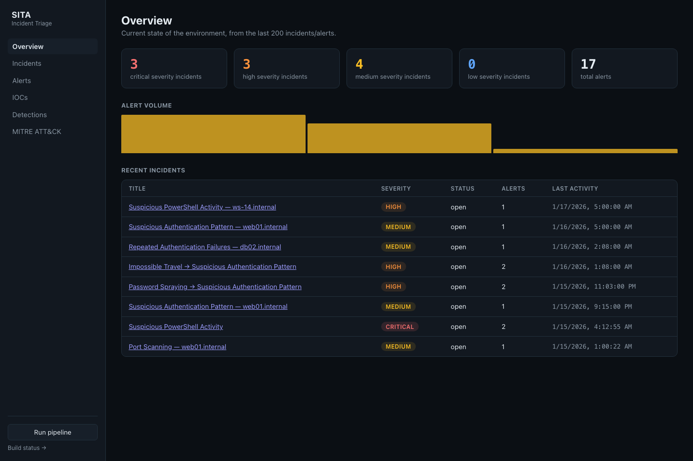
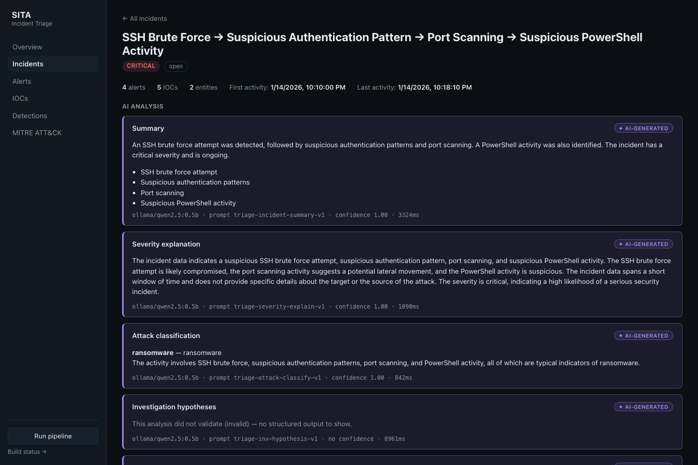
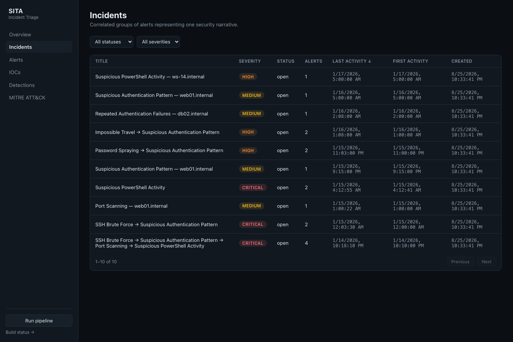
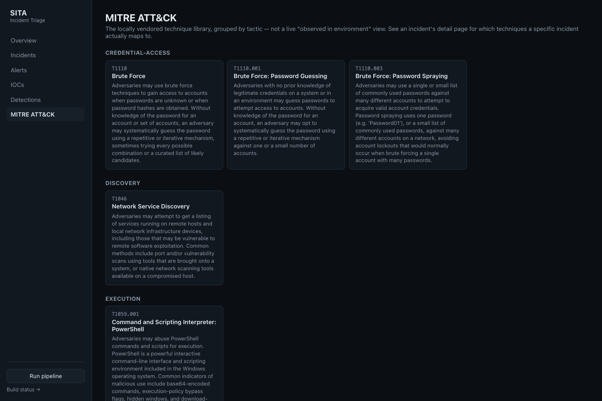

# SITA — Local Security Incident Triage Agent

A local-first security incident triage platform. It ingests simulated security
events, normalizes them, runs deterministic detection rules, extracts
indicators of compromise, correlates alerts into incidents, maps activity to
MITRE ATT&CK, and layers AI-assisted triage (via a local LLM through
[Ollama](https://ollama.com)) on top of — never in place of — that
deterministic pipeline.

No paid APIs or API keys are required anywhere in this project.

See [TODO.md](TODO.md) for the full engineering roadmap, [Documentation/DEF.md](Documentation/DEF.md)
for the field-level data model and contracts, [docs/architecture.md](docs/architecture.md)
for a system overview, and [Documentation/](Documentation/) for a per-phase
narrative of what was built and why (`PHASE-0.md`, `PHASE-1.md`, ...).

```
Event Source(s) → Ingestion → Normalization → Detection Engine → Alert
                                                     │
                                                     ▼
                                          IOC Extraction, Correlation
                                                     │
                                                     ▼
                                                 Incident
                                                     │
                                    ┌────────────────┴────────────────┐
                                    ▼                                 ▼
                          MITRE ATT&CK Mapping              AI Triage (LLMProvider)
                            (deterministic)                  (Ollama / Mock)
                                    │                                 │
                                    └────────────────┬────────────────┘
                                                     ▼
                                            REST API (FastAPI)
                                                     │
                                                     ▼
                                         Frontend Dashboard (React)
```

*(Full narrative version with per-layer detail: [docs/architecture.md](docs/architecture.md).)*

## Screenshots

| Overview | Incident detail (AI-generated triage) |
|---|---|
|  |  |

| Incident list | MITRE ATT&CK technique library |
|---|---|
|  |  |

The AI analysis panel above was captured with `LLM_PROVIDER=ollama` running a
small local model — the project's actual zero-setup default is
`LLM_PROVIDER=mock`, which populates every other part of the dashboard
identically but shows an unvalidated placeholder in the AI panel instead of a
real model response (see [docs/architecture.md § Core Principle](docs/architecture.md#core-principle-deterministic-vs-ai-generated)
and `## Enabling real AI triage` below for how to turn it on).

## Stack

| Layer | Choice |
|---|---|
| Backend | Python + FastAPI |
| Database | PostgreSQL (Docker) / SQLite (local dev) |
| Frontend | React + TypeScript + Vite |
| LLM | Local by default (Ollama / LM Studio) behind a swappable `LLMProvider` interface; optional bring-your-own-key OpenAI/Anthropic |
| Containerization | Docker / Docker Compose |
| Backend package manager | [uv](https://docs.astral.sh/uv/) |
| Backend lint/format | Ruff |
| Frontend lint/format | ESLint + Prettier |
| Backend tests | pytest |

## Quick Start (Docker)

**Requires only [Docker](https://docs.docker.com/get-docker/)** (with Compose
v2, bundled with current Docker Desktop / Docker Engine installs — check with
`docker compose version`). Nothing else — no local Python, Node, or `uv`
install needed for this path.

```bash
git clone <this repo> && cd SITA
./scripts/demo.sh
```

That's the whole quick start — one script, no other setup. It creates `.env`
from `.env.example` if you don't already have one, brings up Postgres,
Ollama, the backend, and the frontend (waiting on each service's own health
check, not just "the container started"), applies database migrations,
loads the checked-in synthetic security event datasets
([data/synthetic_events/](data/synthetic_events/)) plus the vendored MITRE
ATT&CK technique library, and runs the full detection → correlation →
AI-triage pipeline — so the dashboard is already populated with real
correlated, MITRE-mapped incidents the first time you open it. Safe to
re-run: it checks for existing incidents via the real API before reloading
data, so running it twice doesn't create duplicates.

```
==> Starting the stack (postgres, ollama, backend, frontend)...
==> Applying database migrations...
==> Loading synthetic security event data...
==> Loading the vendored MITRE ATT&CK technique dataset...
==> Running the full pipeline (detection, IOC extraction, MITRE mapping, correlation, AI triage)...

Dashboard:     http://localhost:5173
Build status:  http://localhost:5173/status
API docs:      http://localhost:8000/docs
```

Runs in well under two minutes on a typical laptop (`LLM_PROVIDER=mock`,
the default — no model download or LLM inference in the critical path).

### Doing it by hand, or understanding what the script does

Every step `scripts/demo.sh` automates is also a plain, individually useful
command:

```bash
cp .env.example .env
docker compose up --build -d --wait   # waits for every service's healthcheck, not just "started"

# Apply database migrations (first run only, or after pulling new model changes)
docker compose exec backend uv run alembic upgrade head

# Load a synthetic dataset (repeat for whichever files you want)
docker compose exec backend uv run python -m app.ingestion.cli auth /data/synthetic_events/auth/brute_force.jsonl

# Load the vendored MITRE ATT&CK technique dataset (once — the pipeline
# trigger below only links to techniques that already exist, it doesn't
# load them; see docs/architecture.md)
docker compose exec backend uv run python -m app.mitre.cli

# Run the full deterministic-then-AI pipeline against whatever's been ingested
curl -X POST http://localhost:8000/api/v1/pipeline/run
```

This starts Postgres, Ollama, the FastAPI backend (http://localhost:8000,
docs at `/docs`), and the React frontend (http://localhost:5173).

### Enabling real AI triage

With `LLM_PROVIDER=mock` (the default in `.env.example`), the full app runs
with zero LLM network dependency — every deterministic part of the pipeline
(detection, IOC extraction, correlation, MITRE mapping) is fully populated,
and the AI analysis panel shows an unvalidated placeholder rather than a real
model response. `LLM_PROVIDER` supports five values — set it in `.env`,
then recreate the backend service to pick up the change
(`docker compose up -d --force-recreate backend`):

| `LLM_PROVIDER` | Where it runs | API key |
|---|---|---|
| `mock` (default) | Nowhere — canned responses | none |
| `ollama` | Fully local ([ollama.com](https://ollama.com)) | none |
| `lm_studio` | Fully local ([lmstudio.ai](https://lmstudio.ai)) | none |
| `openai` | OpenAI's API | **bring your own** (`OPENAI_API_KEY`) |
| `anthropic` | Anthropic's API | **bring your own** (`ANTHROPIC_API_KEY`) |

`openai`/`anthropic` are the one deliberate exception to this project's "no
paid APIs" default — both are strictly opt-in, off unless you set a key
yourself, and never touched by any test (see
[DEF.md § Phase 6](Documentation/DEF.md#post-roadmap-addition-multi-provider-support-bring-your-own-key)
for why no test ever makes a real call to either). `lm_studio` reuses the
same fully-local pattern as Ollama — start LM Studio, load a model, set
`LM_STUDIO_MODEL` to its exact name. Keys live in `.env` on the backend
only; there's no browser-side key entry.

```bash
# Ollama's default model — small (~400MB), fast, zero-friction, but not
# representative of real triage quality. See "Choosing an Ollama model" below.
docker compose exec ollama ollama pull qwen2.5:0.5b
```

#### Choosing an Ollama model: hardware tradeoffs

`OLLAMA_MODEL` defaults to `qwen2.5:0.5b` (a ~0.5B-parameter model)
specifically so a first-time `docker compose up`/`./scripts/demo.sh` run
doesn't force a multi-gigabyte download or need serious hardware just to
prove the pipeline works end to end — it's a quick-start convenience, not
a quality recommendation. For triage output worth actually reading,
switch to a 7–8B instruct model:

```bash
docker compose exec ollama ollama pull llama3.1:8b-instruct-q4_K_M
# then set OLLAMA_MODEL=llama3.1:8b-instruct-q4_K_M in .env and:
docker compose up -d --force-recreate backend
```

What that upgrade actually costs, so it's not a surprise:

| | `qwen2.5:0.5b` (default) | 7–8B instruct model (recommended for real use) |
|---|---|---|
| Download | ~400 MB | ~4.5–5.5 GB (Q4 quantized) |
| RAM/VRAM while running | ~1 GB | ~6–8 GB free, recommended |
| Latency per triage task, CPU-only | Sub-second to a few seconds (measured, see [PHASE-15.md](Documentation/PHASE-15.md)) | Meaningfully slower — can be tens of seconds per task without a GPU |
| Output quality | Noticeably weaker — has produced at least one confirmed hallucinated classification in this project's own evaluation (see [docs/evaluation_methodology.md](docs/evaluation_methodology.md)) | The actual target this project's prompts were designed for |

If triage calls start timing out on slower hardware, raise
`LLM_REQUEST_TIMEOUT_SECONDS` in `.env` (default `30`) before assuming
something is broken — a CPU-only 8B model genuinely can take longer than
30 seconds for some tasks. A GPU (including Apple Silicon's unified
memory, which Ollama uses automatically) meaningfully closes this gap.

To regenerate AI analysis for incidents that already have results on file
from a different provider (results are additive, not replaced — see
[DEF.md § Phase 7](Documentation/DEF.md#phase-7-ai-powered-triage) — the API
already returns only the latest per task, but forcing a fresh run gets you
new content, not just a new "latest" pointer to old content), force a fresh
run:

```bash
docker compose exec backend uv run python -m app.triage.cli --force
```

## Local Development (without Docker)

Requires [uv](https://docs.astral.sh/uv/) (which manages the Python 3.12+
interpreter itself — no separate Python install needed) for the backend, and
[Node.js 22+](https://nodejs.org/) for the frontend. Postgres and Ollama are
optional for native dev — SQLite and `LLM_PROVIDER=mock` cover both by
default.

### Backend

```bash
cd backend
uv sync
uv run alembic upgrade head
uv run uvicorn app.main:app --reload
```

Runs against SQLite by default (`DATABASE_URL` in `.env`/`.env.example`) — no
Postgres required for backend development. Visit http://localhost:8000/docs
for the interactive API docs and http://localhost:8000/healthz for a health
check.

Run tests and lint:

```bash
uv run pytest
uv run ruff check .
uv run ruff format .
```

With coverage (CI enforces a 95% minimum; the suite is currently at 99%):

```bash
uv run pytest --cov=app --cov-report=term-missing
```

CI also runs the full suite against a real Postgres instance, not just
SQLite — see [DEF.md § Phase 11](Documentation/DEF.md#phase-11-testing) for
how that's done safely (opt-in only, never against a real database by
accident).

### Loading synthetic security event data

A collection of realistic synthetic events (benign and attack-pattern, per
source type) lives under [data/synthetic_events/](data/synthetic_events/),
including a full multi-stage attack scenario
(`scenarios/brute_force_to_lateral_movement/`) that the correlation pipeline
reconstructs as a single incident (`scripts/demo.sh` loads every file here
automatically — see Quick Start above). Load any file individually with the
batch-import CLI:

```bash
cd backend
uv run python -m app.ingestion.cli auth ../data/synthetic_events/auth/brute_force.jsonl
```

Or send events individually via `POST /api/v1/events/{source_type}` (accepts
a single event object or a JSON array).

### Frontend

```bash
cd frontend
npm install
npm run dev
```

Visit http://localhost:5173 for the real SOC-style dashboard: an overview
(severity counts, recent incidents, alert volume), filterable/sortable
alert and incident lists, an incident detail page (constituent alerts,
IOCs, entities, MITRE techniques, recommendations, and an AI analysis
panel visually distinct from deterministic content), an IOC explorer, a
detections page, and a MITRE ATT&CK technique library — all backed live by
the Phase 9 REST API. A "Run pipeline" button in the nav triggers
`POST /api/v1/pipeline/run` for demos.

The original build-status page — one row per roadmap phase with a live
status dot (gray/not implemented, green/live-checked and working, yellow/
complete but with no live-checkable surface, red/unreachable or failing)
— didn't go away; it moved to http://localhost:5173/status as a standing
diagnostic.

```bash
npm run test
npm run lint
npm run format:check
npm run build
```

## Status

Complete: Phase 0 (project foundation), Phase 1 (core data model — SQLAlchemy
models, Alembic migrations, Postgres/SQLite dual-dialect support), Phase 2
(event ingestion — 5 source-type adapters, batch CLI import, REST ingestion
endpoint, synthetic datasets), Phase 3 (detection engine — 7 deterministic
rules), Phase 4 (IOC extraction — 6 regex extractors + structured fields,
dedup), Phase 5 (incident correlation — weighted scoring across
time/IOC/host/MITRE signals), Phase 6 (local LLM integration — a
swappable `LLMProvider` abstraction with `MockProvider`/`OllamaProvider`,
structured-output validation, retry/confidence handling; the app runs with
zero LLM network dependency by default), Phase 7 (AI-powered triage —
six LLM-assisted tasks per incident — summary, severity explanation, attack
classification, investigation hypotheses, investigation steps, MITRE
suggestions — each persisted as a labeled `AnalysisResult`, idempotent and
re-runnable, never merged into deterministic fields), Phase 8 (MITRE
ATT&CK integration — a curated local technique dataset, deterministic
rule-to-technique mappings declared on each detection rule, and the
incident-level technique rollup that also switches on Phase 5's
correlation MITRE-agreement signal, dormant until now for lack of data),
Phase 9 (REST API — a paginated, filterable, sortable read surface
over every domain object, a structured error envelope, auto-generated
OpenAPI docs, and a pipeline-trigger endpoint for demos; also switches
Phase 3/4/5/7/8's dashboard entries from static "Implemented" to
live-checked "Working," a promise each of those phases' own docs made),
Phase 10 (frontend — a real SOC-style dashboard: overview, alert and
incident lists, an incident detail page with a visually distinct AI
analysis panel, an IOC explorer, a detections page, and a MITRE technique
library, all live against the Phase 9 API; the original build-status page
moved to `/status` rather than being replaced), Phase 11 (testing — an
audited, coverage-enforced suite: 338 backend tests at 99% line coverage
with a 95% CI floor, run against both SQLite and a real Postgres instance
on every CI run, plus failure-injection tests proving the system degrades
gracefully — not crashes — when the database or the LLM is unavailable),
and Phase 12 (performance and evaluation — a generated, held-out dataset
(`data/eval/`) distinct from the dev/demo data, scoring detection
(1.0 precision/recall across all 7 rules), IOC extraction (1.0
precision/recall across all 9 types), and correlation (1.0 accuracy)
against it; automated AI-output grounding checks against a live local
model, honestly reporting a 0% grounding rate and one hallucinated
classification; and real pipeline throughput / API latency benchmarks —
see [docs/evaluation_methodology.md](docs/evaluation_methodology.md) and
[docs/benchmarks.md](docs/benchmarks.md)), and Phase 13 (observability —
structured JSON logging closed across every pipeline layer that
previously had none; end-to-end request-ID propagation from HTTP request
through every log line a pipeline run emits; an in-process Prometheus
metrics registry scraped at `GET /metrics`; a catch-all error handler
giving every unhandled exception the same structured envelope and a
traceback in the logs; and `/healthz` extended with LLM reachability —
see [docs/architecture.md § Observability](docs/architecture.md#observability)),
Phase 14 (security hardening — a single opt-in shared bearer token
gating the API, disabled by default so the quick-start above needs no
setup; two-tier in-memory rate limiting on ingestion and the
LLM-triggering endpoint; strict LLM-output schema enforcement
(`extra="forbid"`) as the real backstop behind a documented, honestly-scoped
prompt-injection mitigation; standard security headers; a non-root
production container for the frontend; and blocking dependency scanning
in CI — see [Documentation/PHASE-14.md](Documentation/PHASE-14.md)), and
Phase 15 (deployment — a health-checked `docker-compose.yml` (every
service, not just Postgres) and the one-shot `scripts/demo.sh` bootstrap
above, which brings up the full stack, applies migrations, loads the
synthetic datasets, and runs the real pipeline so a fresh clone shows a
populated, triaged dashboard within about a minute — verified end to end
from a genuinely clean state, including that re-running it is a safe
no-op — see [Documentation/PHASE-15.md](Documentation/PHASE-15.md)).
See [Documentation/](Documentation/) for the detailed report on each
completed phase, and [TODO.md](TODO.md) for the full roadmap — every
phase of it is now complete.

## License

[MIT](LICENSE)
